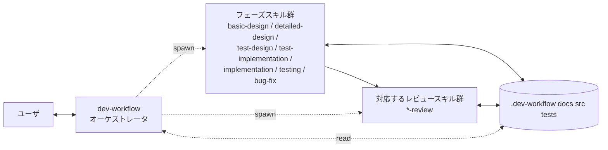

# dev-workflow スキルセット

要件定義から不具合修正までを一貫したプロセスで進めるための、Claude Code (CLI / VS Code 拡張) 向けスキル群。Cowork では **制約付きで動作する** (Cowork の Agent ツールにはカスタム subagent_type が登録されないため、サブエージェントは general-purpose フォールバックで起動する。[USAGE.md](./USAGE.md) の「補足: Cowork で使う場合」参照)。

> **本 README の位置づけ**: 仕様の記述は概要 (ダイジェスト) であり、**正 (single source of truth) は各 `SKILL.md`・`agents/<name>/<name>.md`・`skills/dev-workflow/resources/reference/`**。README と乖離している場合はそちらが正。README 側を編集するときは転記元とセットで更新すること。

## 特徴

- **オーケストレータ＋サブエージェント方式**: `dev-workflow` がオーケストレータとして長期コンテキストを保持し、各フェーズの実作業は **別エージェント (サブエージェント)** として spawn する。コンテキストが肥大化しにくい。
- **二段階の設計**: 全体の「基本設計」と機能ごとの「詳細設計」に分かれており、要件 → 機能 → 設計 → テスト → 実装 → 不具合修正 の流れが乱れにくい。
- **フェーズバッチ実行**: 要件が複数機能 (`F001, F002, ...`) を持つ場合、**「同じフェーズを全機能まとめて」** 進める (機能ごとに最後まで通すのではない)。同一フェーズ内で全機能の成果物が同時に揃うので、命名規約・データ型・API 形式の **横断的な一貫性** をレビューで検証でき、**共通モジュール (`COMMON`) の機会も発見** できる。
- **TDD を強制**: 詳細設計の後に必ず **テスト設計 → テストコード作成 (Red) → 実装 (Green)** の順で進む。テストコードはプロダクトコードより必ず先に書く。
- **フェーズごとの専用レビューゲート**: 各フェーズ完了直後に対応するレビュースキルが自動 spawn され、インプット (前工程の成果物) との整合や規律順守、**横断的な一貫性と共通化の機会** を検証する。**レビュー pass しない限り次フェーズに進まない**。
- **進捗の永続化**: 各機能・各タスクの状態を `.dev-workflow/` 配下の JSON / Markdown に保存。セッションが切れても続きから再開できる。サブエージェント間の引き継ぎもこのファイルを介して行う。
- **Git 統合 (commit ゲート)**: 専用ブランチ上での開始を前提とし (main/master では開始しない)、**各ゲート通過時にオーケストレータが commit を作成 (commit は実行前に必ずユーザ確認・承認を得てから)**。push はユーザが手動で行い、`reset` / `rebase` / `--amend` 等の履歴改変は禁止 (履歴は必ず人が確認できる状態を保つ)。
- **推測しない**: 不明点はユーザに確認する。重要度が高ければ即時、軽微なものはフェーズ末でまとめて (ハイブリッド方針)。
- **Mermaid を用いた図表**: 状態遷移、ER図、シーケンス図は Mermaid で記述。

## 構成 (Skill 5 個 + Agent 26 個)

`dev-workflow` / `dev-workflow-overlay` / `bugfix-workflow` / `feature-add-workflow` / `reverse-design-workflow` は **ユーザが呼ぶ Skill** (`~/.claude/skills/`)。
残り 26 個は **サブエージェント** として `Task(subagent_type="<name>")` で spawn される Agent (`~/.claude/agents/<name>/<name>.md`)。

### Skill (5 個)

| Skill                          | 役割                                                  |
| ------------------------------ | ----------------------------------------------------- |
| `dev-workflow`                 | オーケストレータ。プロジェクト全体の進行を統括 (ユーザとの長期対話、進捗判断、Agent spawn) |
| `dev-workflow-overlay`         | `dev-workflow` のラッパー。プロジェクト直下 `.dev-workflow/rules/` のプロジェクト固有ルール (必須) と `extra-phases.md` の追加フェーズを反映してベースを実行する。Agent 本体の完全上書きも `<PROJECT_ROOT>/.claude/agents/<name>.md` で可能 (Advanced) |
| `bugfix-workflow`              | **不具合修正の軽量ワークフロー** (TDD)。インプット = 不具合内容・再現手順・再現率。原因解析 (`bug-investigation`、推測禁止・条件不明はユーザに問合せ) → 対応方法提案 (`solution-proposal`、あるべき姿の提示必須・ユーザ選定) → 設計修正 (差分明示、既存設計なければ逆引き作成) → 🛑 ユーザ承認 → TDD 実装・テスト (`bug-fix` Step3〜 + review)。ベース dev-workflow の規約 (Git 統合・ゲート・所有権) を継承 |
| `feature-add-workflow`         | **機能追加の軽量ワークフロー** (TDD)。インプット = 現行の動作・機能の変更点。現行解析 (`current-analysis`) → 対応方法提案 (`solution-proposal`、あるべき姿の提示必須・ユーザ選定) → 設計修正 (差分明示、既存設計なければ逆引き作成) → 🛑 ユーザ承認 → TDD 実装・テスト (test-design → Red → Green → 層テスト + 各 review)。1 FID 単位。ベース規約を継承 |
| `reverse-design-workflow`      | **リバース設計ワークフロー**。設計書のない(または一部だけある)既存コードから「詳細設計 → 基本設計 → 要件」を逆順で復元・補完 (`code-survey` → `reverse-design` → `test-design` → `conformance-test`)。**欠落分は新規作成、既存分はコードと突き合わせて誤りを修正**。各設計の正しさは「設計から作ったテストが既存コードで PASS すること」で検証。**ソース修正禁止・テストのみ修正禁止・失敗時は設計→テスト仕様→テストコードの順で修正**。ベース規約を継承 |

### Agent (26 個)

| Agent                          | 役割                                                  |
| ------------------------------ | ----------------------------------------------------- |
| `requirements`                 | 要件定義 (要件ID `R-###` 採番・受入条件の明示化・USDM 構造検証)。V字の左端 |
| `requirements-review`          | 要件定義レビュー (テスト可能性・一意性・矛盾・スコープ境界)。pass 後に human-checkpoint |
| `basic-design`                 | 基本設計 (システム全体方針 + 機能IDの確定)             |
| `basic-design-review`          | 基本設計 ↔ 要件 の整合確認                            |
| `detailed-design`              | 詳細設計 (機能ごとに9章構成 `detailed-design.md`: 概要/トレーサビリティ/サブ機能/I/F/シーケンス/状態。UI/DB は任意追加) |
| `detailed-design-review`       | 詳細設計 ↔ 基本設計 の整合確認                        |
| `test-design`                  | テスト設計ドキュメント作成 (単体/結合/E2E の3層・ケース一覧)。reverse-design-workflow からは `mode=characterization` で spawn され、逆生成設計の主張を期待値とする仕様 (期待 = PASS、コード参照禁止) を 1 層分起こす |
| `test-design-review`           | テスト設計 ↔ 詳細設計 の網羅性確認                    |
| `test-implementation`          | テストコード作成 (実行可能な失敗テスト = TDD Red)      |
| `test-implementation-review`   | テストコード ↔ テスト設計 と Red 確認の検証           |
| `implementation`               | プロダクトコード作成 (失敗テストを Pass = TDD Green)    |
| `implementation-review`        | プロダクトコード ↔ 詳細設計 + Green 確認、勝手な変更の禁止 |
| `security-review`              | セキュリティ専門コードレビュー (implementation-review の後段ゲート)。OWASP Top 10 / CSRF・SSTI・XXE・マスアサインメント / ビジネスロジック悪用・レースコンディション・DoS / OWASP LLM Top 10 (LLM 機能がある場合) / ハードコード秘密情報・安全でない設定・セキュリティヘッダ / 依存ライブラリの既知脆弱性 / IaC・CI 設定 / `non-functional.md` のセキュリティ要件との整合を per_feature + cross で検証。Critical/High があれば fail で差し戻す |
| `testing`                      | テスト実行 Agent。層実行 (mode=initial/retry、1 回の spawn で **1 層のみ**) に加え、**確認モード (mode=red/green)** で test-implementation 直後の Red 確認 / implementation 直後の Green 確認も担う (結果は `docs/04_test_results/<FID>/<phase>-<mode>-confirmation.md`、`*-review` Agent はこれを読むだけ)。dev-workflow は `unit → integration → e2e` の順で **シリアル** に呼び、前層の `open_bugs = 0` まで次層に進めない。各層で fail が出たら bug-fix → 再 testing (mode=retry, リグレッション込み) のループ |
| `unit-test-review`             | 単体テスト結果レビュー。検証対象 = **詳細設計**。`detailed-design.md` (サブ機能 / I/F / 状態) + 任意の ui/db の全要素カバー、AAA / 1 テスト 1 観点 / モック適切性 / 分岐網羅率を判定 |
| `integration-test-review`      | 結合テスト結果レビュー。検証対象 = **基本設計**。アーキ I/F / 機能間連携 / データフロー / コンポーネント境界の網羅、実 DB / 実外部システム使用、N+1 / トランザクション境界を判定 |
| `e2e-test-review`              | E2E テスト結果レビュー。検証対象 = **要件定義書**。要件 (USDM `R-###` / ユースケース) の **100% カバー** を必須、受入条件転記、業務シナリオ、手動 E2E 再現性を判定 |
| `bug-investigation`            | **原因調査専門 (修正は一切しない)**。再現→観測 (エビデンス必須)→Root Cause 特定 (ファイル:行番号)→分類推奨。修正を禁止する規律 (恒久変更ゼロ・原状復帰確認) により「自分が直せる仮説」への収束 (動機バイアス) を抑える。各反復の冒頭に spawn。一時計装は原状復帰 (git diff 空) 条件付きで許可。testing Fail のトリアージにも使える |
| `bug-fix`                      | 不具合修正 (原因調査は `bug-investigation` の独立レポートを引き継ぎ Step 2 から→影響範囲判定とハンドオフ→前工程テスト設計＋コード追加(TDD)→コード修正→テスト実施 の5ステップ反復ループ) |
| `bug-fix-review`               | 反復ごとに 5ステップの規律違反を検証                  |
| `current-analysis`             | **現行解析専門 (修正は一切しない)**。機能追加・改修の前提となる現行動作・関連モジュール・既存設計/テストの有無マップ・影響範囲候補を調査。ユーザ説明とコード実態の食い違いを検出。feature-add-workflow の Step 2-1 で使用 |
| `solution-proposal`            | **対応方法提案専門 (修正は一切しない)**。調査/解析レポートに基づき、**必要な設計を考慮した「あるべき姿 (理想設計)」案の提示を必須** とし、それを基準点に最小修正案・現実解を影響範囲・工数・リスク・あるべき姿との乖離・技術的負債のトレードオフ付きで比較し推奨案を返す。**選定はユーザ** (理想案を選ばない場合は先送り負債も記録)。bugfix-workflow / feature-add-workflow で共用 |
| `code-survey`                  | **コードベース棚卸し専門 (修正は一切しない)**。設計書のない既存コードを走査し、スタック・エントリポイント・公開 I/F を把握、リバース設計の単位となる機能分割マップ (`F###`) を提案。reverse-design-workflow の起点 |
| `reverse-design`               | **設計書の逆生成専門 (ソース修正禁止)**。`level` (detailed/basic/requirements) に応じ、コードが実際にどう動くかを根拠 (ファイル:行番号) 付きで設計化。理想化せず実態を記述。**欠落した設計書/セクションは新規作成、既存分は正しいと仮定せずコードと突き合わせて誤りを修正**。conformance 不一致時は `mode=reconcile` で設計を実態に寄せて修正 |
| `conformance-test`             | **設計⇔コード適合性テスト**。テスト仕様書の期待値を encode したテストを既存コードに対して実行 (期待 PASS = characterization)。**ソース修正禁止・テストを実態に合わせて Green 偽装するの禁止**。FAIL 時は「設計の主張 X / コードの実際 Y」の不一致レポートを返し、設計→仕様→テストの順の修正を要請 |
| `auto-check`                   | 機械チェックゲート。`stack-config.md` 由来の MUST/SHOULD/MAY ツール (linter / typecheck / markdownlint / カバレッジ等) を実行。MUST 失敗でフェーズ差し戻し |

通常は `dev-workflow` (Skill) を起動する。`dev-workflow` が状況を判断して上記 26 個の Agent を **`Task(subagent_type="<name>")` で spawn** する。
ユーザが特定の Agent を直接呼びたい場合 (例: 既存プロジェクトの途中から `implementation` だけ使いたい) は、Claude に「implementation Agent を spawn して」と頼めば `Task(subagent_type="implementation")` が呼ばれる。

### 人間チェックポイント (human-checkpoint)

設計フェーズの **最重要マイルストーン** では、ツールチェック (auto-check) と LLM レビュー (per_feature + cross) が全て pass しても、`dev-workflow` は次フェーズに進まず **ユーザに明示承認を求めて停止** する。

| タイミング | 対象 |
|---|---|
| `requirements-review` pass 直後 | 要件 (R-### / 受入条件 / スコープ境界) の確定 |
| `basic-design` cross review pass 直後 | 機能 ID / アーキ / NFR の確定 |
| `detailed-design` cross review pass 直後 | 全 FID の詳細設計の確定 |

#### ユーザの応答パターン

| 応答 | 動作 |
|---|---|
| `approve` / 「承認」 | `decisions.md` と `status.json (checkpoints.<phase>)` に記録 → 次フェーズへ |
| `<具体的な変更要求>` (例: 「F002 の機能定義を見直して」) | 該当 Agent を再 spawn (フィードバックを briefing に含める) → auto-check → review → 再 checkpoint |
| `skip checkpoint` (明示文字列のみ) | スキップ理由を 1 行ユーザに求め `decisions.md` に記録 → 次フェーズへ |

> 曖昧表現 (「いいかな」「飛ばして」など) は再確認されます。

#### プロジェクト単位で無効化

開発スタイル上 checkpoint が不要な場合、`<PROJECT_ROOT>/.dev-workflow/rules/project/project-config.md` に:

```markdown
## チェックポイント設定 (human-checkpoint)
- requirements: enabled
- basic-design: disabled
  - 理由: 個人プロジェクトのため
- detailed-design: enabled
```

デフォルトは 3 つとも有効。設定箇所はこの `project-config.md` のみで、`project.json` の `checkpoints.<phase>` は実行状態 (`status` 等) だけを持つ (enabled フラグの二重管理はしない)。

### Git 統合 (commit ゲート)

ワークフローの品質ゲートと Git 履歴を対応づける。git 操作は **オーケストレータのみ** が行う (サブエージェントは禁止)。

- **前提**: 開始時に専用ブランチ (例: `dev-workflow/<プロジェクト名>`) 上であること。`main` / `master` / `develop` 上では開始せず、ユーザに切替を依頼する
- **commit タイミング**: 各ゲート通過時 (review pass / checkpoint approve / testing layer 完了 / bug verified / 最終レポート)。メッセージは `[dev-workflow] <phase>: ...` 形式。fail → 修正中は commit しない
- **commit 前のユーザ確認 (必須)**: すべての commit は **実行前にユーザへ提案 commit メッセージ・対象ブランチ・変更サマリ (`git status` / `git diff --stat`) を提示し、承認を得てから** 実行する。承認なしの自動 commit は禁止 (WIP・revert も含む)。Cowork では `AskUserQuestion` で確認。human-checkpoint 直後はチェックポイント承認と commit 確認を 1 メッセージに統合してよい
- **push はユーザが手動で行う** (オーケストレータは push しない)
- **履歴改変の禁止**: `git reset` / `git rebase` / `git commit --amend` / `git push --force` / 変更破棄 (`git restore` 等) は禁止。やり直しは新しい commit を積む前方修正のみ (`git revert` は可)。例外はユーザの明示指示 + `decisions.md` 記録時のみ

詳細は `skills/dev-workflow/SKILL.md` の §「Git 統合 (commit ゲート)」。

### 動作モデル



- **オーケストレータ**: ユーザとの対話、進捗の判断、サブエージェントへの自己完結ブリーフ作成
- **サブエージェント**: フレッシュなコンテキストで起動し、ブリーフと `.dev-workflow/` ファイルだけを頼りに作業
- **状態の共有**: すべてファイル経由。メモリは引き継がれない

## リポジトリ構成

このスキルセットの構成 (`$REPO_ROOT` 配下):

> 注: このツリーは概要であり、正は実ディレクトリ構成。乖離を見つけたらツリー側を直すこと。

```
$REPO_ROOT/
├─ README.md                                   # 概要・構成 (本ファイル)
├─ USAGE.md                                    # 使い方 (インストール〜運用・カスタマイズの手順集)
├─ .gitignore
├─ tools/                                      # リポジトリ保守ツール (インストール対象外)
│  └─ sync-preamble.py                         # Agent 共通前文の検証・一括同期 (--check / --fix)
├─ docs/                                       # ワークフロー全体ドキュメント + 精査レポート
│  └─ workflow-overview.md
├─ skills/                                     # Skill (ユーザ起動の入口)。~/.claude/skills/ にインストール
│  ├─ dev-workflow/
│  │  ├─ SKILL.md
│  │  └─ resources/
│  │     ├─ progress/{project.json, open-questions.md, decisions.md}
│  │     └─ reference/                         # SKILL.md から参照される詳細仕様 (progressive disclosure)
│  │        ├─ review-gates.md
│  │        ├─ git-integration.md
│  │        ├─ human-checkpoint.md
│  │        ├─ testing-gates.md
│  │        ├─ auto-check-gate.md
│  │        └─ bugfix-design-handoff.md
│  ├─ bugfix-workflow/{SKILL.md}                # 不具合修正の軽量ワークフロー (TDD)
│  ├─ feature-add-workflow/{SKILL.md}           # 機能追加の軽量ワークフロー (TDD)
│  ├─ reverse-design-workflow/{SKILL.md}        # リバース設計ワークフロー (コード→設計)
│  └─ dev-workflow-overlay/
│     ├─ SKILL.md
│     └─ resources/
│        ├─ project-rules/                     # プロジェクトカスタマイズ用テンプレ群 (project 層 + 汎用 stack 雛形)
│        └─ stack-presets/                     # 言語/FW 別の stack 層プリセット集 (8 種類)
│           ├─ python-fastapi/    (9 files)
│           ├─ python-django/     (9 files)
│           ├─ go-stdlib-chi/     (9 files)
│           ├─ typescript-nextjs/ (9 files)
│           ├─ typescript-react-vite/ (9 files)
│           ├─ react-native/      (9 files)
│           ├─ java-spring-boot/  (9 files)
│           ├─ ruby-rails/        (9 files)
│           └─ README.md
└─ agents/                                     # Agent (Skill から spawn される)。~/.claude/agents/ にインストール
   ├─ requirements/{requirements.md, resources/}
   ├─ requirements-review/{requirements-review.md, resources/}
   ├─ basic-design/
   │  ├─ basic-design.md                       # frontmatter (name/description/tools/model) + system prompt
   │  └─ resources/                            # 旧 skills/basic-design/resources/ 由来
   ├─ basic-design-review/{basic-design-review.md, resources/}
   ├─ detailed-design/{detailed-design.md, resources/}
   ├─ detailed-design-review/{detailed-design-review.md, resources/}
   ├─ test-design/{test-design.md, resources/}
   ├─ test-design-review/{test-design-review.md, resources/}
   ├─ test-implementation/{test-implementation.md, resources/}    # resources 任意
   ├─ test-implementation-review/{...}
   ├─ implementation/{...}
   ├─ implementation-review/{...}
   ├─ security-review/{security-review.md, resources/}
   ├─ testing/{testing.md, resources/{scripts/, report-template.md, ...}}
   ├─ unit-test-review/{unit-test-review.md, resources/}
   ├─ integration-test-review/{integration-test-review.md, resources/}
   ├─ e2e-test-review/{e2e-test-review.md, resources/}
   ├─ bug-investigation/{bug-investigation.md, resources/}
   ├─ current-analysis/{current-analysis.md, resources/}
   ├─ solution-proposal/{solution-proposal.md, resources/}
   ├─ code-survey/{code-survey.md, resources/}
   ├─ reverse-design/{reverse-design.md, resources/}
   ├─ conformance-test/{conformance-test.md, resources/}
   ├─ bug-fix/{...}
   ├─ bug-fix-review/{...}
   └─ auto-check/{auto-check.md, resources/{scripts/, report-template.md}}
```

**インストール先 (ユーザグローバル):**
```bash
cp -R skills/*  ~/.claude/skills/
cp -R agents/*  ~/.claude/agents/
```

**配置構造と Claude Code の探索仕様 (2026-07-06 公式ドキュメントで確認):**

本リポジトリの `agents/<name>/<name>.md` + `resources/` という入れ子構造が Claude Code の subagent 探索と互換であることを、公式ドキュメント ([Create custom subagents](https://code.claude.com/docs/en/sub-agents)) で確認済み:

1. **再帰探索**: `.claude/agents/` と `~/.claude/agents/` は **サブディレクトリまで再帰的にスキャンされる**。サブディレクトリのパスは識別に影響せず、Agent の同一性は **frontmatter の `name` フィールドのみ** で決まる。したがって `~/.claude/agents/basic-design/basic-design.md` は `Task(subagent_type="basic-design")` で解決される
2. **`resources/*.md` は Agent として誤登録されない**: subagent 定義には frontmatter の `name` と `description` が必須。本リポジトリの `agents/*/resources/**/*.md` (テンプレート・レビュー票の雛形) はいずれも frontmatter を持たないため Agent にならない (frontmatter を持つ resources ファイルが 0 件であることをリポジトリ側でも確認済み)
3. **`name` はツリー全体で一意にすること**: 同一スコープ内で同名の定義が複数あると片方しかロードされない。本リポジトリの 26 Agent の `name` に重複はない (確認済み)。v2.1.196 以降は `/doctor` が同一スコープ内の重複 `name` を報告する

**インストール後の実機確認手順** (環境依存の問題を切り分けるため、初回インストール時に一度実行を推奨):
- `claude /doctor` で重複 `name` の警告が出ないことを確認
- Claude Code 上で「Task ツールで `basic-design` subagent を spawn できるか確認して」等と依頼し、カスタム Agent が解決されることを確認 (解決されない場合、旧構成の残骸 `~/.claude/skills/<phase>/` や同名定義が干渉していないかを確認)

**Skill と Agent の役割:**
- `skills/` の中身はユーザが呼ぶ「ワークフローの入口」 (Skill カタログに自動 load される)
- `agents/` の中身は `Task(subagent_type="<name>")` で spawn される「単一責務のサブエージェント」 (Agent カタログに自動 load される)

**メンテナンス: Agent 共通前文の同期 (`tools/sync-preamble.py`)**

各 Agent の frontmatter 直後にある「Subagent definition」前文 (4 行の blockquote) は、サブエージェントの system prompt が単体で自己完結する必要があるため全 26 Agent に複製されている。更新漏れを防ぐため **正本は `tools/sync-preamble.py` 内の定数** とし、前文を変更するときは同スクリプトを編集して一括反映する:

```bash
python tools/sync-preamble.py --check   # 全 Agent の前文が正本と一致するか検証
python tools/sync-preamble.py --fix     # 正本の内容で一括更新 (Agent ごとに異なる 2 行目は保持)
```

前文は full (通常 Agent 21 個) / readonly (調査・提案・逆生成系 5 個: code-survey / conformance-test / current-analysis / reverse-design / solution-proposal) の 2 変種のみ。各 Agent の前文を個別に直接編集しないこと。

チェックの実行忘れを防ぐため、pre-commit フック (`tools/githooks/pre-commit`: 前文整合 + テンプレ JSON 構文 + 旧表記再混入の 3 チェック) を用意している。リポジトリで一度だけ以下を実行すると有効になる:

```bash
git config core.hooksPath tools/githooks
```

> 旧バージョンとの互換性メモ: 旧構成では 18 個すべてが `skills/` 配下にあったが、Skill (2) と Agent (16) に分離した (その後 `security-review` / `requirements` / `requirements-review` を追加、`test-run` を `testing` に統合、`bug-investigation` / `current-analysis` / `solution-proposal` / `code-survey` / `reverse-design` / `conformance-test` と派生 Skill (`bugfix-workflow` / `feature-add-workflow` / `reverse-design-workflow`) を追加し、現在 Skill 5 / Agent 26)。古い `skills/<phase>/` 等が残っている場合は手動で削除して `~/.claude/agents/` 側に揃えること。

## 使い方

インストール手順・サンプルウォークスルー・シナリオ別の起動プロンプト・レガシー適用・Overlay カスタマイズなど、**使い方はすべて [USAGE.md](./USAGE.md) に分離** している:

- 新規プロジェクトでの使い方 (インストール → プロジェクト準備 → 起動 → 再開。Cowork で使う場合の補足を含む)
- サンプルウォークスルー: タスク管理 API を作る (要件入力から不具合修正・完了まで)
- シナリオ別 起動プロンプト例 (既存プロジェクトの改修 / USDM 形式の要件入力)
- レガシープロジェクトへの適用 (方針 A: 全面逆引き / B: 部分適用 / C: 新機能のみ)
- プロジェクト固有のカスタマイズ (Overlay の 2 層ルール / extra-phases / stack-presets / auto-check 導入手順)

## プロジェクト側のディレクトリ構造

```
<PROJECT_ROOT>/
├─ .dev-workflow/              # 進捗・状態 (スキル群が読み書き)
│  ├─ project.json
│  ├─ open-questions.md
│  ├─ decisions.md
│  └─ features/
│     └─ <FID>/
│        ├─ status.json
│        ├─ tasks/<TID>.json
│        └─ bugs/<BID>.json
├─ docs/
│  ├─ requirements/            # 要件定義書
│  ├─ 01_basic_design/         # 基本設計
│  ├─ 02_detailed_design/<FID>/ # 詳細設計
│  ├─ 03_test_design/<FID>/     # テスト設計 (ケース一覧)
│  ├─ 04_test_results/<FID>/    # Red 確認ログ + テスト実行結果
│  ├─ 05_bug_reports/           # 不具合票
│  └─ 06_reviews/               # レビュー票 (各フェーズ・各反復)
│     ├─ basic-design-review.md
│     └─ <FID>/<phase>-review.md
├─ .dev-workflow/rules/         # プロジェクト固有ルール (overlay 使用時の標準・2 層構造)
│  ├─ stack/                    # 言語/フレームワーク共通ルール (他プロジェクトで再利用可能)
│  │  ├─ stack-config.md
│  │  ├─ <phase>.md             # ADD/OVERRIDE/DISABLE 等
│  │  ├─ <phase>-review.md      # レビュー追加チェック
│  │  └─ extra-phases.md
│  └─ project/                  # このプロジェクトだけの固有ルール
│     ├─ project-config.md
│     ├─ <phase>.md
│     ├─ <phase>-review.md
│     └─ extra-phases.md
│
│ ※ 通常はこの .dev-workflow/rules/ にプロジェクト固有のルールを置くだけでよい。
│   スキル本体は ~/.claude/skills/ にインストール済みのものを使う。
│   スキルそのものを丸ごと上書きしたい場合のみ (Advanced)、後述の
│   <PROJECT_ROOT>/.claude/skills/<name>/SKILL.md を置く。
├─ tests/                       # 自動テストコード (test-implementation が生成)
│  ├─ unit/<FID>/
│  ├─ integration/<FID>/
│  └─ e2e/<FID>/
└─ src/                         # 実装コード (プロジェクト構成に従う)
```

## ID 規約

| 種別       | 形式                  | 例              |
| ---------- | --------------------- | --------------- |
| 機能       | `F<連番3桁>`          | `F001`          |
| タスク     | `<FID>-T<連番2桁>`    | `F001-T01`      |
| 単体テスト | `UT-<FID>-<連番3桁>`  | `UT-F001-001`   |
| 結合テスト | `IT-<FID>-<連番3桁>`  | `IT-F001-001`   |
| E2E        | `E2E-<FID>-<連番3桁>` | `E2E-F001-001`  |
| 不具合     | `B<連番3桁>`          | `B001`          |
| 画面       | `S<連番3桁>`          | `S001`          |

## ワークフロー全体像

詳しい流れは [docs/workflow-overview.md](./docs/workflow-overview.md) を参照。

```mermaid
flowchart TD
    Req[要件定義書] --> BD[basic-design]
    BD --> BDR{basic-design-review}
    BDR -->|fail| BD
    BDR -->|pass| FL[機能一覧 F001 F002 F003 COMMON]

    FL --> DDBatch[detailed-design 全機能 並行 spawn]
    DDBatch --> DDR1{detailed-design-review per_feature}
    DDR1 -->|fail| DDBatch
    DDR1 -->|all pass| DDR2{detailed-design-review cross}
    DDR2 -->|fail| DDBatch
    DDR2 -->|pass| TDBatch[test-design 全機能 並行]
    TDBatch --> TDR1{test-design-review per_feature}
    TDR1 -->|fail| TDBatch
    TDR1 -->|all pass| TDR2{test-design-review cross}
    TDR2 -->|fail| TDBatch
    TDR2 -->|pass| TIBatch[test-implementation TDD Red 並行]
    TIBatch --> TIR1{test-implementation-review per_feature}
    TIR1 -->|fail| TIBatch
    TIR1 -->|all pass| TIR2{test-implementation-review cross}
    TIR2 -->|fail| TIBatch
    TIR2 -->|pass| ImplBatch[implementation COMMON先行 各機能 TDD Green]
    ImplBatch --> IR1{implementation-review per_feature}
    IR1 -->|fail| ImplBatch
    IR1 -->|all pass| IR2{implementation-review cross 重複検出}
    IR2 -->|fail| ImplBatch
    IR2 -->|pass| SR1{security-review per_feature<br/>OWASP/秘密情報/設定}
    SR1 -->|fail| ImplBatch
    SR1 -->|all pass| SR2{security-review cross<br/>依存脆弱性/横断一貫性}
    SR2 -->|fail| ImplBatch
    SR2 -->|pass| TestBatch[testing layer=unit→integration→e2e<br/>各層 直列 全機能 並行]
    TestBatch --> TR1{<layer>-test-review per_feature<br/>(unit / integration / e2e)}
    TR1 -->|fail| TestBatch
    TR1 -->|all pass| TR2{<layer>-test-review cross}
    TR2 -->|fail| TestBatch
    TR2 -->|pass no fail| Final[最終レポート]
    TR2 -->|pass with fail| Bug[bug-fix 5ステップ反復]
    Bug --> BFR{bug-fix-review}
    BFR -->|fail| Bug
    BFR -->|pass_but_open| Bug
    BFR -->|pass_and_verified| TestBatch
```

**レビューは 2 段ゲート:**
1. **個別レビュー (per_feature)**: 機能ごとに並行 spawn。per-feature 内の整合を確認。全機能 pass を待つ
2. **横断レビュー (cross)**: 全機能まとめて 1 回 spawn。命名統一・データ型整合・共通化機会を検証

両方 pass しないと次フェーズに進めない。

## 進捗状態の値

| 値             | 意味                                  |
| -------------- | ------------------------------------- |
| `pending`      | 未着手                                |
| `in_progress`  | 着手中                                |
| `completed`    | 完了                                  |
| `blocked`      | ブロック中 (open-questions 等で停滞)   |

## 制約と注意

- スキル群は **言語非依存** で設計されているため、実装フェーズで使う言語/フレームワーク/テストランナーはプロジェクト固有。`basic-design` の `system-architecture.md` または `decisions.md` で必ず決めること。
- 設計ドキュメントは Markdown + Mermaid のみ。Word 等への変換は別途行う想定。
- セッションが切り替わった場合、まず `.dev-workflow/project.json` を読むこと。スキルの状態はメモリではなくこのファイルにある。
