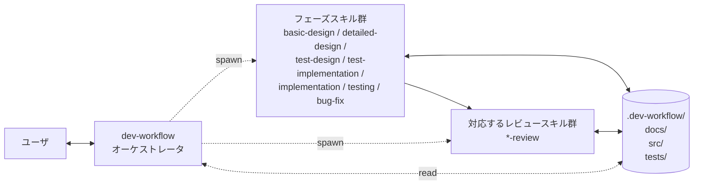
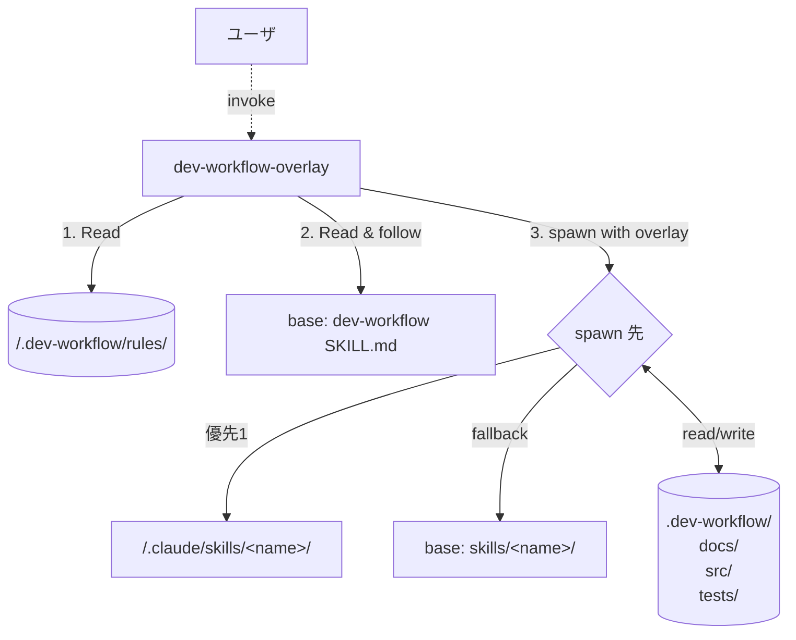
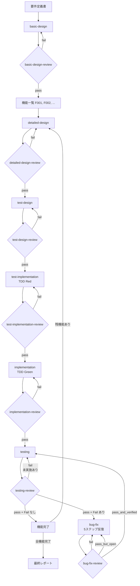

# dev-workflow スキルセット

要件定義から不具合修正までを一貫したプロセスで進めるための、Claude Code (CLI / VS Code 拡張) 向けスキル群。Cowork でも動作する (ツール名読み替えあり)。

## 特徴

- **オーケストレータ＋サブエージェント方式**: `dev-workflow` がオーケストレータとして長期コンテキストを保持し、各フェーズの実作業は **別エージェント (サブエージェント)** として spawn する。コンテキストが肥大化しにくい。
- **二段階の設計**: 全体の「基本設計」と機能ごとの「詳細設計」に分かれており、要件 → 機能 → 設計 → テスト → 実装 → 不具合修正 の流れが乱れにくい。
- **TDD を強制**: 詳細設計の後に必ず **テスト設計 → テストコード作成 (Red) → 実装 (Green)** の順で進む。テストコードはプロダクトコードより必ず先に書く。
- **フェーズごとの専用レビューゲート**: 各フェーズ完了直後に対応するレビュースキルが自動 spawn され、インプット (前工程の成果物) との整合や規律順守を検証する。**レビュー pass しない限り次フェーズに進まない**。
- **機能単位の作業**: 基本設計で確定した機能ID単位で、詳細設計 (UI/機能/状態/DB/シーケンスの5種)、テスト設計 (単体/結合/E2E)、テストコード作成、実装、テスト、不具合修正をループ。
- **進捗の永続化**: 各機能・各タスクの状態を `.dev-workflow/` 配下の JSON / Markdown に保存。セッションが切れても続きから再開できる。サブエージェント間の引き継ぎもこのファイルを介して行う。
- **推測しない**: 不明点はユーザに確認する。重要度が高ければ即時、軽微なものはフェーズ末でまとめて (ハイブリッド方針)。
- **Mermaid を用いた図表**: 状態遷移、ER図、シーケンス図は Mermaid で記述。

## スキル構成

| スキル                          | 役割                                                  |
| ------------------------------- | ----------------------------------------------------- |
| `dev-workflow`                  | オーケストレータ。プロジェクト全体の進行を統括        |
| `dev-workflow-overlay`          | `dev-workflow` のラッパー。`.dev-workflow/rules/` のプロジェクト固有ルールや `.claude/skills/` の上書きスキル、`extra-phases.md` を反映してベースを実行 |
| `basic-design`                  | 基本設計 (システム全体方針 + 機能IDの確定)             |
| `basic-design-review`           | 基本設計 ↔ 要件 の整合確認                            |
| `detailed-design`               | 詳細設計 (機能ごとに UI/機能/状態/DB/シーケンスの5種)  |
| `detailed-design-review`        | 詳細設計 ↔ 基本設計 の整合確認                        |
| `test-design`                   | テスト設計ドキュメント作成 (単体/結合/E2E の3層・ケース一覧) |
| `test-design-review`            | テスト設計 ↔ 詳細設計 の網羅性確認                    |
| `test-implementation`           | テストコード作成 (実行可能な失敗テスト = TDD Red)      |
| `test-implementation-review`    | テストコード ↔ テスト設計 と Red 確認の検証           |
| `implementation`                | プロダクトコード作成 (失敗テストを Pass = TDD Green)    |
| `implementation-review`         | プロダクトコード ↔ 詳細設計 + Green 確認、勝手な変更の禁止 |
| `testing`                       | テスト実行 (包括的に再走し結果を記録、Fail は不具合票へ) |
| `testing-review`                | 全テスト完了確認 (未実施/実施不可で終わっていないか)  |
| `bug-fix`                       | 不具合修正 (原因調査→設計修正→前工程テスト設計＋コード修正(TDD)→コード修正→テスト実施 の5ステップ反復ループ) |
| `bug-fix-review`                | 反復ごとに 5ステップの規律違反を検証                  |

通常は `dev-workflow` を起動する。`dev-workflow` が状況を判断して各フェーズスキルを **別エージェントとして spawn** する。
直接フェーズスキルを起動することもできる (例: 既存プロジェクトの途中から `implementation` だけ使いたい場合)。

### 動作モデル



- **オーケストレータ**: ユーザとの対話、進捗の判断、サブエージェントへの自己完結ブリーフ作成
- **サブエージェント**: フレッシュなコンテキストで起動し、ブリーフと `.dev-workflow/` ファイルだけを頼りに作業
- **状態の共有**: すべてファイル経由。メモリは引き継がれない

## リポジトリ構成

このスキルセットの構成 (`$REPO_ROOT` 配下):

```
$REPO_ROOT/
├─ README.md
├─ docs/                                       # ワークフロー全体ドキュメント
│  └─ workflow-overview.md
└─ skills/                                     # スキル本体 (これを Claude Code のスキルディレクトリにインストール)
   ├─ dev-workflow/
   │  ├─ SKILL.md
   │  └─ resources/                            # 各スキルに必要なテンプレートは自身の resources/ に同梱
   │     └─ progress/{project.json, open-questions.md, decisions.md}
   ├─ dev-workflow-overlay/
   │  ├─ SKILL.md
   │  └─ resources/project-rules/              # プロジェクトカスタマイズ用テンプレ群
   ├─ basic-design/        (+ resources/)
   ├─ basic-design-review/ (+ resources/)
   ├─ detailed-design/     (+ resources/)
   ├─ ... (各フェーズ・各レビュースキル, 計 16 スキル) ...
   └─ bug-fix-review/      (+ resources/)
```

**各スキルは自己完結**: SKILL.md と必要なテンプレートが同じディレクトリにまとまっており、`cp -R skills/* ~/.claude/skills/` のような単純コピーでインストール先がどこでも動作する。

> 旧バージョンとの互換性メモ: 以前はリポジトリ直下に `templates/` が存在したが、現在は各スキル配下の `resources/` に再配置済み。古い `templates/` ディレクトリが残っている場合は手動で削除して問題ない。

## 新規プロジェクトでの使い方

このリポジトリをクローンした場所 (以降 `$REPO_ROOT` と呼ぶ。例: `C:\Users\<user>\github\claudecode_settings` や `~/dev/claudecode_settings`) からスキル群をインストールし、任意の新規プロジェクトに適用する手順。

### Step 1. スキルを Claude Code から呼べる状態にする

#### A. Claude Code CLI / VS Code Claude Code 拡張 (デフォルト想定)

Claude Code はスキルを `~/.claude/skills/` (ユーザグローバル) または `<project>/.claude/skills/` (プロジェクト個別) から読み込む。VS Code 拡張も内部で同じ Claude Code バイナリを使うため設置場所は同じ。

PowerShell 例 (Windows):

```powershell
# このリポジトリのクローン先 (環境に合わせて書き換え)
$RepoRoot = "$env:USERPROFILE\github\claudecode_settings"

# ユーザグローバルに設置するなら
$ClaudeSkills = "$env:USERPROFILE\.claude\skills"
New-Item -ItemType Directory -Force -Path $ClaudeSkills | Out-Null
Copy-Item -Recurse "$RepoRoot\skills\*" $ClaudeSkills

# 特定プロジェクトでだけ使うなら
$ProjectRoot   = "$env:USERPROFILE\projects\my-new-app"
$ProjectSkills = "$ProjectRoot\.claude\skills"
New-Item -ItemType Directory -Force -Path $ProjectSkills | Out-Null
Copy-Item -Recurse "$RepoRoot\skills\*" $ProjectSkills
```

bash / macOS / Linux 例:

```bash
# このリポジトリのクローン先 (環境に合わせて書き換え)
REPO_ROOT="$HOME/dev/claudecode_settings"

# ユーザグローバル
mkdir -p ~/.claude/skills
cp -R "$REPO_ROOT/skills/"* ~/.claude/skills/

# プロジェクト個別
PROJECT_ROOT="$HOME/projects/my-new-app"
mkdir -p "$PROJECT_ROOT/.claude/skills"
cp -R "$REPO_ROOT/skills/"* "$PROJECT_ROOT/.claude/skills/"
```

設置後、Claude Code を起動して以下のいずれかで起動する:

- `/dev-workflow` とスラッシュコマンドで打つ
- 「dev-workflow スキルを使って開発を始めたい」と自然文で頼む

VS Code 拡張の場合: VS Code でプロジェクトフォルダを開き、Claude Code パネルを開いて同様に呼び出す。

#### B. 代替: ファイルパス直接参照 (試用向き)

スキルを設置せず、Claude Code に SKILL.md を **その場で読ませて従わせる**。サブエージェントは元々ファイルパス経由で SKILL.md を読む設計なので、オーケストレータも同じ方式で起動できる。

ユーザの最初の発話例:

```
<このリポジトリをクローンした場所>/skills/dev-workflow/SKILL.md
を読んで、その指示に従って開発ワークフローを始めてください。
プロジェクトルートは <PROJECT_ROOT> です。
```

(例: `~/dev/claudecode_settings/skills/dev-workflow/SKILL.md` や
`C:\Users\<user>\github\claudecode_settings\skills\dev-workflow\SKILL.md` のように、自分の環境のパスに置き換える)

#### C. 補足: Cowork で使う場合

Cowork は Claude Code とはスキルディレクトリが異なる:

```
%APPDATA%\Claude\local-agent-mode-sessions\skills-plugin\<your-skill-set-id>\skills\
```

実際のパスは Cowork の「スキル一覧」から確認して合わせる。ツール名の読み替えは以下:

| Claude Code (本ドキュメントの標準) | Cowork での名称       |
| ---------------------------------- | --------------------- |
| `Task`                             | `Agent`               |
| `TodoWrite`                        | `TaskCreate` / `TaskUpdate` |
| (チャットで質問)                   | `AskUserQuestion` (構造化選択肢が使える) |

SKILL.md 内ではこの読み替えを必要箇所に明記済み。

### Step 2. プロジェクトルートを準備する

以下のいずれかを用意する。

- **空のフォルダ**: 何もないフォルダから始める (要件はチャットで口頭で伝える / 後でファイル化する)
- **要件定義書だけがあるフォルダ**: `docs/requirements/requirements.md` (またはユーザが用意した任意の名前) を置いておく

`.dev-workflow/` 配下、`docs/01_basic_design/` などはオーケストレータが自動で作成するので、最初から用意する必要はない。

### Step 3. プロジェクトのディレクトリで Claude Code を起動

ターミナルでプロジェクトルートに `cd` してから `claude` を起動する:

```bash
cd /path/to/my-new-app
claude
```

VS Code 拡張の場合は、当該プロジェクトを VS Code で開き、Claude Code パネルを開く。CWD が自動的にプロジェクトルートになる。

Cowork を使う場合のみ: 画面上で対象フォルダを作業フォルダとして選択する。

### Step 4. `dev-workflow` を起動

Claude Code に最初の指示を出す。例:

```
dev-workflow スキルで新規プロジェクトを始めたい。
プロジェクト名は task-api。
要件はこの後チャットで伝えるので、聞きながら docs/requirements/requirements.md にまとめてほしい。
```

以降、オーケストレータが必要に応じてユーザに確認 (Claude Code はチャットで質問、Cowork は `AskUserQuestion` で構造化質問) しながら、基本設計 → 詳細設計 → ... と各フェーズのサブエージェントを spawn して進める。

### Step 5. セッションを再開する場合

別の日 / 別のセッションで続きをやるときは、**同じプロジェクトディレクトリで Claude Code を起動** してから、伝える。

```
dev-workflow を続けたい。.dev-workflow/project.json を読んで、現状サマリと次のアクションを教えて。
```

オーケストレータが `project.json` と各 `status.json` を読み、現フェーズ・機能ごとの進捗・未解決質問をまとめて提示する。承認すれば続きから進む。

---

## サンプルウォークスルー: タスク管理 API を作る

小規模なサンプルで、プロジェクト開始から不具合修正までの流れを示す。実際の Claude との対話例。

### 0. 想定する要件

> シンプルなタスク管理 REST API:
> - ユーザはタスクを登録・取得・完了・削除できる
> - タスクは title (必須)、description (任意)、status (open/done)、created_at を持つ
> - 認証は今回スコープ外
> - データは SQLite に永続化

### 1. プロジェクト初期化 (ユーザの最初の発話)

```
ユーザ:
  dev-workflow スキルで新規プロジェクト task-api を始めたい。
  要件は次のとおり: タスクの登録/取得/完了/削除ができる REST API。
  認証なし。データは SQLite。
  プロジェクトルート: C:\Users\<user>\projects\task-api
```

オーケストレータの応答 (概要):

```
Claude (dev-workflow):
  プロジェクトルートが指定されました。確認させてください。

  以下を確認させてください:
  - プロジェクト名: task-api でよいですか?
  - 要件はチャット入力でいいですか? それともファイルがありますか?
  - 言語/FW の希望はありますか? それとも基本設計内で確認しますか?
```

ユーザの回答後、オーケストレータが `.dev-workflow/` を初期化し、`docs/requirements/requirements.md` を書き起こしてレビューを依頼する。

### 2. 基本設計 (basic-design サブエージェント)

オーケストレータが `basic-design` を spawn:

```
Claude (オーケストレータ):
  要件が確定したので、基本設計を別エージェントで進めます。

  [Task ツールで basic-design サブエージェントを spawn]

  - サブエージェントの戻り値:
    summary: 基本設計4ドキュメントを作成。機能を3つに分割した。
    updated_files:
      - docs/01_basic_design/system-overview.md
      - docs/01_basic_design/feature-list.md
      - docs/01_basic_design/system-architecture.md
      - docs/01_basic_design/non-functional.md
      - .dev-workflow/features/F001/status.json
      - .dev-workflow/features/F002/status.json
      - .dev-workflow/features/F003/status.json
    open_questions: 言語/FW がまだ未確定 (Q002)
    next_action: ユーザに言語/FW を確認し、F001 詳細設計へ
```

機能の例:
- `F001` タスク登録
- `F002` タスク一覧取得・状態更新
- `F003` タスク削除

ここでオーケストレータが言語/FW についてユーザに確認 (例: Python 3.12 + FastAPI + SQLite に決定)。`decisions.md` に記録。

### 3. F001 詳細設計 (detailed-design サブエージェント)

```
Claude (オーケストレータ):
  F001 の詳細設計を spawn します。

  [Agent: detailed-design FID=F001]

  - 戻り値:
    summary: F001 の詳細設計5種を作成 (UI は API のみのため「該当なし」明記)。
    updated_files:
      - docs/02_detailed_design/F001/ui-design.md (API 入出力例のみ)
      - docs/02_detailed_design/F001/functional-design.md
      - docs/02_detailed_design/F001/state-transition.md (該当なし)
      - docs/02_detailed_design/F001/db-design.md  (tasks テーブル)
      - docs/02_detailed_design/F001/sequence.md   (POST /tasks 正常系/異常系)
    open_questions: title の最大文字数 (Q003)
    next_action: ユーザレビュー後 F001 テスト設計へ
```

オーケストレータが残った確認事項 (`title` 最大長など) をまとめてユーザに確認。確定後、テスト設計へ。

### 4. F001 テスト設計 (test-design サブエージェント) — ケース設計ドキュメントのみ

```
[Agent: test-design FID=F001]

戻り値:
  summary: F001 の単体/結合/E2E のテスト設計ドキュメントを作成。
  updated_files:
    - docs/03_test_design/F001/unit-test.md         (8ケース)
    - docs/03_test_design/F001/integration-test.md  (4ケース)
    - docs/03_test_design/F001/e2e-test.md          (2シナリオ)
  open_questions: なし
  next_action: F001 テストコード作成 (test-implementation) へ
```

### 5. F001 テストコード作成 (test-implementation サブエージェント) — TDD Red

設計したテストを **実行可能なコードに落とし、必ず Fail することを確認** する。

```
[Agent: test-implementation FID=F001]

戻り値:
  summary: F001 の14ケースを実コード化。全テスト Fail を確認 (Red)。
  updated_files:
    - tests/unit/F001/test_task_model.py            (4ケース)
    - tests/unit/F001/test_task_service.py          (4ケース)
    - tests/integration/F001/test_task_repository.py (3ケース)
    - tests/integration/F001/test_create_endpoint.py (1ケース)
    - tests/e2e/F001/test_create_task_flow.py        (2シナリオ)
    - docs/04_test_results/F001/unit-test-result.md (Red 確認セクション追記)
    - docs/04_test_results/F001/integration-test-result.md (Red 確認)
    - docs/04_test_results/F001/e2e-test-result.md  (Red 確認)
    - .dev-workflow/features/F001/status.json       (red_confirmed=true)
  open_questions: なし
  next_action: F001 実装 (Green 化) へ
```

主な Fail パターン:
- `ImportError: cannot import name 'TaskService' ...`
- `assert response.status_code == 201` → 404 (エンドポイント未実装)
- `assert task.title == "buy milk"` → AttributeError (モデル未定義)

これらの実行ログを `docs/04_test_results/F001/*.md` に貼り付けて Red のエビデンスとする。

### 6. F001 実装 (implementation サブエージェント) — TDD Green

既存の失敗テストを **Pass させる最小実装** を書く。

```
[Agent: implementation FID=F001 スコープ=タスク分割のみ]

戻り値:
  summary: F001 を 5タスクに分割。各タスクに tdd_target_tests を紐付け。
  updated_files:
    - .dev-workflow/features/F001/tasks/F001-T01.json (DBスキーマ → IT-F001-001..)
    - .dev-workflow/features/F001/tasks/F001-T02.json (Task モデル → UT-F001-001..004)
    - .dev-workflow/features/F001/tasks/F001-T03.json (リポジトリ層 → IT-F001-001..003)
    - .dev-workflow/features/F001/tasks/F001-T04.json (ドメインサービス層 → UT-F001-005..008)
    - .dev-workflow/features/F001/tasks/F001-T05.json (API ルータ + DI → IT-F001-004, E2E-F001-001..002)
  next_action: F001-T01 から順に Green 化
```

各タスクを1つずつ spawn (依存関係に従い直列):

```
[Agent: implementation FID=F001 スコープ=F001-T02 のみ (Task モデル)]

戻り値:
  summary: UT-F001-001..004 を Green に。リファクタも実施。
  updated_files:
    - src/models/task.py
    - .dev-workflow/features/F001/tasks/F001-T02.json (completed)
  green_confirmed_tests: [UT-F001-001, UT-F001-002, UT-F001-003, UT-F001-004]
```

各タスクは「自分のターゲットテストを Red → Green」のサイクルを回すのみ。新規テストの追加は禁止 (必要なら test-implementation に戻る)。

### 7. F001 テスト実施 (testing サブエージェント)

```
[Agent: testing FID=F001]

戻り値:
  summary: 単体/結合/E2E を実行。1件 Fail。
  updated_files:
    - docs/04_test_results/F001/unit-test-result.md
    - docs/04_test_results/F001/integration-test-result.md
    - docs/04_test_results/F001/e2e-test-result.md
    - .dev-workflow/features/F001/bugs/B001.json
    - docs/05_bug_reports/B001.md
  detected_bugs: [B001]   # title が空文字でも 201 になってしまう
  next_action: bug-fix B001
```

### 8. 不具合修正 (bug-fix サブエージェント)

5ステップ反復ループ:

```
[Agent: bug-fix BID=B001]

戻り値:
  summary: B001 を 1反復で verified に。
  iteration_count: 1
  updated_files:
    - .dev-workflow/features/F001/bugs/B001.json
    - docs/05_bug_reports/B001.md
    - docs/02_detailed_design/F001/functional-design.md  # title の必須/最小長を明記
    - docs/03_test_design/F001/unit-test.md              # UT-F001-009 を追加 (空文字 → 400)
    - src/models/task.py                                  # Pydantic で min_length=1
    - docs/04_test_results/F001/unit-test-result.md      # 反復1 の結果を追記
    - .dev-workflow/decisions.md                          # B001 設計変更を記録
  final_status: verified
  next_action: F001 のテスト実施を再走 (リグレッション含む)
```

反復のなかで:
- **Step 1**: ログを仕込んで title="" のときバリデーションが効いていないことを観察 (推測ではなく)
- **Step 2**: functional-design に title 必須/最小長を追記
- **Step 3**: 検出層 (integration) より細かい unit に新ケース `UT-F001-009` を追加 → 修正前 Fail を確認 (TDD)
- **Step 4**: Pydantic モデルに `min_length=1` を追加
- **Step 5**: 検出元 + 新規 + F001 リグレッション全件を実行 → 全 Pass → verified

オーケストレータが `B001 -> verified` を確認し、testing を再走させて F001 が完全に Pass することを確認。

### 9. 残機能と完了

F001 が完了したら、オーケストレータが `project.json` を見て次の機能 (F002) の詳細設計を spawn。同じパターンを繰り返し、F003 まで完了したら最終レポートを作成して終了。

```
ユーザ:
  全機能完了したら最終レポートも作って。

Claude (オーケストレータ):
  全機能 verified を確認。最終レポート docs/00_final_report.md を作ります。
  [Agent: 最終レポート作成]

  完了しました。機能3つ・テスト合計42ケース全 Pass・不具合は B001〜B003 (すべて verified)。
  [View 最終レポート](computer://...)
```

### 補足: 中断と再開

たとえば F002 の実装中に時間切れになった場合:

```
ユーザ:
  今日はここまで。

Claude (オーケストレータ):
  現在の状態を保存します:
  - F001: completed
  - F002: implementation 中 (F002-T03 が in_progress, notes: 「Repository.update メソッドの実装中」)
  - F003: pending
  次回は同じフォルダで「dev-workflow 続けて」と言ってください。
```

数日後:

```
ユーザ:
  dev-workflow 続けたい。

Claude (オーケストレータ):
  [.dev-workflow/project.json と各 status.json を読込]
  再開サマリ:
  - 現フェーズ: F002 implementation
  - 進行中タスク: F002-T03 (Repository.update の実装中)
  - 未解決質問: なし
  推奨次アクション: F002-T03 の続きを implementation サブエージェントで再開
  進めてよいですか?
```

---

## シナリオ別 起動プロンプト例

「ユーザが Claude に最初に何と言えばよいか」のテンプレ集。プロンプトに含めるべきキーワード (太字部分) があると、オーケストレータが正しい分岐に入りやすい。

### A. 既存プロジェクトを **改修** する

> トリガキーワード: 「**改修**」「**既存プロジェクト**」「**追加してほしい**」「**変更してほしい**」「**修正してほしい**」

オーケストレータは以下の判断を行う:
1. `PROJECT_ROOT/.dev-workflow/project.json` の有無を確認
2. ある場合 → 既存の機能ID群と進捗を引き継ぎ、影響を受ける機能だけを再フェーズに戻す
3. ない場合 → 既存コード/docs から **逆引きで最小限の基本設計と機能一覧を生成** することを提案

#### A-1. 既存機能の変更/拡張

```
dev-workflow で改修したい。
プロジェクトルート: C:\Users\<user>\projects\task-api

改修内容: 既存機能 F002 (タスク検索) を変更したい。
  現状: title の部分一致検索のみ
  変更後: title または description の部分一致 (大文字小文字無視)、
          複数キーワードで AND 検索、ページネーション対応

既存の .dev-workflow/ を読み、影響範囲 (詳細設計 / テスト設計 / テストコード / 実装) を
洗い出してから、必要なフェーズだけサブエージェントで spawn してください。
```

オーケストレータの応答 (概要):
- F002 の `phases.detailed_design.status` を `in_progress` に戻し、`functional-design.md` / `db-design.md` / `sequence.md` の差分修正を `detailed-design` サブエージェントに依頼
- 影響を受ける `test-design` → `test-implementation` → `implementation` を順次再走
- 影響を受けない他の機能 (F001, F003) は触らない
- `decisions.md` に「改修: F002 検索仕様変更」を記録

#### A-2. 新機能の追加

```
dev-workflow で機能を追加したい。
プロジェクトルート: C:\Users\<user>\projects\task-api

新機能: タスクへの複数タグ付け
  - 1タスクに 0〜10 個のタグを付けられる
  - タグでフィルタ検索できる (AND/OR)
  - タグ名は 1〜20 文字、英数字とハイフンのみ

新規機能IDとして F004 を採番してほしい。
既存機能 (F001〜F003) への影響も基本設計の段階で洗い出して。
```

オーケストレータの応答 (概要):
- `feature-list.md` に F004 を追記し、`feature-coverage` を更新
- F004 用の `.dev-workflow/features/F004/status.json` を新規作成
- 既存機能への影響 (F001 タスク作成へのタグ受付、F002 検索へのタグフィルタ等) を `feature-list.md` の依存関係に反映
- F004 を起点に `detailed-design` から TDD ループで進める

#### A-3. `.dev-workflow/` が無い既存プロジェクト (逆引きモード)

```
dev-workflow を既存プロジェクトに導入したい。
プロジェクトルート: C:\Users\<user>\projects\legacy-app

このプロジェクトには .dev-workflow/ がまだない。
既存のソースコードと docs/ を読んで、現状の機能を逆引きで F001, F002... と割り振り、
最低限の基本設計 (feature-list, system-architecture) と
各機能の status.json を「実装済み・テスト未整備」相当の状態で作ってほしい。

そのあとで、改修したい機能を一緒に決める。
```

オーケストレータの応答 (概要):
- 既存フォルダで Claude Code が起動済み (CWD = プロジェクトルート)
- `src/`, `docs/`, `tests/` を `Glob` + `Grep` で構造把握 (この調査は `Explore` サブエージェントに任せる選択も可)
- 既存機能を推定し、暫定的な `feature-list.md` ドラフトをユーザに提示してレビューを依頼
- 確定後、各機能の `status.json` を `phases.implementation.status = "completed"` 等で初期化
- `current_phase` を「改修開始」状態に

#### A-4. 不具合修正だけしたい

```
dev-workflow の bug-fix だけ使いたい。
プロジェクトルート: C:\Users\<user>\projects\task-api

報告された不具合: タスクを完了状態にしたあと再オープンできない (500 エラー)
再現手順:
  1. POST /tasks { "title": "test" } → 201
  2. PATCH /tasks/{id} { "status": "done" } → 200
  3. PATCH /tasks/{id} { "status": "open" } → 500 (期待: 200)

これを F002 配下の不具合 B007 として起票して、5ステップ反復ループで修正してほしい。
```

オーケストレータの応答 (概要):
- `B007` を起票 (`.dev-workflow/features/F002/bugs/B007.json` + `docs/05_bug_reports/B007.md`)
- `bug-fix` サブエージェントを spawn して 5ステップループ (原因調査 → 設計修正 → テスト設計＋コード修正 → コード修正 → テスト実施) を回す
- 修正後、`testing` サブエージェントで F002 のリグレッションを実行

---

### B. 要件を **USDM 形式** で入力する

> トリガキーワード: 「**USDM**」「**要求 R-**」「**仕様 S-**」「**USDM 形式の要件定義書**」

USDM (Universal Specification Describing Manner) は、清水吉男氏が提唱する要件定義書の記述スタイル。要求 (`R-###`) と仕様 (`S-###-##`) を階層化し、各項目に **理由 / 説明 / 補足** を必ず添える。

オーケストレータは USDM トリガを検出すると、以下の方針で進める:
1. 要件ファイルが指す USDM 構造 (R / S / 理由 / 説明 / 補足) を **そのまま尊重**
2. 機能ID (`F###`) を採番するときに **`R-###` との対応関係** を `feature-list.md` のトレーサビリティ表に必ず記録
3. 仕様 (`S-###-##`) は **詳細設計のサブ機能ID** や **テストケースID** にマッピング
4. 各設計判断の理由は USDM の「理由」をそのまま引用 (勝手に翻訳しない)

USDM はユーザ自身が事前に作成したファイル (Markdown / Excel / Word いずれでも可、最も扱いやすいのは Markdown) を、プロジェクトルート配下に配置してから渡すのが基本。チャットで段階的に書き起こす運用は推奨しない (推敲後の確定要件として渡すべきものなので)。

#### B-1. USDM ファイルを置いて、オーケストレータに渡す

事前にユーザがやっておくこと:
1. プロジェクトルート配下に `docs/requirements/` を作成
2. 自分で作成した USDM 形式の要件定義書を `docs/requirements/usdm.md` (またはユーザが付けた任意のファイル名) として配置
3. その状態でプロジェクトルートにて Claude Code を起動 (`cd <root> && claude` または VS Code でフォルダを開く)

その上で Claude への最初のプロンプト例:

```
dev-workflow で新規開発を始めたい。
プロジェクトルート: C:\Users\<user>\projects\inventory-app

要件は私が USDM 形式で作成済みで、下記に置いてある:
  C:\Users\<user>\projects\inventory-app\docs\requirements\usdm.md

このファイルを読み、要求 (R-###) を機能ID (F###) にマッピングし、
仕様 (S-###-##) を詳細設計のサブ機能 / テストケースに展開してほしい。

トレーサビリティ表 (feature-list.md と test-design の各表) には
USDM の R-### / S-###-## を必ず併記して、双方向に追跡できるようにすること。

USDM の「理由」フィールドは、決定事項を decisions.md に書く際に
そのまま引用して残してほしい (要約や言い換えはしない)。

USDM ファイル自体は変更しないでください (ユーザ管理)。
不明点があればこちらに質問してください。
```

オーケストレータの応答 (概要):
- 指定された USDM ファイルを Read (書き換えはしない)
- 要求の一覧 (`R-001 ... R-NNN`) と各要求の下の仕様一覧を抽出
- 暫定マッピング (USDM → 機能ID / サブ機能ID) を `feature-list.md` のドラフトとしてユーザに提示
- 例:

  | 機能ID | 機能名     | カバーする USDM 要求 ID | サブ機能ID ⇔ 仕様ID                   |
  | ------ | ---------- | ----------------------- | ------------------------------------- |
  | F001   | 在庫登録   | R-001                   | F001-1 ⇔ S-001-01 / F001-2 ⇔ S-001-02 |
  | F002   | 在庫検索   | R-002, R-003            | F002-1 ⇔ S-002-01 / F002-2 ⇔ S-003-01 |

- レビュー後、確定したマッピングを元に basic-design → detailed-design へと進む
- USDM 上の不明点 (理由が書かれていない、説明が抽象的すぎる、補足と仕様が矛盾している、など) は **勝手に解釈せず** ユーザに確認 (チャットで質問)

#### B-2. USDM ⇔ 機能ID マッピングの記録例

`feature-list.md` の **カバレッジマップ** (基本設計テンプレ既存項目) に USDM 列を追加して以下のように記す:

| 要件ID (USDM) | 要件サマリ                                     | カバーする機能 |
| ------------- | ---------------------------------------------- | -------------- |
| R-001         | 在庫アイテムを登録できる                       | F001           |
| R-002         | 在庫アイテムを SKU / 名前で検索できる          | F002           |
| R-003         | 在庫アイテムの数量を増減できる (入出庫)        | F002, F003     |
| S-001-01      | SKU の形式制約 (英数字 4〜20 文字、ユニーク)   | F001 → UT/IT   |
| S-001-02      | 商品名の必須・文字数制約                       | F001 → UT      |
| S-001-03      | 初期在庫数の型制約                             | F001 → UT      |

仕様 (`S-###-##`) は詳細設計の `functional-design.md` のサブ機能行と、テスト設計の各テストIDの「カバーする要件ID」欄から参照される。

#### B-3. USDM + 改修の組み合わせ (差分要求書を渡す)

事前にユーザがやっておくこと:
1. 改修分の要件を USDM 差分形式で記述したファイルを作成 (例: `docs/requirements/usdm-rev2.md`)
2. 差分は「追加分 / 変更分 / 削除分」の3セクションに分け、それぞれに `R-###` を振る
3. プロジェクトルート配下に配置

その上で Claude への最初のプロンプト例:

```
dev-workflow で改修したい。
プロジェクトルート: C:\Users\<user>\projects\inventory-app

私が作成した USDM 形式の差分要求書を下記に置いた:
  C:\Users\<user>\projects\inventory-app\docs\requirements\usdm-rev2.md

このファイルは「追加分」「変更分」「削除分」に分かれていて、それぞれに R-### がある。

既存の機能IDマッピング (.dev-workflow/project.json + feature-list.md) を保ったまま、
  - 追加分 → 新規 F### を採番
  - 変更分 → 既存 F### の詳細設計を更新 (該当フェーズに戻す)
  - 削除分 → 該当機能の status を deprecated に
としてほしい。

差分要求書ファイル自体は変更しないでください。
不明点はこちらに質問してください。
```

オーケストレータは差分 USDM を Read し、`feature-list.md` のマッピング表に「追加 / 変更 / 削除」列を増やして反映する。各機能の `status.json` を該当フェーズに戻し、改修フローを進める。

---

## プロジェクト固有のカスタマイズ (Overlay)

インストール済みのベーススキル群 (`~/.claude/skills/dev-workflow/`, `~/.claude/skills/basic-design/`, … など、`dev-workflow-overlay` 以外) は **共有資産** として変更しない。プロジェクトごとに固有のルール / 追加レビュー / 追加フェーズが必要な場合は、**プロジェクト直下にオーバーレイファイルを置く** ことで、ベースに被せる形で挙動を変えられる。

### 起動するスキルを切り替える

| 状況                                           | 起動するスキル             |
| ---------------------------------------------- | -------------------------- |
| カスタマイズなし (ベース挙動のみ)              | `dev-workflow`             |
| プロジェクト固有のルール/スキル/フェーズあり   | **`dev-workflow-overlay`** |

`dev-workflow-overlay` は `dev-workflow` のラッパー。プロジェクトルールを読み込んでから、内部でベースの dev-workflow 手順を踏襲し、サブエージェント spawn 時にルールをブリーフに重ねる。**ベース層は一切書き換えない**。

### 2層のオーバーレイ機構



#### 層A: ファイル単位の完全上書き — `<project>/.claude/skills/<name>/SKILL.md`

Claude Code のスキル探索順を利用して、同名スキルをプロジェクト直下に置くだけで完全に上書きできる。
- `<project>/.claude/skills/test-design/SKILL.md` を作れば、テスト設計フェーズは丸ごとそのスキルになる。
- ベースは触らない。

#### 層B: ルールの追加/部分上書き — `<project>/.dev-workflow/rules/<phase>.md`

スキル丸ごと書き直さず、特定のルールだけを **追加/置き換え/無効化** したいケース。各フェーズ・各レビューに対応するルールファイルを置く。

各ファイルは `ADD` / `OVERRIDE` / `DISABLE` / `ADDITIONAL_ARTIFACTS` / `REVIEW_EXTRAS` の節を持つ:

```markdown
# basic-design — Project-specific rules

## ADD
- 機能IDは `F-XXXX` 形式 (ハイフン付き4桁)
- 全機能に compliance マッピングを必須化

## OVERRIDE
- 「non-functional.md」は不要。代わりに `docs/compliance/` を作成する

## DISABLE
- 「Mermaid 構成図必須」を緩和 (ASCII art も可)

## ADDITIONAL_ARTIFACTS
- docs/01_basic_design/compliance.md

## REVIEW_EXTRAS
- compliance.md が全機能をカバーしているか (basic-design-review に追加)
```

優先順位は `OVERRIDE`/`DISABLE` > `ADD` > ベース指示。矛盾は `decisions.md` に記録される。

### 追加フェーズ — `<project>/.dev-workflow/rules/extra-phases.md`

ベースワークフローにフェーズを **新規挿入** できる。例:

```
## PHASE: security-review
position: after implementation_review
skill: security-review
project_local: yes
gating: blocks_next_phase_on_fail
artifact_path: docs/07_security/<FID>/
description: 実装後にセキュリティ観点の専門レビューを行う
```

- 対応するスキルは `<project>/.claude/skills/security-review/SKILL.md` に配置
- `gating: blocks_next_phase_on_fail` ならベースのレビューゲートと同等に「pass しないと進めない」
- `gating: warn_only_on_fail` なら警告のみで進む (`decisions.md` に記録)

### 導入手順

1. プロジェクト直下に `.dev-workflow/rules/` ディレクトリを作る
2. ベース `dev-workflow-overlay` スキル同梱のテンプレ集 (`$REPO_ROOT/skills/dev-workflow-overlay/resources/project-rules/` または インストール後の `~/.claude/skills/dev-workflow-overlay/resources/project-rules/`) から必要なファイルだけコピー
3. `ADD` / `OVERRIDE` / `DISABLE` 等を編集
4. (必要なら) `<project>/.claude/skills/<name>/SKILL.md` で完全上書きするスキルを追加
5. (必要なら) `extra-phases.md` に追加フェーズを定義
6. Claude Code への起動時、`dev-workflow` ではなく **`dev-workflow-overlay`** を呼ぶ

PowerShell 例:

```powershell
$ProjectRoot = "$env:USERPROFILE\projects\my-app"
$RepoRoot    = "$env:USERPROFILE\github\claudecode_settings"   # クローン先に合わせて書き換え
$RulesDir    = "$ProjectRoot\.dev-workflow\rules"
$Templates   = "$RepoRoot\skills\dev-workflow-overlay\resources\project-rules"

New-Item -ItemType Directory -Force -Path $RulesDir | Out-Null
Copy-Item "$Templates\project-config.md" $RulesDir
Copy-Item "$Templates\implementation.md" $RulesDir       # 必要な分だけ
Copy-Item "$Templates\extra-phases.md"   $RulesDir       # 追加フェーズがあれば
```

ルールが何もないプロジェクトでは `dev-workflow-overlay` を呼んでも素のベースと同じ動作なので、常に overlay を起動する運用も可。

### 優先順位まとめ

| 優先 | 種類                                                                                       |
| ---- | ------------------------------------------------------------------------------------------ |
| 高   | `<project>/.claude/skills/<name>/SKILL.md` (層A: 完全上書き)                                |
|      | `<project>/.dev-workflow/rules/<phase>.md` の `OVERRIDE` / `DISABLE` (層B)                  |
|      | `<project>/.dev-workflow/rules/<phase>.md` の `ADD` / `ADDITIONAL_ARTIFACTS` (層B)          |
| 低   | ベース `skills/<name>/SKILL.md`                                                            |

矛盾するルールがある場合は上位が勝ち、決定の経緯は `<project>/.dev-workflow/decisions.md` に記録される。

### 起動プロンプト例 (overlay 使用時)

```
dev-workflow-overlay スキルで開発を始めたい。
プロジェクトルート: C:\Users\<user>\projects\inventory-app

プロジェクト固有ルールを .dev-workflow/rules/ 配下に配置済み。
ベースのワークフローはそのまま、プロジェクトルールを優先しながら進めてほしい。
要件は docs/requirements/usdm.md にある。
```

---

## プロジェクト側のディレクトリ構造

```
<PROJECT_ROOT>/
├─ .dev-workflow/              # 進捗・状態 (スキル群が読み書き)
│  ├─ project.json
│  ├─ open-questions.md
│  ├─ decisions.md
│  └─ features/
│     └─ <FID>/
│        ├─ status.json
│        ├─ tasks/<TID>.json
│        └─ bugs/<BID>.json
├─ docs/
│  ├─ requirements/            # 要件定義書
│  ├─ 01_basic_design/         # 基本設計
│  ├─ 02_detailed_design/<FID>/ # 詳細設計
│  ├─ 03_test_design/<FID>/     # テスト設計 (ケース一覧)
│  ├─ 04_test_results/<FID>/    # Red 確認ログ + テスト実行結果
│  ├─ 05_bug_reports/           # 不具合票
│  └─ 06_reviews/               # レビュー票 (各フェーズ・各反復)
│     ├─ basic-design-review.md
│     └─ <FID>/<phase>-review.md
├─ .dev-workflow/rules/         # プロジェクト固有ルール (任意・overlay 使用時)
│  ├─ project-config.md
│  ├─ <phase>.md                # ADD/OVERRIDE/DISABLE 等
│  ├─ <phase>-review.md         # レビュー追加チェック
│  └─ extra-phases.md           # 追加フェーズ定義
├─ .claude/skills/              # プロジェクトローカル上書きスキル (任意)
│  └─ <skill>/SKILL.md          # 同名ならベースより優先
├─ tests/                       # 自動テストコード (test-implementation が生成)
│  ├─ unit/<FID>/
│  ├─ integration/<FID>/
│  └─ e2e/<FID>/
└─ src/                         # 実装コード (プロジェクト構成に従う)
```

## ID 規約

| 種別       | 形式                  | 例              |
| ---------- | --------------------- | --------------- |
| 機能       | `F<連番3桁>`          | `F001`          |
| タスク     | `<FID>-T<連番2桁>`    | `F001-T01`      |
| 単体テスト | `UT-<FID>-<連番3桁>`  | `UT-F001-001`   |
| 結合テスト | `IT-<FID>-<連番3桁>`  | `IT-F001-001`   |
| E2E        | `E2E-<FID>-<連番3桁>` | `E2E-F001-001`  |
| 不具合     | `B<連番3桁>`          | `B001`          |
| 画面       | `S<連番3桁>`          | `S001`          |

## ワークフロー全体像

詳しい流れは [docs/workflow-overview.md](./docs/workflow-overview.md) を参照。



各フェーズ完了の直後に **同名のレビュースキルが自動 spawn** され、判定によって次に進むか戻すかを決める。

## 進捗状態の値

| 値             | 意味                                  |
| -------------- | ------------------------------------- |
| `pending`      | 未着手                                |
| `in_progress`  | 着手中                                |
| `completed`    | 完了                                  |
| `blocked`      | ブロック中 (open-questions 等で停滞)   |

## 制約と注意

- スキル群は **言語非依存** で設計されているため、実装フェーズで使う言語/フレームワーク/テストランナーはプロジェクト固有。`basic-design` の `system-architecture.md` または `decisions.md` で必ず決めること。
- 設計ドキュメントは Markdown + Mermaid のみ。Word 等への変換は別途行う想定。
- セッションが切り替わった場合、まず `.dev-workflow/project.json` を読むこと。スキルの状態はメモリではなくこのファイルにある。
