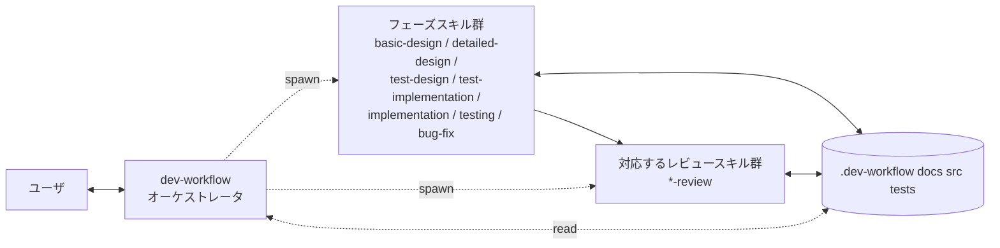
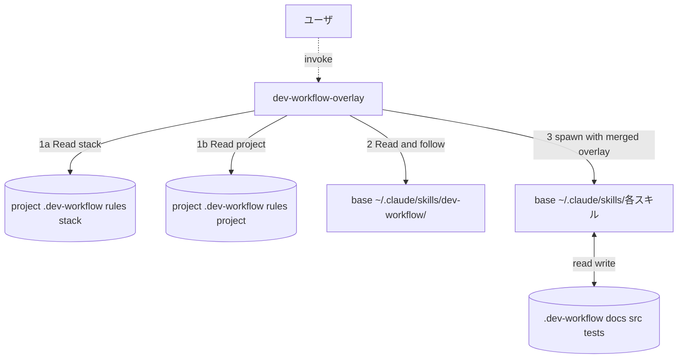

# dev-workflow スキルセット

要件定義から不具合修正までを一貫したプロセスで進めるための、Claude Code (CLI / VS Code 拡張) 向けスキル群。Cowork でも動作する (ツール名読み替えあり)。

## 特徴

- **オーケストレータ＋サブエージェント方式**: `dev-workflow` がオーケストレータとして長期コンテキストを保持し、各フェーズの実作業は **別エージェント (サブエージェント)** として spawn する。コンテキストが肥大化しにくい。
- **二段階の設計**: 全体の「基本設計」と機能ごとの「詳細設計」に分かれており、要件 → 機能 → 設計 → テスト → 実装 → 不具合修正 の流れが乱れにくい。
- **フェーズバッチ実行**: 要件が複数機能 (`F001, F002, ...`) を持つ場合、**「同じフェーズを全機能まとめて」** 進める (機能ごとに最後まで通すのではない)。同一フェーズ内で全機能の成果物が同時に揃うので、命名規約・データ型・API 形式の **横断的な一貫性** をレビューで検証でき、**共通モジュール (`COMMON`) の機会も発見** できる。
- **TDD を強制**: 詳細設計の後に必ず **テスト設計 → テストコード作成 (Red) → 実装 (Green)** の順で進む。テストコードはプロダクトコードより必ず先に書く。
- **フェーズごとの専用レビューゲート**: 各フェーズ完了直後に対応するレビュースキルが自動 spawn され、インプット (前工程の成果物) との整合や規律順守、**横断的な一貫性と共通化の機会** を検証する。**レビュー pass しない限り次フェーズに進まない**。
- **進捗の永続化**: 各機能・各タスクの状態を `.dev-workflow/` 配下の JSON / Markdown に保存。セッションが切れても続きから再開できる。サブエージェント間の引き継ぎもこのファイルを介して行う。
- **Git 統合 (commit ゲート)**: 専用ブランチ上での開始を前提とし (main/master では開始しない)、**各ゲート通過時にオーケストレータが commit を作成**。push はユーザが手動で行い、`reset` / `rebase` / `--amend` 等の履歴改変は禁止 (履歴は必ず人が確認できる状態を保つ)。
- **推測しない**: 不明点はユーザに確認する。重要度が高ければ即時、軽微なものはフェーズ末でまとめて (ハイブリッド方針)。
- **Mermaid を用いた図表**: 状態遷移、ER図、シーケンス図は Mermaid で記述。

## 構成 (Skill 2 個 + Agent 20 個)

`dev-workflow` / `dev-workflow-overlay` は **ユーザが呼ぶ Skill** (`~/.claude/skills/`)。
残り 20 個は **サブエージェント** として `Task(subagent_type="<name>")` で spawn される Agent (`~/.claude/agents/<name>/<name>.md`)。

### Skill (2 個)

| Skill                          | 役割                                                  |
| ------------------------------ | ----------------------------------------------------- |
| `dev-workflow`                 | オーケストレータ。プロジェクト全体の進行を統括 (ユーザとの長期対話、進捗判断、Agent spawn) |
| `dev-workflow-overlay`         | `dev-workflow` のラッパー。プロジェクト直下 `.dev-workflow/rules/` のプロジェクト固有ルール (必須) と `extra-phases.md` の追加フェーズを反映してベースを実行する。Agent 本体の完全上書きも `<PROJECT_ROOT>/.claude/agents/<name>.md` で可能 (Advanced) |

### Agent (20 個)

| Agent                          | 役割                                                  |
| ------------------------------ | ----------------------------------------------------- |
| `requirements`                 | 要件定義 (要件ID `R-###` 採番・受入条件の明示化・USDM 構造検証)。V字の左端 |
| `requirements-review`          | 要件定義レビュー (テスト可能性・一意性・矛盾・スコープ境界)。pass 後に human-checkpoint |
| `basic-design`                 | 基本設計 (システム全体方針 + 機能IDの確定)             |
| `basic-design-review`          | 基本設計 ↔ 要件 の整合確認                            |
| `detailed-design`              | 詳細設計 (機能ごとに UI/機能/状態/DB/シーケンスの5種)  |
| `detailed-design-review`       | 詳細設計 ↔ 基本設計 の整合確認                        |
| `test-design`                  | テスト設計ドキュメント作成 (単体/結合/E2E の3層・ケース一覧) |
| `test-design-review`           | テスト設計 ↔ 詳細設計 の網羅性確認                    |
| `test-implementation`          | テストコード作成 (実行可能な失敗テスト = TDD Red)      |
| `test-implementation-review`   | テストコード ↔ テスト設計 と Red 確認の検証           |
| `implementation`               | プロダクトコード作成 (失敗テストを Pass = TDD Green)    |
| `implementation-review`        | プロダクトコード ↔ 詳細設計 + Green 確認、勝手な変更の禁止 |
| `security-review`              | セキュリティ専門コードレビュー (implementation-review の後段ゲート)。OWASP Top 10 / CSRF・SSTI・XXE・マスアサインメント / ビジネスロジック悪用・レースコンディション・DoS / OWASP LLM Top 10 (LLM 機能がある場合) / ハードコード秘密情報・安全でない設定・セキュリティヘッダ / 依存ライブラリの既知脆弱性 / IaC・CI 設定 / `non-functional.md` のセキュリティ要件との整合を per_feature + cross で検証。Critical/High があれば fail で差し戻す |
| `testing`                      | テスト実行 Agent。層実行 (mode=initial/retry、1 回の spawn で **1 層のみ**) に加え、**確認モード (mode=red/green)** で test-implementation 直後の Red 確認 / implementation 直後の Green 確認も担う (結果は `docs/04_test_results/<FID>/<phase>-<mode>-confirmation.md`、`*-review` Agent はこれを読むだけ)。dev-workflow は `unit → integration → e2e` の順で **シリアル** に呼び、前層の `open_bugs = 0` まで次層に進めない。各層で fail が出たら bug-fix → 再 testing (mode=retry, リグレッション込み) のループ |
| `unit-test-review`             | 単体テスト結果レビュー。検証対象 = **詳細設計**。詳細設計 5 ドキュメント (functional / state / sequence / UI / DB) の全要素カバー、AAA / 1 テスト 1 観点 / モック適切性 / 分岐網羅率を判定 |
| `integration-test-review`      | 結合テスト結果レビュー。検証対象 = **基本設計**。アーキ I/F / 機能間連携 / データフロー / コンポーネント境界の網羅、実 DB / 実外部システム使用、N+1 / トランザクション境界を判定 |
| `e2e-test-review`              | E2E テスト結果レビュー。検証対象 = **要件定義書**。要件 (USDM `R-###` / ユースケース) の **100% カバー** を必須、受入条件転記、業務シナリオ、手動 E2E 再現性を判定 |
| `bug-fix`                      | 不具合修正 (原因調査→影響範囲判定とハンドオフ→前工程テスト設計＋コード追加(TDD)→コード修正→テスト実施 の5ステップ反復ループ) |
| `bug-fix-review`               | 反復ごとに 5ステップの規律違反を検証                  |
| `auto-check`                   | 機械チェックゲート。`stack-config.md` 由来の MUST/SHOULD/MAY ツール (linter / typecheck / markdownlint / カバレッジ等) を実行。MUST 失敗でフェーズ差し戻し |

通常は `dev-workflow` (Skill) を起動する。`dev-workflow` が状況を判断して上記 20 個の Agent を **`Task(subagent_type="<name>")` で spawn** する。
ユーザが特定の Agent を直接呼びたい場合 (例: 既存プロジェクトの途中から `implementation` だけ使いたい) は、Claude に「implementation Agent を spawn して」と頼めば `Task(subagent_type="implementation")` が呼ばれる。

### 人間チェックポイント (human-checkpoint)

設計フェーズの **最重要マイルストーン** では、ツールチェック (auto-check) と LLM レビュー (per_feature + cross) が全て pass しても、`dev-workflow` は次フェーズに進まず **ユーザに明示承認を求めて停止** する。

| タイミング | 対象 |
|---|---|
| `requirements-review` pass 直後 | 要件 (R-### / 受入条件 / スコープ境界) の確定 |
| `basic-design` cross review pass 直後 | 機能 ID / アーキ / NFR の確定 |
| `detailed-design` cross review pass 直後 | 全 FID の詳細設計の確定 |

#### ユーザの応答パターン

| 応答 | 動作 |
|---|---|
| `approve` / 「承認」 | `decisions.md` と `status.json (checkpoints.<phase>)` に記録 → 次フェーズへ |
| `<具体的な変更要求>` (例: 「F002 の機能定義を見直して」) | 該当 Agent を再 spawn (フィードバックを briefing に含める) → auto-check → review → 再 checkpoint |
| `skip checkpoint` (明示文字列のみ) | スキップ理由を 1 行ユーザに求め `decisions.md` に記録 → 次フェーズへ |

> 曖昧表現 (「いいかな」「飛ばして」など) は再確認されます。

#### プロジェクト単位で無効化

開発スタイル上 checkpoint が不要な場合、`<PROJECT_ROOT>/.dev-workflow/rules/project/project-config.md` に:

```markdown
## チェックポイント設定 (human-checkpoint)
- requirements: enabled
- basic-design: disabled
  - 理由: 個人プロジェクトのため
- detailed-design: enabled
```

デフォルトは 3 つとも `enabled`。

### Git 統合 (commit ゲート)

ワークフローの品質ゲートと Git 履歴を対応づける。git 操作は **オーケストレータのみ** が行う (サブエージェントは禁止)。

- **前提**: 開始時に専用ブランチ (例: `dev-workflow/<プロジェクト名>`) 上であること。`main` / `master` / `develop` 上では開始せず、ユーザに切替を依頼する
- **commit タイミング**: 各ゲート通過時 (review pass / checkpoint approve / testing layer 完了 / bug verified / 最終レポート)。メッセージは `[dev-workflow] <phase>: ...` 形式。fail → 修正中は commit しない
- **push はユーザが手動で行う** (オーケストレータは push しない)
- **履歴改変の禁止**: `git reset` / `git rebase` / `git commit --amend` / `git push --force` / 変更破棄 (`git restore` 等) は禁止。やり直しは新しい commit を積む前方修正のみ (`git revert` は可)。例外はユーザの明示指示 + `decisions.md` 記録時のみ

詳細は `skills/dev-workflow/SKILL.md` の §「Git 統合 (commit ゲート)」。

### 動作モデル



- **オーケストレータ**: ユーザとの対話、進捗の判断、サブエージェントへの自己完結ブリーフ作成
- **サブエージェント**: フレッシュなコンテキストで起動し、ブリーフと `.dev-workflow/` ファイルだけを頼りに作業
- **状態の共有**: すべてファイル経由。メモリは引き継がれない

## リポジトリ構成

このスキルセットの構成 (`$REPO_ROOT` 配下):

```
$REPO_ROOT/
├─ README.md
├─ docs/                                       # ワークフロー全体ドキュメント
│  └─ workflow-overview.md
├─ skills/                                     # Skill (ユーザ起動の入口)。~/.claude/skills/ にインストール
│  ├─ dev-workflow/
│  │  ├─ SKILL.md
│  │  └─ resources/
│  │     └─ progress/{project.json, open-questions.md, decisions.md}
│  └─ dev-workflow-overlay/
│     ├─ SKILL.md
│     └─ resources/
│        ├─ project-rules/                     # プロジェクトカスタマイズ用テンプレ群 (project 層 + 汎用 stack 雛形)
│        └─ stack-presets/                     # 言語/FW 別の stack 層プリセット集 (8 種類)
│           ├─ python-fastapi/    (7 files)
│           ├─ python-django/     (7 files)
│           ├─ go-stdlib-chi/     (7 files)
│           ├─ typescript-nextjs/ (7 files)
│           ├─ typescript-react-vite/ (7 files)
│           ├─ react-native/      (7 files)
│           ├─ java-spring-boot/  (7 files)
│           ├─ ruby-rails/        (7 files)
│           └─ README.md
└─ agents/                                     # Agent (Skill から spawn される)。~/.claude/agents/ にインストール
   ├─ requirements/{requirements.md, resources/}
   ├─ requirements-review/{requirements-review.md, resources/}
   ├─ basic-design/
   │  ├─ basic-design.md                       # frontmatter (name/description/tools/model) + system prompt
   │  └─ resources/                            # 旧 skills/basic-design/resources/ 由来
   ├─ basic-design-review/{basic-design-review.md, resources/}
   ├─ detailed-design/{detailed-design.md, resources/}
   ├─ detailed-design-review/{detailed-design-review.md, resources/}
   ├─ test-design/{test-design.md, resources/}
   ├─ test-design-review/{test-design-review.md, resources/}
   ├─ test-implementation/{test-implementation.md, resources/}    # resources 任意
   ├─ test-implementation-review/{...}
   ├─ implementation/{...}
   ├─ implementation-review/{...}
   ├─ security-review/{security-review.md, resources/}
   ├─ testing/{testing.md, resources/{scripts/, report-template.md, ...}}
   ├─ unit-test-review/{unit-test-review.md, resources/}
   ├─ integration-test-review/{integration-test-review.md, resources/}
   ├─ e2e-test-review/{e2e-test-review.md, resources/}
   ├─ bug-fix/{...}
   ├─ bug-fix-review/{...}
   └─ auto-check/{auto-check.md, resources/{scripts/, report-template.md}}
```

**インストール先 (ユーザグローバル):**
```bash
cp -R skills/*  ~/.claude/skills/
cp -R agents/*  ~/.claude/agents/
```

**Skill と Agent の役割:**
- `skills/` の中身はユーザが呼ぶ「ワークフローの入口」 (Skill カタログに自動 load される)
- `agents/` の中身は `Task(subagent_type="<name>")` で spawn される「単一責務のサブエージェント」 (Agent カタログに自動 load される)

> 旧バージョンとの互換性メモ: 旧構成では 18 個すべてが `skills/` 配下にあったが、Skill (2) と Agent (16) に分離した (その後 `security-review` / `requirements` / `requirements-review` を追加、`test-run` を `testing` に統合し、現在 Agent は 20)。古い `skills/<phase>/` 等が残っている場合は手動で削除して `~/.claude/agents/` 側に揃えること。

## 新規プロジェクトでの使い方

このリポジトリをクローンした場所 (以降 `$REPO_ROOT` と呼ぶ。例: `C:\Users\<user>\github\claudecode_settings` や `~/dev/claudecode_settings`) からスキル群をインストールし、任意の新規プロジェクトに適用する手順。

### Step 1. スキルを Claude Code から呼べる状態にする

#### A. Claude Code CLI / VS Code Claude Code 拡張 (デフォルト想定)

ベーススキル群は **`~/.claude/skills/` (ユーザグローバル) に1回だけインストール** すれば、すべてのプロジェクトから利用できる。VS Code 拡張も内部で同じ Claude Code バイナリを使うため設置場所は同じ。

> プロジェクト直下にスキル本体を置く必要はない。プロジェクトには **固有ルールだけ** を `.dev-workflow/rules/` 配下に置く (詳細は §「プロジェクト固有のカスタマイズ」参照)。

PowerShell 例 (Windows):

```powershell
# このリポジトリのクローン先 (環境に合わせて書き換え)
$RepoRoot = "$env:USERPROFILE\github\claudecode_settings"

# Skill (2 個) と Agent (20 個) をユーザグローバルに設置
$ClaudeSkills = "$env:USERPROFILE\.claude\skills"
$ClaudeAgents = "$env:USERPROFILE\.claude\agents"
New-Item -ItemType Directory -Force -Path $ClaudeSkills | Out-Null
New-Item -ItemType Directory -Force -Path $ClaudeAgents | Out-Null
Copy-Item -Recurse "$RepoRoot\skills\*" $ClaudeSkills
Copy-Item -Recurse "$RepoRoot\agents\*" $ClaudeAgents
```

bash / macOS / Linux 例:

```bash
# このリポジトリのクローン先 (環境に合わせて書き換え)
REPO_ROOT="$HOME/dev/claudecode_settings"

# Skill (2 個) と Agent (20 個) をユーザグローバルに設置
mkdir -p ~/.claude/skills ~/.claude/agents
cp -R "$REPO_ROOT/skills/"* ~/.claude/skills/
cp -R "$REPO_ROOT/agents/"* ~/.claude/agents/
```

設置後、Claude Code を起動して以下のいずれかで起動する:

- `/dev-workflow` とスラッシュコマンドで打つ
- 「dev-workflow スキルを使って開発を始めたい」と自然文で頼む

VS Code 拡張の場合: VS Code でプロジェクトフォルダを開き、Claude Code パネルを開いて同様に呼び出す。

#### B. 代替: ファイルパス直接参照 (試用向き)

スキルを設置せず、Claude Code に SKILL.md を **その場で読ませて従わせる**。サブエージェントは元々ファイルパス経由で SKILL.md を読む設計なので、オーケストレータも同じ方式で起動できる。

ユーザの最初の発話例:

```
<このリポジトリをクローンした場所>/skills/dev-workflow/SKILL.md
を読んで、その指示に従って開発ワークフローを始めてください。
プロジェクトルートは <PROJECT_ROOT> です。
```

(例: `~/dev/claudecode_settings/skills/dev-workflow/SKILL.md` や
`C:\Users\<user>\github\claudecode_settings\skills\dev-workflow\SKILL.md` のように、自分の環境のパスに置き換える)

#### C. 補足: Cowork で使う場合

Cowork は Claude Code とはスキルディレクトリが異なる:

```
%APPDATA%\Claude\local-agent-mode-sessions\skills-plugin\<your-skill-set-id>\skills\
```

実際のパスは Cowork の「スキル一覧」から確認して合わせる。ツール名の読み替えは以下:

| Claude Code (本ドキュメントの標準) | Cowork での名称       |
| ---------------------------------- | --------------------- |
| `Task`                             | `Agent`               |
| `TodoWrite`                        | `TaskCreate` / `TaskUpdate` |
| (チャットで質問)                   | `AskUserQuestion` (構造化選択肢が使える) |

SKILL.md 内ではこの読み替えを必要箇所に明記済み。

### Step 2. プロジェクトルートを準備する

以下のいずれかを用意する。

- **空のフォルダ**: 何もないフォルダから始める (要件はチャットで口頭で伝える / 後でファイル化する)
- **要件定義書だけがあるフォルダ**: `docs/requirements/requirements.md` (またはユーザが用意した任意の名前) を置いておく

`.dev-workflow/` 配下、`docs/01_basic_design/` などはオーケストレータが自動で作成するので、最初から用意する必要はない。

### Step 3. プロジェクトのディレクトリで Claude Code を起動

ターミナルでプロジェクトルートに `cd` してから `claude` を起動する:

```bash
cd /path/to/my-new-app
claude
```

VS Code 拡張の場合は、当該プロジェクトを VS Code で開き、Claude Code パネルを開く。CWD が自動的にプロジェクトルートになる。

Cowork を使う場合のみ: 画面上で対象フォルダを作業フォルダとして選択する。

### Step 4. `dev-workflow` を起動

Claude Code に最初の指示を出す。例:

```
dev-workflow スキルで新規プロジェクトを始めたい。
プロジェクト名は task-api。
要件はこの後チャットで伝えるので、聞きながら docs/requirements/requirements.md にまとめてほしい。
```

以降、オーケストレータが必要に応じてユーザに確認 (Claude Code はチャットで質問、Cowork は `AskUserQuestion` で構造化質問) しながら、基本設計 → 詳細設計 → ... と各フェーズのサブエージェントを spawn して進める。

### Step 5. セッションを再開する場合

別の日 / 別のセッションで続きをやるときは、**同じプロジェクトディレクトリで Claude Code を起動** してから、伝える。

```
dev-workflow を続けたい。.dev-workflow/project.json を読んで、現状サマリと次のアクションを教えて。
```

オーケストレータが `project.json` と各 `status.json` を読み、現フェーズ・機能ごとの進捗・未解決質問をまとめて提示する。承認すれば続きから進む。

---

## サンプルウォークスルー: タスク管理 API を作る

小規模なサンプルで、プロジェクト開始から不具合修正までの流れを示す。実際の Claude との対話例。

### 0. 想定する要件

> シンプルなタスク管理 REST API:
> - ユーザはタスクを登録・取得・完了・削除できる
> - タスクは title (必須)、description (任意)、status (open/done)、created_at を持つ
> - 認証は今回スコープ外
> - データは SQLite に永続化

### 1. プロジェクト初期化 (ユーザの最初の発話)

```
ユーザ:
  dev-workflow スキルで新規プロジェクト task-api を始めたい。
  要件は次のとおり: タスクの登録/取得/完了/削除ができる REST API。
  認証なし。データは SQLite。
  プロジェクトルート: C:\Users\<user>\projects\task-api
```

オーケストレータの応答 (概要):

```
Claude (dev-workflow):
  プロジェクトルートが指定されました。確認させてください。

  以下を確認させてください:
  - プロジェクト名: task-api でよいですか?
  - 要件はチャット入力でいいですか? それともファイルがありますか?
  - 言語/FW の希望はありますか? それとも基本設計内で確認しますか?
```

ユーザの回答後、オーケストレータが `.dev-workflow/` を初期化し、`docs/requirements/requirements.md` を書き起こしてレビューを依頼する。

### 2. 基本設計 (basic-design サブエージェント)

オーケストレータが `basic-design` を spawn:

```
Claude (オーケストレータ):
  要件が確定したので、基本設計を別エージェントで進めます。

  [Task ツールで basic-design サブエージェントを spawn]

  - サブエージェントの戻り値:
    summary: 基本設計4ドキュメントを作成。機能を3つに分割した。
    updated_files:
      - docs/01_basic_design/system-overview.md
      - docs/01_basic_design/feature-list.md
      - docs/01_basic_design/system-architecture.md
      - docs/01_basic_design/non-functional.md
      - .dev-workflow/features/F001/status.json
      - .dev-workflow/features/F002/status.json
      - .dev-workflow/features/F003/status.json
    open_questions: 言語/FW がまだ未確定 (Q002)
    next_action: ユーザに言語/FW を確認し、F001 詳細設計へ
```

機能の例:
- `F001` タスク登録
- `F002` タスク一覧取得・状態更新
- `F003` タスク削除

ここでオーケストレータが言語/FW についてユーザに確認 (例: Python 3.12 + FastAPI + SQLite に決定)。`decisions.md` に記録。

### 3. F001 詳細設計 (detailed-design サブエージェント)

```
Claude (オーケストレータ):
  F001 の詳細設計を spawn します。

  [Agent: detailed-design FID=F001]

  - 戻り値:
    summary: F001 の詳細設計5種を作成 (UI は API のみのため「該当なし」明記)。
    updated_files:
      - docs/02_detailed_design/F001/ui-design.md (API 入出力例のみ)
      - docs/02_detailed_design/F001/functional-design.md
      - docs/02_detailed_design/F001/state-transition.md (該当なし)
      - docs/02_detailed_design/F001/db-design.md  (tasks テーブル)
      - docs/02_detailed_design/F001/sequence.md   (POST /tasks 正常系/異常系)
    open_questions: title の最大文字数 (Q003)
    next_action: ユーザレビュー後 F001 テスト設計へ
```

オーケストレータが残った確認事項 (`title` 最大長など) をまとめてユーザに確認。確定後、テスト設計へ。

### 4. F001 テスト設計 (test-design サブエージェント) — ケース設計ドキュメントのみ

```
[Agent: test-design FID=F001]

戻り値:
  summary: F001 の単体/結合/E2E のテスト設計ドキュメントを作成。
  updated_files:
    - docs/03_test_design/F001/unit-test.md         (8ケース)
    - docs/03_test_design/F001/integration-test.md  (4ケース)
    - docs/03_test_design/F001/e2e-test.md          (2シナリオ)
  open_questions: なし
  next_action: F001 テストコード作成 (test-implementation) へ
```

### 5. F001 テストコード作成 (test-implementation サブエージェント) — TDD Red

設計したテストを **実行可能なコードに落とし、必ず Fail することを確認** する。

```
[Agent: test-implementation FID=F001]

戻り値:
  summary: F001 の14ケースを実コード化。全テスト Fail を確認 (Red)。
  updated_files:
    - tests/unit/F001/test_task_model.py            (4ケース)
    - tests/unit/F001/test_task_service.py          (4ケース)
    - tests/integration/F001/test_task_repository.py (3ケース)
    - tests/integration/F001/test_create_endpoint.py (1ケース)
    - tests/e2e/F001/test_create_task_flow.py        (2シナリオ)
    - docs/04_test_results/F001/unit-test-result.md (Red 確認セクション追記)
    - docs/04_test_results/F001/integration-test-result.md (Red 確認)
    - docs/04_test_results/F001/e2e-test-result.md  (Red 確認)
    - .dev-workflow/features/F001/status.json       (red_confirmed=true)
  open_questions: なし
  next_action: F001 実装 (Green 化) へ
```

主な Fail パターン:
- `ImportError: cannot import name 'TaskService' ...`
- `assert response.status_code == 201` → 404 (エンドポイント未実装)
- `assert task.title == "buy milk"` → AttributeError (モデル未定義)

これらの実行ログを `docs/04_test_results/F001/*.md` に貼り付けて Red のエビデンスとする。

### 6. F001 実装 (implementation サブエージェント) — TDD Green

既存の失敗テストを **Pass させる最小実装** を書く。

```
[Agent: implementation FID=F001 スコープ=タスク分割のみ]

戻り値:
  summary: F001 を 5タスクに分割。各タスクに tdd_target_tests を紐付け。
  updated_files:
    - .dev-workflow/features/F001/tasks/F001-T01.json (DBスキーマ → IT-F001-001..)
    - .dev-workflow/features/F001/tasks/F001-T02.json (Task モデル → UT-F001-001..004)
    - .dev-workflow/features/F001/tasks/F001-T03.json (リポジトリ層 → IT-F001-001..003)
    - .dev-workflow/features/F001/tasks/F001-T04.json (ドメインサービス層 → UT-F001-005..008)
    - .dev-workflow/features/F001/tasks/F001-T05.json (API ルータ + DI → IT-F001-004, E2E-F001-001..002)
  next_action: F001-T01 から順に Green 化
```

各タスクを1つずつ spawn (依存関係に従い直列):

```
[Agent: implementation FID=F001 スコープ=F001-T02 のみ (Task モデル)]

戻り値:
  summary: UT-F001-001..004 を Green に。リファクタも実施。
  updated_files:
    - src/models/task.py
    - .dev-workflow/features/F001/tasks/F001-T02.json (completed)
  green_confirmed_tests: [UT-F001-001, UT-F001-002, UT-F001-003, UT-F001-004]
```

各タスクは「自分のターゲットテストを Red → Green」のサイクルを回すのみ。新規テストの追加は禁止 (必要なら test-implementation に戻る)。

### 7. F001 テスト実施 (testing サブエージェント)

```
[Agent: testing FID=F001]

戻り値:
  summary: 単体/結合/E2E を実行。1件 Fail。
  updated_files:
    - docs/04_test_results/F001/unit-test-result.md
    - docs/04_test_results/F001/integration-test-result.md
    - docs/04_test_results/F001/e2e-test-result.md
    - .dev-workflow/features/F001/bugs/B001.json
    - docs/05_bug_reports/B001.md
  detected_bugs: [B001]   # title が空文字でも 201 になってしまう
  next_action: bug-fix B001
```

### 8. 不具合修正 (bug-fix サブエージェント)

5ステップ反復ループ:

```
[Agent: bug-fix BID=B001]

戻り値:
  summary: B001 を 1反復で verified に。
  iteration_count: 1
  updated_files:
    - .dev-workflow/features/F001/bugs/B001.json
    - docs/05_bug_reports/B001.md
    - docs/02_detailed_design/F001/functional-design.md  # title の必須/最小長を明記
    - docs/03_test_design/F001/unit-test.md              # UT-F001-009 を追加 (空文字 → 400)
    - src/models/task.py                                  # Pydantic で min_length=1
    - docs/04_test_results/F001/unit-test-result.md      # 反復1 の結果を追記
    - .dev-workflow/decisions.md                          # B001 設計変更を記録
  final_status: verified
  next_action: F001 のテスト実施を再走 (リグレッション含む)
```

反復のなかで:
- **Step 1**: ログを仕込んで title="" のときバリデーションが効いていないことを観察 (推測ではなく)
- **Step 2**: functional-design に title 必須/最小長を追記
- **Step 3**: 検出層 (integration) より細かい unit に新ケース `UT-F001-009` を追加 → 修正前 Fail を確認 (TDD)
- **Step 4**: Pydantic モデルに `min_length=1` を追加
- **Step 5**: 検出元 + 新規 + F001 リグレッション全件を実行 → 全 Pass → verified

オーケストレータが `B001 -> verified` を確認し、testing を再走させて F001 が完全に Pass することを確認。

### 9. 残機能と完了

F001 が完了したら、オーケストレータが `project.json` を見て次の機能 (F002) の詳細設計を spawn。同じパターンを繰り返し、F003 まで完了したら最終レポートを作成して終了。

```
ユーザ:
  全機能完了したら最終レポートも作って。

Claude (オーケストレータ):
  全機能 verified を確認。最終レポート docs/00_final_report.md を作ります。
  [Agent: 最終レポート作成]

  完了しました。機能3つ・テスト合計42ケース全 Pass・不具合は B001〜B003 (すべて verified)。
  [View 最終レポート](computer://...)
```

### 補足: 中断と再開

たとえば F002 の実装中に時間切れになった場合:

```
ユーザ:
  今日はここまで。

Claude (オーケストレータ):
  現在の状態を保存します:
  - F001: completed
  - F002: implementation 中 (F002-T03 が in_progress, notes: 「Repository.update メソッドの実装中」)
  - F003: pending
  次回は同じフォルダで「dev-workflow 続けて」と言ってください。
```

数日後:

```
ユーザ:
  dev-workflow 続けたい。

Claude (オーケストレータ):
  [.dev-workflow/project.json と各 status.json を読込]
  再開サマリ:
  - 現フェーズ: F002 implementation
  - 進行中タスク: F002-T03 (Repository.update の実装中)
  - 未解決質問: なし
  推奨次アクション: F002-T03 の続きを implementation サブエージェントで再開
  進めてよいですか?
```

---

## シナリオ別 起動プロンプト例

「ユーザが Claude に最初に何と言えばよいか」のテンプレ集。プロンプトに含めるべきキーワード (太字部分) があると、オーケストレータが正しい分岐に入りやすい。

### A. 既存プロジェクトを **改修** する

> トリガキーワード: 「**改修**」「**既存プロジェクト**」「**追加してほしい**」「**変更してほしい**」「**修正してほしい**」

オーケストレータは以下の判断を行う:
1. `PROJECT_ROOT/.dev-workflow/project.json` の有無を確認
2. ある場合 → 既存の機能ID群と進捗を引き継ぎ、影響を受ける機能だけを再フェーズに戻す
3. ない場合 → 既存コード/docs から **逆引きで最小限の基本設計と機能一覧を生成** することを提案

#### A-1. 既存機能の変更/拡張

```
dev-workflow で改修したい。
プロジェクトルート: C:\Users\<user>\projects\task-api

改修内容: 既存機能 F002 (タスク検索) を変更したい。
  現状: title の部分一致検索のみ
  変更後: title または description の部分一致 (大文字小文字無視)、
          複数キーワードで AND 検索、ページネーション対応

既存の .dev-workflow/ を読み、影響範囲 (詳細設計 / テスト設計 / テストコード / 実装) を
洗い出してから、必要なフェーズだけサブエージェントで spawn してください。
```

オーケストレータの応答 (概要):
- F002 の `phases.detailed_design.status` を `in_progress` に戻し、`functional-design.md` / `db-design.md` / `sequence.md` の差分修正を `detailed-design` サブエージェントに依頼
- 影響を受ける `test-design` → `test-implementation` → `implementation` を順次再走
- 影響を受けない他の機能 (F001, F003) は触らない
- `decisions.md` に「改修: F002 検索仕様変更」を記録

#### A-2. 新機能の追加

```
dev-workflow で機能を追加したい。
プロジェクトルート: C:\Users\<user>\projects\task-api

新機能: タスクへの複数タグ付け
  - 1タスクに 0〜10 個のタグを付けられる
  - タグでフィルタ検索できる (AND/OR)
  - タグ名は 1〜20 文字、英数字とハイフンのみ

新規機能IDとして F004 を採番してほしい。
既存機能 (F001〜F003) への影響も基本設計の段階で洗い出して。
```

オーケストレータの応答 (概要):
- `feature-list.md` に F004 を追記し、`feature-coverage` を更新
- F004 用の `.dev-workflow/features/F004/status.json` を新規作成
- 既存機能への影響 (F001 タスク作成へのタグ受付、F002 検索へのタグフィルタ等) を `feature-list.md` の依存関係に反映
- F004 を起点に `detailed-design` から TDD ループで進める

#### A-3. `.dev-workflow/` が無い既存プロジェクト (逆引きモード)

```
dev-workflow を既存プロジェクトに導入したい。
プロジェクトルート: C:\Users\<user>\projects\legacy-app

このプロジェクトには .dev-workflow/ がまだない。
既存のソースコードと docs/ を読んで、現状の機能を逆引きで F001, F002... と割り振り、
最低限の基本設計 (feature-list, system-architecture) と
各機能の status.json を「実装済み・テスト未整備」相当の状態で作ってほしい。

そのあとで、改修したい機能を一緒に決める。
```

オーケストレータの応答 (概要):
- 既存フォルダで Claude Code が起動済み (CWD = プロジェクトルート)
- `src/`, `docs/`, `tests/` を `Glob` + `Grep` で構造把握 (この調査は `Explore` サブエージェントに任せる選択も可)
- 既存機能を推定し、暫定的な `feature-list.md` ドラフトをユーザに提示してレビューを依頼
- 確定後、各機能の `status.json` を `phases.implementation.status = "completed"` 等で初期化
- `current_phase` を「改修開始」状態に

#### A-4. 不具合修正だけしたい

```
dev-workflow の bug-fix だけ使いたい。
プロジェクトルート: C:\Users\<user>\projects\task-api

報告された不具合: タスクを完了状態にしたあと再オープンできない (500 エラー)
再現手順:
  1. POST /tasks { "title": "test" } → 201
  2. PATCH /tasks/{id} { "status": "done" } → 200
  3. PATCH /tasks/{id} { "status": "open" } → 500 (期待: 200)

これを F002 配下の不具合 B007 として起票して、5ステップ反復ループで修正してほしい。
```

オーケストレータの応答 (概要):
- `B007` を起票 (`.dev-workflow/features/F002/bugs/B007.json` + `docs/05_bug_reports/B007.md`)
- `bug-fix` サブエージェントを spawn して 5ステップループ (原因調査 → 設計修正 → テスト設計＋コード修正 → コード修正 → テスト実施) を回す
- 修正後、`testing` サブエージェントで F002 のリグレッションを実行

---

### B. 要件を **USDM 形式** で入力する

> トリガキーワード: 「**USDM**」「**要求 R-**」「**仕様 S-**」「**USDM 形式の要件定義書**」

USDM (Universal Specification Describing Manner) は、清水吉男氏が提唱する要件定義書の記述スタイル。要求 (`R-###`) と仕様 (`S-###-##`) を階層化し、各項目に **理由 / 説明 / 補足** を必ず添える。

オーケストレータは USDM トリガを検出すると、以下の方針で進める:
1. 要件ファイルが指す USDM 構造 (R / S / 理由 / 説明 / 補足) を **そのまま尊重**
2. 機能ID (`F###`) を採番するときに **`R-###` との対応関係** を `feature-list.md` のトレーサビリティ表に必ず記録
3. 仕様 (`S-###-##`) は **詳細設計のサブ機能ID** や **テストケースID** にマッピング
4. 各設計判断の理由は USDM の「理由」をそのまま引用 (勝手に翻訳しない)

USDM はユーザ自身が事前に作成したファイル (Markdown / Excel / Word いずれでも可、最も扱いやすいのは Markdown) を、プロジェクトルート配下に配置してから渡すのが基本。チャットで段階的に書き起こす運用は推奨しない (推敲後の確定要件として渡すべきものなので)。

#### B-1. USDM ファイルを置いて、オーケストレータに渡す

事前にユーザがやっておくこと:
1. プロジェクトルート配下に `docs/requirements/` を作成
2. 自分で作成した USDM 形式の要件定義書を `docs/requirements/usdm.md` (またはユーザが付けた任意のファイル名) として配置
3. その状態でプロジェクトルートにて Claude Code を起動 (`cd <root> && claude` または VS Code でフォルダを開く)

その上で Claude への最初のプロンプト例:

```
dev-workflow で新規開発を始めたい。
プロジェクトルート: C:\Users\<user>\projects\inventory-app

要件は私が USDM 形式で作成済みで、下記に置いてある:
  C:\Users\<user>\projects\inventory-app\docs\requirements\usdm.md

このファイルを読み、要求 (R-###) を機能ID (F###) にマッピングし、
仕様 (S-###-##) を詳細設計のサブ機能 / テストケースに展開してほしい。

トレーサビリティ表 (feature-list.md と test-design の各表) には
USDM の R-### / S-###-## を必ず併記して、双方向に追跡できるようにすること。

USDM の「理由」フィールドは、決定事項を decisions.md に書く際に
そのまま引用して残してほしい (要約や言い換えはしない)。

USDM ファイル自体は変更しないでください (ユーザ管理)。
不明点があればこちらに質問してください。
```

オーケストレータの応答 (概要):
- 指定された USDM ファイルを Read (書き換えはしない)
- 要求の一覧 (`R-001 ... R-NNN`) と各要求の下の仕様一覧を抽出
- 暫定マッピング (USDM → 機能ID / サブ機能ID) を `feature-list.md` のドラフトとしてユーザに提示
- 例:

  | 機能ID | 機能名     | カバーする USDM 要求 ID | サブ機能ID ⇔ 仕様ID                   |
  | ------ | ---------- | ----------------------- | ------------------------------------- |
  | F001   | 在庫登録   | R-001                   | F001-1 ⇔ S-001-01 / F001-2 ⇔ S-001-02 |
  | F002   | 在庫検索   | R-002, R-003            | F002-1 ⇔ S-002-01 / F002-2 ⇔ S-003-01 |

- レビュー後、確定したマッピングを元に basic-design → detailed-design へと進む
- USDM 上の不明点 (理由が書かれていない、説明が抽象的すぎる、補足と仕様が矛盾している、など) は **勝手に解釈せず** ユーザに確認 (チャットで質問)

#### B-2. USDM ⇔ 機能ID マッピングの記録例

`feature-list.md` の **カバレッジマップ** (基本設計テンプレ既存項目) に USDM 列を追加して以下のように記す:

| 要件ID (USDM) | 要件サマリ                                     | カバーする機能 |
| ------------- | ---------------------------------------------- | -------------- |
| R-001         | 在庫アイテムを登録できる                       | F001           |
| R-002         | 在庫アイテムを SKU / 名前で検索できる          | F002           |
| R-003         | 在庫アイテムの数量を増減できる (入出庫)        | F002, F003     |
| S-001-01      | SKU の形式制約 (英数字 4〜20 文字、ユニーク)   | F001 → UT/IT   |
| S-001-02      | 商品名の必須・文字数制約                       | F001 → UT      |
| S-001-03      | 初期在庫数の型制約                             | F001 → UT      |

仕様 (`S-###-##`) は詳細設計の `functional-design.md` のサブ機能行と、テスト設計の各テストIDの「カバーする要件ID」欄から参照される。

#### B-3. USDM + 改修の組み合わせ (差分要求書を渡す)

事前にユーザがやっておくこと:
1. 改修分の要件を USDM 差分形式で記述したファイルを作成 (例: `docs/requirements/usdm-rev2.md`)
2. 差分は「追加分 / 変更分 / 削除分」の3セクションに分け、それぞれに `R-###` を振る
3. プロジェクトルート配下に配置

その上で Claude への最初のプロンプト例:

```
dev-workflow で改修したい。
プロジェクトルート: C:\Users\<user>\projects\inventory-app

私が作成した USDM 形式の差分要求書を下記に置いた:
  C:\Users\<user>\projects\inventory-app\docs\requirements\usdm-rev2.md

このファイルは「追加分」「変更分」「削除分」に分かれていて、それぞれに R-### がある。

既存の機能IDマッピング (.dev-workflow/project.json + feature-list.md) を保ったまま、
  - 追加分 → 新規 F### を採番
  - 変更分 → 既存 F### の詳細設計を更新 (該当フェーズに戻す)
  - 削除分 → 該当機能の status を deprecated に
としてほしい。

差分要求書ファイル自体は変更しないでください。
不明点はこちらに質問してください。
```

オーケストレータは差分 USDM を Read し、`feature-list.md` のマッピング表に「追加 / 変更 / 削除」列を増やして反映する。各機能の `status.json` を該当フェーズに戻し、改修フローを進める。

---

## レガシープロジェクトへの適用

既にコードベースがあり、要件定義書も設計書もない (あるいは古い) プロジェクトに本ワークフローを後付けで導入する手順。3 つの **適用方針** から選択する:

| 方針                       | 適用範囲                                                            | 向いているケース                                       |
| -------------------------- | ------------------------------------------------------------------- | ------------------------------------------------------ |
| **A. 全面逆引き**          | 既存機能をすべて `F001..Fn` として設計復元、`COMMON` も抽出          | 長期保守体制を整えたい・全コードベースを把握したい     |
| **B. 部分適用 (切り出し)** | 改修対象/不具合修正対象の機能だけ設計化、他はブラックボックス        | 段階的な品質向上、限定的リファクタ、特定領域の改善     |
| **C. 新機能のみ適用**      | 既存コードはそのまま、**追加機能だけ** workflow を適用                | 既存への影響を最小化、新機能だけ厳格に管理したい       |

選択基準: チーム/工数に余裕があるなら **A**、特定モジュールが課題なら **B**、リスクを抑えたいなら **C** から始める。後から **C → B → A** と段階的に拡大することも可能。

### 共通事前ステップ

どの方針でも最初に行う:

1. **作業ディレクトリで `dev-workflow-overlay` を起動** (Claude Code CLI または VS Code 拡張)
2. **既存資産の棚卸し** をユーザと相談:
   - `src/` (または相当する) のディレクトリ構造
   - `tests/` の有無、カバレッジ、テストフレームワーク
   - 既存ドキュメント (`README`, `docs/`, Wiki エクスポート 等) の有無
   - 規約/コーディングスタイル (lint 設定、コミット規約 等)
3. **規約抽出**: 既存コードから命名・モジュール構成・エラー処理パターン等を抜き出し、**stack 層ルール** に固める
   - 例: `tests/conftest.py` から共通フィクスチャ作法、`src/common/exceptions.py` からエラー階層 を抽出
   - これにより以降の作業が既存規約と整合する
4. **適用方針の確定**: A / B / C のどれかを選び、`.dev-workflow/decisions.md` に記録

---

### 方針 A. 全面逆引き

#### 手順

1. `dev-workflow-overlay` 起動 → 共通事前ステップ完了
2. **逆引き basic-design**: Claude が `src/`, `tests/`, 既存 `docs/` を `Glob` + `Grep` で走査し、機能を `F001..Fn` として **推定** したドラフトを `feature-list.md` に提示 (`Explore` サブエージェントに任せる選択も可)
3. ユーザがドラフトをレビュー・修正 → 確定
4. 各機能の `status.json` を **既存実装の状況に合わせた初期状態** で作成:
   - 実装済み・テスト無し → `phases.basic_design.status=completed`, `phases.implementation.status=completed`, ただし `phases.testing.status=pending` (テスト未整備として扱う)
   - 実装済み・テスト一部 → 部分的に `completed` を付ける
5. **逆引き detailed-design** を機能ごとにバッチ spawn (横断レビューも通常どおり)。既存コードを Read して 5 種ドキュメント (UI/機能/状態/DB/シーケンス) を起こす
6. 既存テストがあれば **逆引き test-design** で起こす (なければ「該当層なし」と明記)
7. 以降は通常の改修フロー (A. 既存機能の変更/拡張 や B. 新機能追加) を回せる状態になる

#### プロンプト例

```
dev-workflow-overlay スキルで、既存プロジェクトに開発ワークフローを全面適用したい。
プロジェクトルート: C:\Users\<user>\projects\legacy-shop

このプロジェクトは Python + Flask の在庫管理 API。
- src/ にコードあり
- tests/ は一部 (主要エンドポイントの結合テストだけ)
- docs/ なし、README は最小限
- .dev-workflow/ はまだ無い

手順:
1. まず src/ と tests/ をスキャンし、規約 (命名・例外階層・テスト作法) を抽出して
   .dev-workflow/rules/stack/ に stack-config.md と関連ルールを下書きしてほしい。
2. 次に既存機能を F001..Fn として逆引きし feature-list.md ドラフトを提示してほしい。
3. ドラフトをレビューしたら、各機能の status.json を実装状況に合わせて初期化してほしい
   (実装済みだがテスト未整備の機能は phases.testing=pending のままにする)。
4. その後、機能ごとに detailed-design / test-design を逆引きで起こす計画を立ててほしい。

不明点はこちらに質問してください。
```

---

### 方針 B. 部分適用 (機能切り出し)

#### 手順

1. `dev-workflow-overlay` 起動 → 共通事前ステップ完了
2. **対象機能の特定**: ユーザが「ここを改修したい」「ここに不具合がある」と指定したスコープだけ機能化
3. `feature-list.md` には対象機能 (1〜3 個) だけを `F001..` で登録。他は **「未管理」と注記** して詳細設計しない
4. 対象機能のみ逆引き detailed-design → test-design を起こす
5. 通常の改修/追加フローを進める
6. 後で別機能も同じ手順で取り込んでいける (段階的拡大)

#### プロンプト例

```
dev-workflow-overlay スキルで、既存プロジェクトの一部に開発ワークフローを適用したい。
プロジェクトルート: C:\Users\<user>\projects\legacy-shop

このプロジェクトは Python + Flask の在庫管理 API で、全体は逆引きしない。
今回適用するのは以下だけ:
- 「在庫検索」モジュール (src/inventory/search.py 周辺)
- 「在庫減算」モジュール (src/inventory/decrement.py 周辺)

手順:
1. これらのモジュール周辺の src/ と tests/ をスキャンし、規約を抽出して
   .dev-workflow/rules/stack/ に下書きしてほしい。
2. この 2 機能を F001 (在庫検索) と F002 (在庫減算) として feature-list.md に登録。
   他のモジュールは「未管理」と注記し、詳細設計しないでください。
3. F001 と F002 だけ逆引き detailed-design → test-design を起こしてほしい。
4. その後、ユーザから依頼する改修/不具合を通常のワークフローで進める。

スキャン時に対象モジュールが他のコードと依存している場合は、依存関係だけ記録し
ブラックボックス扱いで進めてください。
```

---

### 方針 C. 新機能のみ適用

#### 手順

1. `dev-workflow-overlay` 起動 → 共通事前ステップ完了
2. **既存コードは「不可触の外部」扱い**: feature-list には登録しない
3. 新規追加する機能だけ `F001..` として通常の workflow で進める (basic-design から)
4. ただし新機能が既存コードを **呼び出す/拡張する** 場合、その依存箇所だけは「既存システム I/F」として詳細設計に含める (Sequence 図で外部システム同様に表現)
5. 規約抽出 (共通事前ステップ 3) は実施しておくと、新機能が既存と整合する

#### プロンプト例

```
dev-workflow-overlay スキルで、既存プロジェクトに新機能だけ追加したい。
プロジェクトルート: C:\Users\<user>\projects\legacy-shop

このプロジェクトは Python + Flask の在庫管理 API。
既存コードには手を入れない・設計の逆引きもしない。
新機能だけを本ワークフローで厳格に作りたい。

新機能: 在庫アラート通知
  - 在庫数が閾値を下回ったら Slack に通知
  - 通知履歴を DB に保存

手順:
1. 既存 src/ をスキャンして、新機能が呼ぶ可能性のあるモジュール
   (在庫数取得 API、DB セッション、ロガー 等) と、その規約を抽出。
   抽出結果は .dev-workflow/rules/stack/ に下書きしてほしい。
2. 既存機能は feature-list に登録しない。
3. 「在庫アラート通知」を F001 として新規に basic-design から進めてほしい。
4. 既存モジュールを呼び出す箇所は、詳細設計の sequence.md で
   「既存 I/F (src/inventory/repository.py) を呼ぶ」と明記してほしい。
5. テストコード作成時、既存モジュールをスタブ/モックする方針も
   .dev-workflow/rules/stack/test-implementation.md に追記してほしい。
```

---

### レガシー適用の注意点

| 注意点                                                              | 対処                                                                    |
| ------------------------------------------------------------------- | ----------------------------------------------------------------------- |
| 既存コードに **テスト未整備** な機能がある                          | `phases.testing.status` を `pending` のまま残し、改修時に test-design から作る |
| 既存コードに **設計外の振る舞い** が多数ある                        | bug-fix 時の `undocumented_behavior` 分類で都度設計フェーズに判断させる |
| 既存規約がコード散在で **stack ルールに固めにくい**                 | 1 度に全部やらず、改修対象の機能で出てきた規約から漸進的に stack/ に追記 |
| 仕様復元で **不明点が多数** 出る                                    | `open-questions.md` に蓄積、ステークホルダーに一括確認                  |
| 既存テストの観点が **テスト設計と乖離** している                    | 既存テストはそのまま使い、test-design では「既存カバー分」として明記    |
| **依存関係が不透明** な機能 (Spaghetti)                             | 方針 B/C を選び、徐々に切り出す。一括の方針 A は最初の試行で避ける       |

---

## プロジェクト固有のカスタマイズ (Overlay)

インストール済みのベーススキル群 (`~/.claude/skills/dev-workflow/`, `~/.claude/skills/basic-design/`, … など) は **共有資産** として変更しない。プロジェクトごとの違いは、**プロジェクト直下 `.dev-workflow/rules/` にルールファイルだけ** を置くことで吸収する。これが標準パターン。

**前提のおさらい:**
- スキル本体 (SKILL.md と resources/) は **`~/.claude/skills/` に1回だけ** 配置
- プロジェクト直下には **プロジェクト固有のルールだけ** を置く (進捗状態 `.dev-workflow/` と一緒)
- ルールは **2 層** に分けて配置: `stack/` (言語/FW 共通) と `project/` (本プロジェクト固有)
- スキル本体を丸ごと上書きする「層A」は Advanced 機能 (通常は不要)

### 起動するスキルを切り替える

| 状況                                           | 起動するスキル             |
| ---------------------------------------------- | -------------------------- |
| カスタマイズなし (ベース挙動のみ)              | `dev-workflow`             |
| プロジェクト固有のルール/スキル/フェーズあり   | **`dev-workflow-overlay`** |

`dev-workflow-overlay` は `dev-workflow` のラッパー。プロジェクトルールを読み込んでから、内部でベースの dev-workflow 手順を踏襲し、サブエージェント spawn 時にルールをブリーフに重ねる。**ベース層は一切書き換えない**。

### 標準: ルールを 2 層に分けてプロジェクト直下に置く (層B)



ルールは **2 層** に分けて配置する:

| 層        | 配置先                          | 目的                                                   | 例                                        |
| --------- | ------------------------------- | ------------------------------------------------------ | ----------------------------------------- |
| `stack`   | `.dev-workflow/rules/stack/`    | 言語/フレームワーク共通 (他プロジェクトで再利用可能)   | Python+FastAPI 用、React 用 …             |
| `project` | `.dev-workflow/rules/project/`  | このプロジェクトだけの個別事情 (ドメイン用語・例外規約) | 「社内 Slack 通知形式」「監査ログ詳細」 等 |

両方の層を同時に使うことも、片方だけ使うこともできる。

#### 層B: ルールの追加/部分上書き (**標準**)

スキル丸ごと書き直さず、特定のルールだけを **追加/置き換え/無効化** したいケース。各フェーズ・各レビューに対応するルールファイルを `stack/` または `project/` 配下に置く。

各ファイルは `ADD` / `OVERRIDE` / `DISABLE` / `ADDITIONAL_ARTIFACTS` / `REVIEW_EXTRAS` の節を持つ:

```markdown
# basic-design — Project-specific rules

## ADD
- 機能IDは `F-XXXX` 形式 (ハイフン付き4桁)
- 全機能に compliance マッピングを必須化

## OVERRIDE
- 「non-functional.md」は不要。代わりに `docs/compliance/` を作成する

## DISABLE
- 「Mermaid 構成図必須」を緩和 (ASCII art も可)

## ADDITIONAL_ARTIFACTS
- docs/01_basic_design/compliance.md

## REVIEW_EXTRAS
- compliance.md が全機能をカバーしているか (basic-design-review に追加)
```

優先順位は `OVERRIDE`/`DISABLE` > `ADD` > ベース指示。矛盾は `decisions.md` に記録される。

#### 層A (Advanced): スキル本体の完全上書き — `<project>/.claude/skills/<name>/SKILL.md`

> **通常は使わない**。スキル本体ごと丸ごと書き換えたい場合のみ。

ルールの追加/上書きでは表現できない大きな変更 (例: フェーズの内部手順を全く別物にする) が必要な場合だけ、Claude Code の Agent 探索順を利用してプロジェクト直下に同名 Agent を置く:

- `<project>/.claude/agents/test-design.md` または `<project>/.claude/agents/test-design/test-design.md` を作れば、テスト設計フェーズは丸ごとそのプロジェクトローカル Agent になる (Claude Code は project 配下を優先)。
- ベース (`~/.claude/agents/test-design/`) は触らない。

この機能を使うと「Agent 本体まで読み解かないと挙動が分からない」状態になり保守性が落ちるため、可能な限り層B のルールファイルで対応すること。

### 追加フェーズ — `<project>/.dev-workflow/rules/extra-phases.md`

ベースワークフローにフェーズを **新規挿入** できる。例 (アクセシビリティ専門レビューを実装後に追加):

```
## PHASE: a11y-review
position: after security_review
skill: a11y-review
project_local: yes
gating: blocks_next_phase_on_fail
artifact_path: docs/08_a11y/<FID>/
description: 実装後にアクセシビリティ観点の専門レビューを行う
```

- 対応するスキルは `<project>/.claude/skills/a11y-review/SKILL.md` に配置
- `gating: blocks_next_phase_on_fail` ならベースのレビューゲートと同等に「pass しないと進めない」
- `gating: warn_only_on_fail` なら警告のみで進む (`decisions.md` に記録)

> **補足**: セキュリティ専門レビュー (`security-review`) は当初この extra-phase の例だったが、現在は **ベース構成の正式 Agent** に昇格済み (implementation-review の後段ブロッキングゲート)。プロジェクト側で追加定義する必要はない。観点を足したい場合は `.dev-workflow/rules/(stack|project)/security-review.md` の `REVIEW_EXTRAS` を使う。

### スタックプリセット (stack-presets) — `stack/` 層をゼロから書かずに済ませる

`stack/` 層 (言語/フレームワーク共通ルール) は、よく使うスタックについて **完成済みのプリセット** を `dev-workflow-overlay` 同梱で 8 種類用意してある。新規プロジェクト立ち上げ時は、該当プリセットを `stack/` にコピーするだけで、その技術スタック向けの規約 7 ファイルが一気に揃う。

| プリセット名               | 想定スタック                                        | 主要ツール (テスト / DB / Lint)                                        |
| -------------------------- | --------------------------------------------------- | ---------------------------------------------------------------------- |
| `python-fastapi`           | Python 3.13 + FastAPI 0.115 + SQLAlchemy 2 (async)  | pytest / pytest-asyncio / ruff / mypy --strict / uv                    |
| `python-django`            | Python 3.13 + Django 5.x + DRF                      | pytest-django / factory-boy / ruff / mypy (django-stubs)               |
| `go-stdlib-chi`            | Go 1.23 + net/http + chi v5 + sqlc                  | go test -race / testify / testcontainers-go / golangci-lint            |
| `typescript-nextjs`        | TypeScript 5.7 + Next.js 15 (App Router) + React 19 | Vitest または Jest / Playwright / ESLint / msw / Prisma                |
| `typescript-react-vite`    | TypeScript 5.7 + React 19 + Vite (SPA)              | Vitest または Jest / Playwright / TanStack Query / msw                 |
| `react-native`             | TypeScript + React Native 0.76 + Expo SDK 52        | Jest (jest-expo) / @testing-library/react-native / Maestro または Detox |
| `java-spring-boot`         | Java 21 + Spring Boot 3.4 + Spring Data JPA         | JUnit 5 / AssertJ / Mockito / Testcontainers / Spotless / Flyway       |
| `ruby-rails`               | Ruby 3.4 + Rails 8.x + Hotwire                      | RSpec / FactoryBot / Capybara + Cuprite / RuboCop / Brakeman / SimpleCov |

各プリセットは以下の 7 ファイル構成で統一されている (そのまま `.dev-workflow/rules/stack/` にコピーして使う):

```
<preset-name>/
├─ stack-config.md            ← 言語/FW/規約/CI (必ず読まれる)
├─ detailed-design.md         ← FW 固有の設計パターン
├─ test-implementation.md     ← テストランナー作法・フィクスチャ
├─ implementation.md          ← 言語慣習・エラー処理・パフォーマンス
├─ testing.md                 ← カバレッジ計測・E2E 実行
├─ implementation-review.md   ← 実装レビュー追加観点 (per_feature + cross)
├─ unit-test-review.md        ← 単体テスト結果レビュー追加観点 (per_feature + cross)
├─ integration-test-review.md ← 結合テスト結果レビュー追加観点
└─ e2e-test-review.md         ← E2E テスト結果レビュー追加観点
```

格納場所 (REPO 内 / インストール後共通):

```
$REPO_ROOT/skills/dev-workflow-overlay/resources/stack-presets/<preset-name>/
~/.claude/skills/dev-workflow-overlay/resources/stack-presets/<preset-name>/   # インストール後
```

プリセットの詳細・選び方は `stack-presets/README.md` を参照。
ここに無いスタック (例: ASP.NET Core / Kotlin Spring / Flutter) は、最も近いプリセットを丸ごとコピーして書き換える運用を推奨 (作り方も `stack-presets/README.md` に記載)。

**TypeScript 系のテストランナー選定:** `typescript-nextjs` / `typescript-react-vite` / `react-native` は Vitest / Jest を両論併記しているので、project 層 `project-config.md` で採用理由を明記する。

### 自動チェックゲート (auto-check)

各フェーズの **LLM レビューの直前** に、ツールによる **機械チェック** (`auto-check` スキル) が走る。LLM では判定できない or 判定が不安定な観点 (構文/型/lint/カバレッジ/typo/リンク切れ/重複コード/依存脆弱性) を機械的に確定させることで:

- LLM レビューが安定し、トークン消費も減る
- 仕様書・コードの低レベルな品質問題を早期に検出
- 設計意図・命名・横断一貫性など、ツールでは判定できない観点に LLM レビューが集中できる

#### 動作

```
フェーズ完了
  → auto-check (per_feature) … MUST/SHOULD/MAY を順次実行
    → MUST fail なら本フェーズに差し戻し
    → MUST pass → LLM per_feature レビュー
      → 全機能 pass → auto-check (cross) … 横断ツール (jscpd 等) があれば
        → MUST pass → LLM cross レビュー
          → pass → 次フェーズへ
```

#### ツールの 3 階層

| 階層 | 失敗時 | 用途 |
|---|---|---|
| **MUST** | フェーズ差し戻し | スタック標準の必須ツール (linter / typecheck / カバレッジ等) |
| **SHOULD** | warn のみ。LLM が判断 | 強く推奨だが project 判断で猶予あり (依存脆弱性 / 複雑度) |
| **MAY** | info のみ | 任意 (mutation testing / リンク切れ等) |

実行するコマンドは **`stack-config.md` の「自動チェック (MUST / SHOULD / MAY)」セクション** で宣言する。8 種のスタックプリセットすべてに、そのスタック向けのコマンドが事前定義されている。

#### 未インストールツールの扱い

ローカル開発でツールが入っていない場合は **skip + warn** でゲートを通す。CI 側では事前に全 MUST ツールがインストール済みである前提とする (CI 設定で担保)。

#### 横断ツール (全スタック共通、stack-presets で既定)

| ツール | 階層 | 用途 |
|---|---|---|
| markdownlint-cli2 | MUST | Markdown 構文 |
| mermaid-cli (mmdc) | MUST | Mermaid ブロックのパース検証 |
| textlint + prh | SHOULD | 日本語表記揺れ |
| typos | SHOULD | typo 検出 (高速) |
| lychee | MAY | リンク切れ検出 |
| jscpd | MAY (cross) | 重複コード検出 |
| semgrep | SHOULD | パターン静的解析 (各スタック preset で組み込み) |
| 依存脆弱性 (pip-audit / npm audit / govulncheck / OWASP / bundle audit) | SHOULD | スタック別 |

詳細は `auto-check/SKILL.md` を参照。

#### 使い方

##### 1. ツールのインストール

横断ツール (8 スタック共通) はワンセットでインストールしておけば全プロジェクトで再利用できる。

bash / macOS / Linux:

```bash
# Node 系 (markdownlint / mermaid-cli / textlint / jscpd)
npm install -g markdownlint-cli2 @mermaid-js/mermaid-cli textlint textlint-rule-preset-ja-technical-writing jscpd

# Rust 系 (typos / lychee) — cargo が必要
cargo install typos-cli lychee

# Python 系 (semgrep) — uv または pipx
pipx install semgrep
```

PowerShell (Windows):

```powershell
npm install -g markdownlint-cli2 "@mermaid-js/mermaid-cli" textlint textlint-rule-preset-ja-technical-writing jscpd
cargo install typos-cli lychee
pipx install semgrep
```

スタック別ツール (ruff / mypy / golangci-lint / gradle / bundler 等) はプロジェクトの依存マネージャ経由で導入する。各 stack-presets の `stack-config.md` の install hint (コマンドコメント `# install: ...`) を参照。

##### 2. 自動起動 (通常運用)

`dev-workflow` / `dev-workflow-overlay` を起動して開発を進めると、各フェーズ完了時に **自動で auto-check が spawn される**。ユーザの追加操作は不要。

LLM レビューの直前で auto-check が走り、結果は `docs/06_reviews/<FID>/<phase>-auto-check.md` に保存される。

##### 3. 手動実行 (デバッグ / CI 設計時)

特定フェーズの auto-check だけを試したい場合:

bash:

```bash
bash ~/.claude/agents/auto-check/resources/scripts/run-checks.sh \
  --project-root "$HOME/projects/my-app" \
  --phase implementation \
  --mode per_feature \
  --target F001
```

PowerShell:

```powershell
pwsh "$env:USERPROFILE\.claude\agents\auto-check\resources\scripts\run-checks.ps1" `
  -ProjectRoot "$env:USERPROFILE\projects\my-app" `
  -Phase implementation `
  -Mode per_feature `
  -Target F001
```

exit code:
- `0` — MUST 全 pass
- `10` — MUST fail あり
- `2` — 引数 / 設定エラー (`stack-config.md` が無い等)

##### 4. ツール存在確認

事前にどのツールが入っていないか確認したい場合:

```bash
bash ~/.claude/agents/auto-check/resources/scripts/check-tools.sh \
  markdownlint-cli2 mmdc textlint typos lychee jscpd semgrep
```

各行が `<tool>\tOK\t<version>` か `<tool>\tMISSING\t-` で出力される。

##### 5. 一時的にスキップする

`auto-check` を走らせず先に進めたい場合 (例: CI が止まる本番障害対応中):

`<PROJECT_ROOT>/.dev-workflow/decisions.md` に以下を記録すると `dev-workflow` がそのフェーズの auto-check spawn をスキップする:

```markdown
## YYYY-MM-DD: auto-check スキップ承認
- 対象: <phase> (例: implementation)
- 期間: 当該フェーズ 1 回のみ / 恒久的
- 理由: <理由>
- 承認者: <ユーザ名>
- リカバリ: CI 側で全 MUST ツールが走ることを確認済み
```

恒久的に CI 側に寄せたい場合は `project-config.md` に「auto-check は CI 側で実施」と明記し、`stack-config.md` の「自動チェック」セクションを DISABLE する。

##### 6. CI 連携

ローカルではツール未インストールでも skip + warn でゲートが通るため、**MUST ツールが必ず走ることを CI で担保する**。各 stack-presets の `stack-config.md` に書かれた MUST コマンドを GitHub Actions / GitLab CI で実行する例:

```yaml
# .github/workflows/auto-check.yml (Python+FastAPI の例)
name: auto-check
on: [pull_request]
jobs:
  check:
    runs-on: ubuntu-latest
    steps:
      - uses: actions/checkout@v4
      - uses: actions/setup-node@v4
        with: { node-version: 22 }
      - run: npm install -g markdownlint-cli2 @mermaid-js/mermaid-cli
      - run: pip install uv
      - run: uv sync --frozen
      - run: markdownlint-cli2 "**/*.md" "#node_modules"
      - run: uv run ruff check .
      - run: uv run ruff format --check .
      - run: uv run mypy src
      - run: uv run pytest --cov=src --cov-branch --cov-fail-under=80
```

##### 7. レポートの読み方

auto-check 実行後、以下に Markdown レポートが生成される:

| mode | パス |
|---|---|
| per_feature | `docs/06_reviews/<FID>/<phase>-auto-check.md` |
| cross | `docs/06_reviews/cross/<phase>-auto-check.md` |

レポートには **サマリ表 (MUST/SHOULD/MAY × 実行/pass/fail/skipped)**、各コマンドの **exit code・実行時間・出力先頭 50 行**、**判定 (PASS/FAIL)** が記録される。LLM レビューはこのレポートを読んで SHOULD warning や MAY info を判断する。

### 導入手順

1. プロジェクト直下に `.dev-workflow/rules/` ディレクトリを作る
2. **stack 層** はスタックに合うプリセットを `stack-presets/<preset-name>/` から **丸ごと** `.dev-workflow/rules/stack/` にコピー (前節の表から選ぶ)
3. **project 層** は `project-rules/` から `project-config.md` を中心に、必要なフェーズ別ルールファイルをコピーして編集
4. コピーした各ファイルの `ADD` / `OVERRIDE` / `DISABLE` 等を、プロジェクト実態に合わせて編集
5. (必要なら) `<project>/.claude/skills/<name>/SKILL.md` で完全上書きするスキルを追加
6. (必要なら) `project/extra-phases.md` に追加フェーズを定義
7. Claude Code への起動時、`dev-workflow` ではなく **`dev-workflow-overlay`** を呼ぶ

PowerShell 例 (Python+FastAPI プロジェクトの場合):

```powershell
$ProjectRoot = "$env:USERPROFILE\projects\my-app"
$RepoRoot    = "$env:USERPROFILE\github\claudecode_settings"   # クローン先に合わせて書き換え
$StackDir    = "$ProjectRoot\.dev-workflow\rules\stack"
$ProjectDir  = "$ProjectRoot\.dev-workflow\rules\project"
$Presets     = "$RepoRoot\skills\dev-workflow-overlay\resources\stack-presets"
$Templates   = "$RepoRoot\skills\dev-workflow-overlay\resources\project-rules"

# 2 層のディレクトリを作成
New-Item -ItemType Directory -Force -Path $StackDir   | Out-Null
New-Item -ItemType Directory -Force -Path $ProjectDir | Out-Null

# stack 層: プリセットを丸ごとコピー (Python+FastAPI の例)
$Preset = "python-fastapi"   # ← 適用したいプリセット名に置換
Copy-Item "$Presets\$Preset\*.md" $StackDir

# project 層 (本プロジェクト固有) のテンプレをコピー
Copy-Item "$Templates\project-config.md" $ProjectDir
Copy-Item "$Templates\basic-design.md"   $ProjectDir     # ドメイン固有の機能分割規約
Copy-Item "$Templates\extra-phases.md"   $ProjectDir     # プロジェクト固有の追加フェーズがあれば
```

bash 例:

```bash
PROJECT_ROOT="$HOME/projects/my-app"
REPO_ROOT="$HOME/github/claudecode_settings"
STACK_DIR="$PROJECT_ROOT/.dev-workflow/rules/stack"
PROJECT_DIR="$PROJECT_ROOT/.dev-workflow/rules/project"
PRESETS="$REPO_ROOT/skills/dev-workflow-overlay/resources/stack-presets"
TEMPLATES="$REPO_ROOT/skills/dev-workflow-overlay/resources/project-rules"

mkdir -p "$STACK_DIR" "$PROJECT_DIR"

# stack 層: プリセットを丸ごとコピー
PRESET="python-fastapi"
cp "$PRESETS/$PRESET"/*.md "$STACK_DIR/"

# project 層
cp "$TEMPLATES/project-config.md" "$PROJECT_DIR/"
cp "$TEMPLATES/basic-design.md"   "$PROJECT_DIR/"
cp "$TEMPLATES/extra-phases.md"   "$PROJECT_DIR/"
```

ルールが何もないプロジェクトでは `dev-workflow-overlay` を呼んでも素のベースと同じ動作なので、常に overlay を起動する運用も可。

### 優先順位まとめ

| 優先 | 種類                                                                                                       |
| ---- | ---------------------------------------------------------------------------------------------------------- |
| 高   | `<project>/.claude/skills/<name>/SKILL.md` (層A 完全上書き — **Advanced 通常は使わない**)                   |
|      | `<project>/.dev-workflow/rules/project/<phase>.md` の `OVERRIDE` / `DISABLE` (層B project — **標準**)       |
|      | `<project>/.dev-workflow/rules/project/<phase>.md` の `ADD` / `ADDITIONAL_ARTIFACTS` (層B project)          |
|      | `<project>/.dev-workflow/rules/stack/<phase>.md` の `OVERRIDE` / `DISABLE` (層B stack)                      |
|      | `<project>/.dev-workflow/rules/stack/<phase>.md` の `ADD` / `ADDITIONAL_ARTIFACTS` (層B stack)              |
| 低   | ベース `~/.claude/skills/<name>/SKILL.md`                                                                  |

矛盾するルールがある場合は上位が勝ち、決定の経緯は `<project>/.dev-workflow/decisions.md` に記録される。
**通常は層B (ルールファイル) で要件を満たせる**。層A を使う前にまず層B (stack または project) で表現できないか検討する。
両層の `ADD` は **両方適用** (加算)、`OVERRIDE` / `DISABLE` の矛盾は project が勝つ。

### 起動プロンプト例 (overlay 使用時)

```
dev-workflow-overlay スキルで開発を始めたい。
プロジェクトルート: C:\Users\<user>\projects\inventory-app

プロジェクト固有ルールを .dev-workflow/rules/ 配下に 2 層 (stack/ と project/) で配置済み。
ベースのワークフローはそのまま、stack/ と project/ の両層のルールを合成して
(project が stack より優先) 進めてほしい。
要件は docs/requirements/usdm.md にある。
```

---

## プロジェクト側のディレクトリ構造

```
<PROJECT_ROOT>/
├─ .dev-workflow/              # 進捗・状態 (スキル群が読み書き)
│  ├─ project.json
│  ├─ open-questions.md
│  ├─ decisions.md
│  └─ features/
│     └─ <FID>/
│        ├─ status.json
│        ├─ tasks/<TID>.json
│        └─ bugs/<BID>.json
├─ docs/
│  ├─ requirements/            # 要件定義書
│  ├─ 01_basic_design/         # 基本設計
│  ├─ 02_detailed_design/<FID>/ # 詳細設計
│  ├─ 03_test_design/<FID>/     # テスト設計 (ケース一覧)
│  ├─ 04_test_results/<FID>/    # Red 確認ログ + テスト実行結果
│  ├─ 05_bug_reports/           # 不具合票
│  └─ 06_reviews/               # レビュー票 (各フェーズ・各反復)
│     ├─ basic-design-review.md
│     └─ <FID>/<phase>-review.md
├─ .dev-workflow/rules/         # プロジェクト固有ルール (overlay 使用時の標準・2 層構造)
│  ├─ stack/                    # 言語/フレームワーク共通ルール (他プロジェクトで再利用可能)
│  │  ├─ stack-config.md
│  │  ├─ <phase>.md             # ADD/OVERRIDE/DISABLE 等
│  │  ├─ <phase>-review.md      # レビュー追加チェック
│  │  └─ extra-phases.md
│  └─ project/                  # このプロジェクトだけの固有ルール
│     ├─ project-config.md
│     ├─ <phase>.md
│     ├─ <phase>-review.md
│     └─ extra-phases.md
│
│ ※ 通常はこの .dev-workflow/rules/ にプロジェクト固有のルールを置くだけでよい。
│   スキル本体は ~/.claude/skills/ にインストール済みのものを使う。
│   スキルそのものを丸ごと上書きしたい場合のみ (Advanced)、後述の
│   <PROJECT_ROOT>/.claude/skills/<name>/SKILL.md を置く。
├─ tests/                       # 自動テストコード (test-implementation が生成)
│  ├─ unit/<FID>/
│  ├─ integration/<FID>/
│  └─ e2e/<FID>/
└─ src/                         # 実装コード (プロジェクト構成に従う)
```

## ID 規約

| 種別       | 形式                  | 例              |
| ---------- | --------------------- | --------------- |
| 機能       | `F<連番3桁>`          | `F001`          |
| タスク     | `<FID>-T<連番2桁>`    | `F001-T01`      |
| 単体テスト | `UT-<FID>-<連番3桁>`  | `UT-F001-001`   |
| 結合テスト | `IT-<FID>-<連番3桁>`  | `IT-F001-001`   |
| E2E        | `E2E-<FID>-<連番3桁>` | `E2E-F001-001`  |
| 不具合     | `B<連番3桁>`          | `B001`          |
| 画面       | `S<連番3桁>`          | `S001`          |

## ワークフロー全体像

詳しい流れは [docs/workflow-overview.md](./docs/workflow-overview.md) を参照。

```mermaid
flowchart TD
    Req[要件定義書] --> BD[basic-design]
    BD --> BDR{basic-design-review}
    BDR -->|fail| BD
    BDR -->|pass| FL[機能一覧 F001 F002 F003 COMMON]

    FL --> DDBatch[detailed-design 全機能 並行 spawn]
    DDBatch --> DDR1{detailed-design-review per_feature}
    DDR1 -->|fail| DDBatch
    DDR1 -->|all pass| DDR2{detailed-design-review cross}
    DDR2 -->|fail| DDBatch
    DDR2 -->|pass| TDBatch[test-design 全機能 並行]
    TDBatch --> TDR1{test-design-review per_feature}
    TDR1 -->|fail| TDBatch
    TDR1 -->|all pass| TDR2{test-design-review cross}
    TDR2 -->|fail| TDBatch
    TDR2 -->|pass| TIBatch[test-implementation TDD Red 並行]
    TIBatch --> TIR1{test-implementation-review per_feature}
    TIR1 -->|fail| TIBatch
    TIR1 -->|all pass| TIR2{test-implementation-review cross}
    TIR2 -->|fail| TIBatch
    TIR2 -->|pass| ImplBatch[implementation COMMON先行 各機能 TDD Green]
    ImplBatch --> IR1{implementation-review per_feature}
    IR1 -->|fail| ImplBatch
    IR1 -->|all pass| IR2{implementation-review cross 重複検出}
    IR2 -->|fail| ImplBatch
    IR2 -->|pass| SR1{security-review per_feature<br/>OWASP/秘密情報/設定}
    SR1 -->|fail| ImplBatch
    SR1 -->|all pass| SR2{security-review cross<br/>依存脆弱性/横断一貫性}
    SR2 -->|fail| ImplBatch
    SR2 -->|pass| TestBatch[testing layer=unit→integration→e2e<br/>各層 直列 全機能 並行]
    TestBatch --> TR1{<layer>-test-review per_feature<br/>(unit / integration / e2e)}
    TR1 -->|fail| TestBatch
    TR1 -->|all pass| TR2{<layer>-test-review cross}
    TR2 -->|fail| TestBatch
    TR2 -->|pass no fail| Final[最終レポート]
    TR2 -->|pass with fail| Bug[bug-fix 5ステップ反復]
    Bug --> BFR{bug-fix-review}
    BFR -->|fail| Bug
    BFR -->|pass_but_open| Bug
    BFR -->|pass_and_verified| TestBatch
```

**レビューは 2 段ゲート:**
1. **個別レビュー (per_feature)**: 機能ごとに並行 spawn。per-feature 内の整合を確認。全機能 pass を待つ
2. **横断レビュー (cross)**: 全機能まとめて 1 回 spawn。命名統一・データ型整合・共通化機会を検証

両方 pass しないと次フェーズに進めない。

## 進捗状態の値

| 値             | 意味                                  |
| -------------- | ------------------------------------- |
| `pending`      | 未着手                                |
| `in_progress`  | 着手中                                |
| `completed`    | 完了                                  |
| `blocked`      | ブロック中 (open-questions 等で停滞)   |

## 制約と注意

- スキル群は **言語非依存** で設計されているため、実装フェーズで使う言語/フレームワーク/テストランナーはプロジェクト固有。`basic-design` の `system-architecture.md` または `decisions.md` で必ず決めること。
- 設計ドキュメントは Markdown + Mermaid のみ。Word 等への変換は別途行う想定。
- セッションが切り替わった場合、まず `.dev-workflow/project.json` を読むこと。スキルの状態はメモリではなくこのファイルにある。
