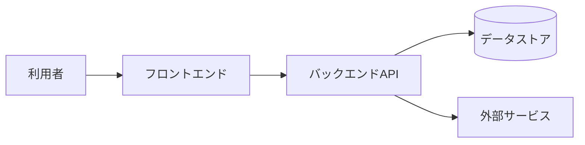

# システムアーキテクチャ (System Architecture)

## 1. 全体構成図

## 2. 構成要素一覧

| 要素 | 役割 | 採用技術(候補) | 備考 |
| ---- | ---- | -------------- | ---- |
|      |      |                |      |

## 3. 外部システム連携

| 連携先 | 目的 | プロトコル | 認証方式 |
| ------ | ---- | ---------- | -------- |
|        |      |            |          |

## 4. 配置 (Deployment)
- 環境構成 (Dev/Stg/Prod) や実行基盤に関する基本方針。

## 5. データの流れ

## 6. アーキテクチャ上の決定 (ADR)
| 番号 | 決定内容 | 理由 | 代替案 |
| ---- | -------- | ---- | ------ |
| ADR-001 |          |      |        |
