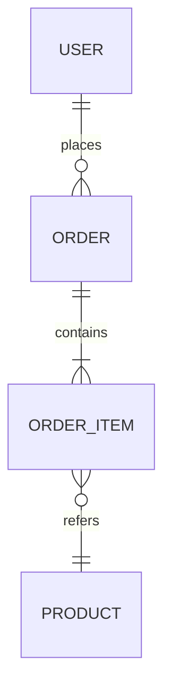

# DB設計 — {{機能ID}} {{機能名}}

> 永続化を伴わない機能の場合、「該当なし」と明記する。
> インメモリ/キャッシュのみの場合もデータ構造として記述する。

## 1. ER図

## 2. テーブル一覧

| テーブル名 | 論理名 | 用途 |
| ---------- | ------ | ---- |
|            |        |      |

## 3. テーブル定義

### 3.1 {{テーブル名}}

| カラム名 | 論理名 | 型 | NOT NULL | PK | FK | デフォルト | 説明 |
| -------- | ------ | -- | -------- | -- | -- | ---------- | ---- |
| id       | ID     |    | yes      | PK |    |            |      |

#### インデックス
| 名前 | 種類 | 対象カラム | 補足 |
| ---- | ---- | ---------- | ---- |
|      |      |            |      |

#### 制約
- 一意制約:
- チェック制約:

## 4. データライフサイクル
- 作成 / 更新 / 削除 / アーカイブ条件。論理削除有無。保持期間。

## 5. 移行・初期データ
- 初期データの有無、マイグレーション方針。
