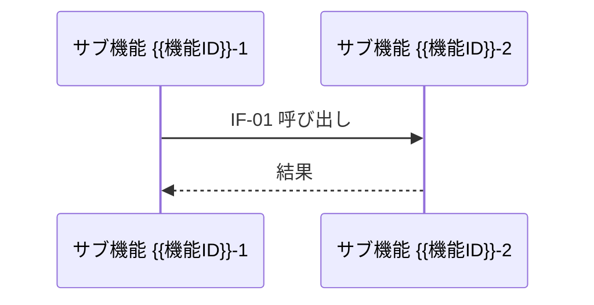
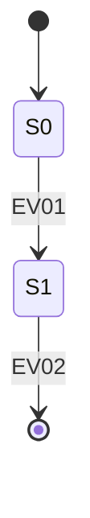

# 詳細設計 — {{機能ID}} {{機能名}}

> 本書は「サブ機能の定義」を軸とした詳細設計書である。
> **コードは書かない** (処理内容は文章・表・箇条書き・図で記述する)。
> 該当しない章は削除せず「該当なし」と理由を明記する。

## 1. 概要

- 機能の目的・スコープ・前提条件を記述する。
- 基本設計 (`feature-list.md` の対象機能行) との対応を1〜2行で示す。

## 2. 上位ドキュメントと詳細設計内のトレーサビリティ

上位ドキュメント (要件定義・基本設計) の各項目が、本書のどのサブ機能・章でカバーされるかを示す。

| 上位ID (要件ID / 仕様ID / 機能ID) | 上位ドキュメント:箇所 | 本書の対応箇所 (サブ機能ID / 章) |
| --------------------------------- | --------------------- | -------------------------------- |
| R-001                             |                       | {{機能ID}}-1 (§5.1)              |

- 上位項目で本書がカバーしないものがあれば「対象外」と理由を明記する。

## 3. サブ機能一覧

| サブ機能ID | 名称 | 概要 | 対応上位ID |
| ---------- | ---- | ---- | ---------- |
| {{機能ID}}-1 |    |      |            |

## 4. サブ機能関連図

サブ機能間の呼び出し・データの流れを Mermaid で図示する。

```mermaid
flowchart LR
    SF1[{{機能ID}}-1 xxx] --> SF2[{{機能ID}}-2 yyy]
    SF2 --> SF3[{{機能ID}}-3 zzz]
```

- 外部 (他機能・外部システム) との関連もこの図に含める。

## 5. サブ機能詳細

> サブ機能ごとに1節。**処理内容を定義する。コードは書かない。**

### 5.1 {{機能ID}}-1 {{サブ機能名}}

- **目的**:
- **入力**:

| 入力ID | 入力名 | 型 | 必須 | 制約 |
| ------ | ------ | -- | ---- | ---- |
| IN-01  |        |    | yes  |      |

- **出力**:

| 出力ID | 出力名 | 型 | 補足 |
| ------ | ------ | -- | ---- |
| OUT-01 |        |    |      |

- **処理内容** (文章・箇条書き・表で記述):
  1.
  2.
- **例外・エラー処理**:

| エラーID | 条件 | 振る舞い | 通知 |
| -------- | ---- | -------- | ---- |
| E001     |      |          |      |

## 6. インタフェース定義

> サブモジュール間の I/F 定義。**関数型と入出力、処理内容のみ。コードは書かない。**

| I/F ID | 名称 | 提供元 → 利用元 | 関数型 (シグネチャ表記) | 入力 | 出力 | 処理内容 (1〜3行) |
| ------ | ---- | --------------- | ----------------------- | ---- | ---- | ----------------- |
| IF-01  |      | {{機能ID}}-1 → {{機能ID}}-2 | `name(arg: 型) -> 戻り型` |  |  |  |

- 事前条件・事後条件・エラー時の戻り値規約があれば I/F ごとに補足する。

## 7. シーケンスパターン一覧

| パターンID | パターン名 | 契機 (トリガ) | 関与サブ機能 / I/F | 分類 (正常系/異常系) |
| ---------- | ---------- | ------------- | ------------------ | -------------------- |
| SQ01       |            |               |                    | 正常系               |

- 正常系だけでなく、代表的な異常系 (エラー・タイムアウト・リトライ) を必ず1つ以上含める。

## 8. シーケンス図

> §7 の各パターンにつき1図。Mermaid `sequenceDiagram` で描く。

### SQ01 — {{パターン名}}



- リトライ・冪等性・タイムアウト・トランザクション境界などの補足を必ず書く。

## 9. 状態定義、状態遷移図、状態遷移イベント定義

> 状態を持たない場合は「該当なし (状態は単一)」と明記する。
> 状態を持つ対象 (エンティティ・ジョブなど) ごとに以下を1セット作成する。

### 9.1 状態定義

| 状態ID | 状態名 | 意味 |
| ------ | ------ | ---- |
| S0     |        |      |

### 9.2 状態遷移イベント定義

| イベントID | イベント名 | 発生条件 |
| ---------- | ---------- | -------- |
| EV01       |            |          |

### 9.3 状態遷移図



### 9.4 状態遷移表

| From → To | トリガ (イベントID) | ガード条件 | アクション |
| --------- | ------------------- | ---------- | ---------- |
| S0 → S1   | EV01                |            |            |

### 9.5 不変条件 (Invariants)

- どの状態でも成立し続けるべき条件を箇条書きする。
