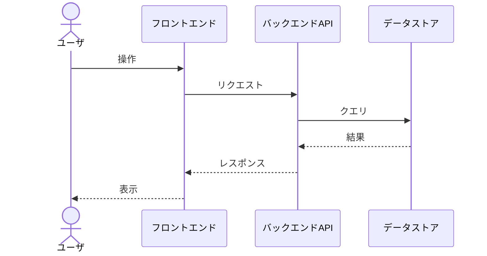
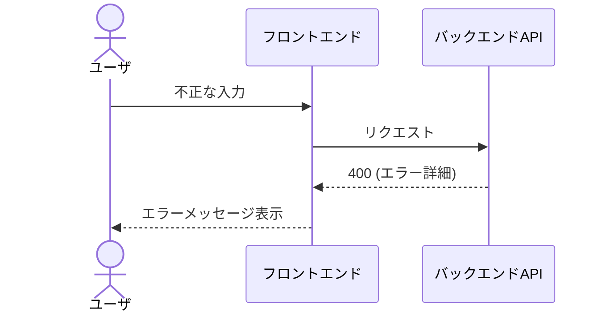

# 処理シーケンス — {{機能ID}} {{機能名}}

> 主要なユースケースごとに1つシーケンス図を作成する。
> 正常系だけでなく、代表的な異常系も必ず1つ以上記述する。

## 1. ユースケース一覧

| ID | ユースケース名 | アクター | 概要 |
| -- | -------------- | -------- | ---- |
| UC01 |              |          |      |

## 2. シーケンス図

### UC01 — 正常系

### UC01 — 異常系 (バリデーション失敗)

## 3. 補足
- リトライ・冪等性・タイムアウトに関する考慮事項。
- トランザクション境界。
