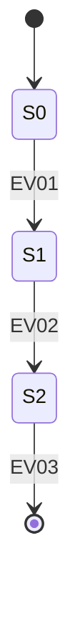

# 状態遷移 — {{機能ID}} {{機能名}}

> 状態を持つ対象(画面、エンティティ、ジョブなど)ごとに 1セクション作成する。

## 1. 状態一覧

| 状態ID | 状態名 | 意味 |
| ------ | ------ | ---- |
| S0     |        |      |

## 2. イベント一覧

| イベントID | イベント名 | 発生条件 |
| ---------- | ---------- | -------- |
| EV01       |            |          |

## 3. 状態遷移図

## 4. 状態遷移表

| From → To | トリガ | ガード条件 | アクション |
| --------- | ------ | ---------- | ---------- |
| S0 → S1   | EV01   |            |            |

## 5. 不変条件 (Invariants)
- どの状態でも成立し続けるべき条件を箇条書きする。
