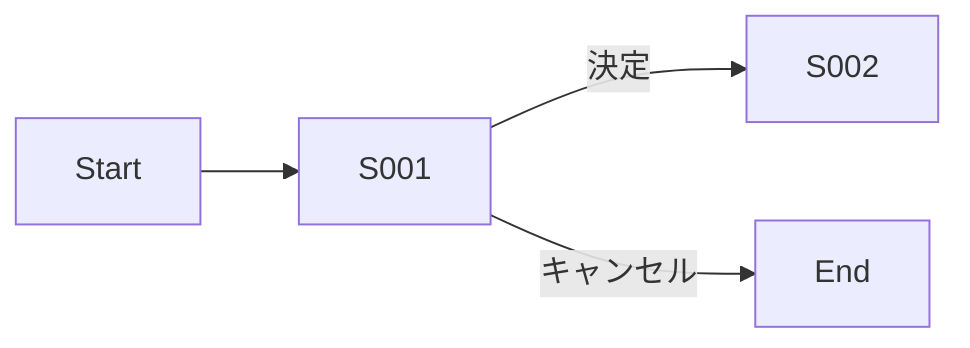

# UI設計 — {{機能ID}} {{機能名}}

> バックエンドのみの機能の場合、本書は「該当なし」と明記し、入出力(CLI/APIのリクエストレスポンス例)を簡潔に書く。

## 1. 画面一覧

| 画面ID | 画面名 | 用途 | 関連ユースケース |
| ------ | ------ | ---- | ---------------- |
| S001   |        |      |                  |

## 2. 画面別詳細

### S001 {{画面名}}

#### 2.1 ワイヤーフレーム (テキストモック)
```
+-----------------------------------+
|  ヘッダー                          |
+-----------------------------------+
|  メイン領域                        |
|                                   |
+-----------------------------------+
```

#### 2.2 表示項目

| 項目ID | 表示名 | 種別 | 必須 | 初期値 | 制約 |
| ------ | ------ | ---- | ---- | ------ | ---- |
| I001   |        | text | yes  |        |      |

#### 2.3 操作・遷移

| 操作ID | 操作 | 起点 | 条件 | 動作 | 遷移先 |
| ------ | ---- | ---- | ---- | ---- | ------ |
| A001   |      |      |      |      |        |

#### 2.4 バリデーション

| 対象項目 | ルール | エラーメッセージ |
| -------- | ------ | ---------------- |
|          |        |                  |

#### 2.5 表示メッセージ

| メッセージID | 種別 | 文面 | 表示タイミング |
| ------------ | ---- | ---- | -------------- |
| M001         |      |      |                |

## 3. 画面遷移図


