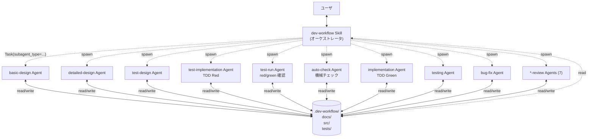
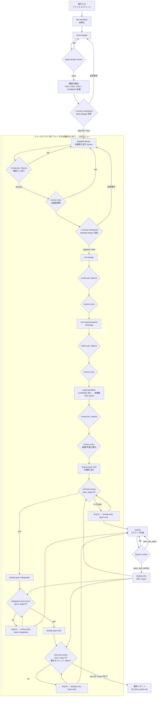
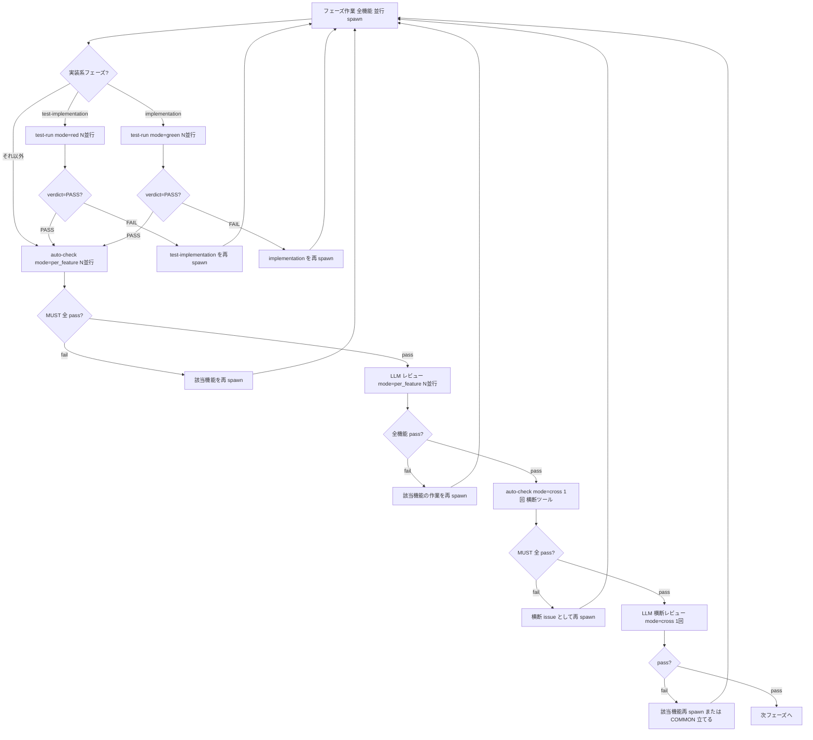
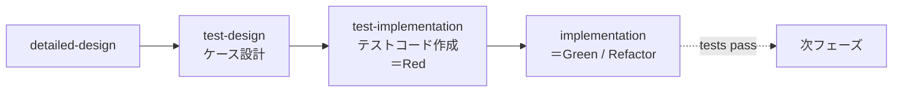
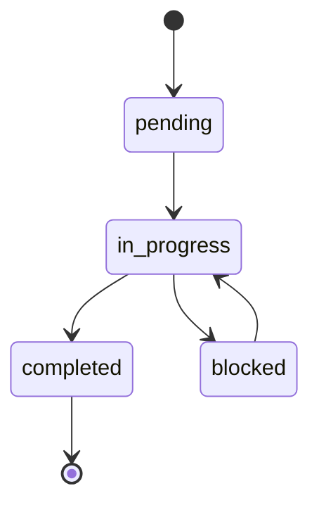

# ワークフロー全体像

## エージェント構成 (Skill 2 個 + Agent 16 個)

ユーザは Skill `dev-workflow` (または `dev-workflow-overlay`) を起動する。Skill が「メイン Claude」として動き、各フェーズの作業を Agent (`~/.claude/agents/<name>/<name>.md`) に `Task(subagent_type="<name>")` で委譲する。



- **Skill** (`~/.claude/skills/dev-workflow/`, `~/.claude/skills/dev-workflow-overlay/`) はメイン Claude にロードされ、ユーザと長期対話する。設計ドキュメントやコードは原則書かない。
- **Agent** (`~/.claude/agents/<name>/<name>.md`) は **フレッシュコンテキスト** で起動し、frontmatter (`tools`, `model`) と body (system prompt) に従って単一タスクを遂行。
- ブリーフは「今回のスコープ + 既知の前提」だけを渡す (手順は Agent の system prompt に組み込み済み)。
- 状態の引き継ぎはすべて `.dev-workflow/` ファイル経由。

## 人間チェックポイント (human-checkpoint)

設計フェーズの **最重要マイルストーン** では、auto-check と LLM レビューが全て pass しても **dev-workflow は次フェーズに進まず、ユーザに明示承認を求めて停止する**。

| タイミング | 対象 |
|---|---|
| `basic-design` cross review pass 直後 | プロジェクト全体 (機能ID / アーキ / NFR の確定) |
| `detailed-design` cross review pass 直後 | 全 FID の詳細設計の確定 |

ユーザの応答による分岐:
- **approve** → `decisions.md` と `status.json (checkpoints.<phase>)` に記録、次フェーズへ
- **変更要求** → 該当 Agent を再 spawn (フィードバックをブリーフに含める)、再 review → 再 checkpoint
- **`skip checkpoint`** (明示文字列のみ) → 理由を 1 行ユーザに求めて `decisions.md` に記録、次フェーズへ

詳細は `dev-workflow/SKILL.md` の §「人間チェックポイント」を参照。

## 全体フロー



**重要なポイント:**
- フェーズはバッチで進む (機能ごとに最後まで通さない)
- **testing フェーズは特殊**: `unit → integration → e2e` の **3 層シリアル** で進行。前層の全機能で `open_bugs = 0` になるまで次層を開始しない (詳細は §「testing フェーズの 3 層シリアル化」)
- 各フェーズは全機能の作業が揃ってから **auto-check (機械チェック) → 個別レビュー (per_feature, 並行) → 横断レビュー (cross, 1回)** の **3 段ゲート** を通って初めて次フェーズへ
- **auto-check** はツール (markdownlint / mermaid-cli / linter / typecheck / カバレッジ等) を MUST/SHOULD/MAY の 3 階層で実行する機械チェック。MUST が pass しなければ LLM レビューに進まない
- 個別レビューは「per-feature 内の整合」を、横断レビューは「機能間の一貫性と共通化機会」をそれぞれ集中して検証
- 改修・新機能追加で1機能だけ進める場合も同じフロー (バッチ対象が1機能になるだけで、cross も自動的に縮退)

## testing フェーズの 3 層シリアル化

testing フェーズは **層ごとに厳密にシリアル** に進む (`unit → integration → e2e`)。
各層で **fail が出たら bug-fix で全解消するまで次層に進まない**。これは「単体テストで根本欠陥があるまま結合・E2E を走らせない」ためのゲート。

```
[Layer 1: 単体]
  testing (layer=unit, mode=initial)
    → auto-check → <layer>-test-review (per_feature → cross) — layer ごとに専用 review Agent (unit-test-review / integration-test-review / e2e-test-review)
    → open_bugs > 0?
        → yes → bug-fix → testing (layer=unit, mode=retry, 全実行) → 再判定
        → no  → 次層へ
[Layer 2: 結合]
  testing (layer=integration, mode=initial) → ... (同じ流れ)
[Layer 3: E2E]
  testing (layer=e2e, mode=initial) → ... (同じ流れ)
→ 全 3 layer で open_bugs=0 で testing 完了
```

各 layer の bug-fix → 再 testing は **mode=retry** で同じ layer の全テストをリグレッション込みで再走する (部分実行禁止)。
不具合票には `found_in_test_layer = unit | integration | e2e` が記録され、bug-fix-review pass 後は **検出された layer** の testing に戻る。

## ゲートの動作 (test-run → auto-check → per_feature → cross)

各フェーズ完了直後、LLM レビューの前段で **test-run (実装系のみ) → auto-check → per_feature → cross** の順に走る。test-run は実装系フェーズ (test-implementation / implementation) でのみ spawn される。



- **test-run** は単一責務スキル: 対象機能のテストを走らせ Red/Green 状態だけを確認。`docs/04_test_results/<FID>/<phase>-<mode>-confirmation.md` に出力
- これにより `test-implementation-review` / `implementation-review` は **自分でテスト実行しなくてよい** (test-run の結果を Read するだけ)
- **auto-check** はテスト実行 *以外* の機械チェック (lint / typecheck / カバレッジ等) を担当
- **未インストールツール / コマンド未定義** は skip + warn (ローカル開発は止まらない、CI 側で担保)
- 横断スキャン系ツール (jscpd / lychee 等) がない場合、cross モードの auto-check は skip 可

## TDD の規律

詳細設計の後、プロダクトコードを書くより前に必ずテストコードを書く。



- `test-implementation` のゴール: 全テストが **必ず Fail** することを確認 (Red)
- `implementation` のゴール: 失敗テストを **最小実装で Pass** させる (Green)、その後 Refactor
- `implementation` の中で **新規テストを書くことは禁止** (必要なら test-implementation か bug-fix に戻る)

## bug-fix の5ステップ反復ループ (設計差し戻し型)

**bug-fix は設計を直接編集しない**。設計変更が必要な場合は該当設計フェーズ (`basic-design` / `detailed-design`) に差し戻し、そこの 2 段レビュー (per_feature + cross) を通って初めて設計が確定。bug-fix は調整役。


**Step 2 の分類と差し戻し先:**

| 分類                            | 差し戻し先                                  |
| ------------------------------- | ------------------------------------------- |
| `code_bug_only`                 | なし (Step 3 へ)                            |
| `design_error_detailed`         | `detailed-design`                           |
| `design_error_basic`            | `basic-design`                              |
| `undocumented_behavior`         | 該当設計フェーズで「入れるべきか」判断       |
| `requirements_misinterpretation`| `basic-design` (必要なら要件もユーザ確認)    |

**前工程テスト設計修正の適用ルール (Step 3):**

| 検出層 | 補強対象の前工程層 |
|--------|--------------------|
| unit | なし。スキップ可 |
| integration | unit |
| e2e | unit と integration |

反復が 5 回を超えても解消しない不具合 (特に差し戻しが繰り返される場合) は、設計の根本欠陥の可能性が高い → ユーザにエスカレーション。

## フェーズと成果物の対応

| フェーズ                 | 成果物のパス                                                    | 形式 |
| ------------------------ | --------------------------------------------------------------- | ---- |
| 要件入力                 | `docs/requirements/requirements.md`                             | md   |
| 基本設計                 | `docs/01_basic_design/{system-overview, feature-list, system-architecture, non-functional}.md` | md + Mermaid |
| 詳細設計 (機能毎)        | `docs/02_detailed_design/<FID>/{ui-design, functional-design, state-transition, db-design, sequence}.md` | md + Mermaid |
| テスト設計 (機能毎)      | `docs/03_test_design/<FID>/{unit-test, integration-test, e2e-test}.md` | md   |

### テスト 3 層と設計 3 層の対応 (test-design / test-design-review の中核ルール)

| テスト層 | 検証対象 (インプット)    | 確認すること                                          |
| -------- | ------------------------ | ---------------------------------------------------- |
| 単体     | **詳細設計** 5 ドキュメント | 機能内部の振る舞いが詳細設計どおりに動くこと          |
| 結合     | **基本設計** 4 ドキュメント | 機能間連携・アーキ要件が基本設計どおりに繋がること   |
| E2E      | **要件定義書** (USDM `R-###` / ユースケース) | システムが要件を満たすこと (要件カバレッジ 100% 必須) |

`test-design-review` はこの 3 層対応の網羅と双方向トレーサビリティを必須項目として判定する。
| テストコード (機能毎)    | `tests/{unit,integration,e2e}/<FID>/...` (プロジェクト固有)    | コード |
| Red 確認ログ (機能毎)    | `docs/04_test_results/<FID>/*.md` の Red 確認セクション         | md   |
| 実装                     | `src/...` (プロジェクト固有)                                   | コード |
| テスト実行 (機能毎)      | `docs/04_test_results/<FID>/{unit-test-result, integration-test-result, e2e-test-result}.md` | md   |
| 不具合票                 | `docs/05_bug_reports/B<番号>.md`                               | md   |
| レビュー票               | `docs/06_reviews/<basic | <FID>/<phase>>-review.md`            | md   |

## 進捗管理ファイル

```
.dev-workflow/
├─ project.json             # プロジェクト全体の進捗 (current_phase, features 配列)
├─ open-questions.md        # 未解決の確認事項
├─ decisions.md             # 確定した決定事項
└─ features/
   └─ <FID>/
      ├─ status.json        # 機能ごとのフェーズ状態
      ├─ tasks/<TID>.json   # 実装タスクごとの状態
      └─ bugs/<BID>.json    # 不具合ごとの状態
```

## セッション間の継続のしかた

1. ユーザが `dev-workflow` を再度起動
2. スキルが `.dev-workflow/project.json` を Read
3. 各機能の `status.json` を Read
4. `open-questions.md` の open 項目を読み上げ
5. **再開サマリ** をユーザに提示し、次のアクションを確認
6. 適切なフェーズスキルに引き継ぐ

## 確認のハイブリッド方針

| 確認タイミング   | 対象                                                                |
| ---------------- | ------------------------------------------------------------------- |
| **即時**         | 要件の解釈、アーキ選定、機能スコープ、DB既存データ影響、セキュリティ、設計外の実装判断 |
| **チェックポイント (フェーズ末)** | カバレッジ目標、軽微なUI挙動、エラーメッセージ文言、コードスタイルなど |

いずれも質問する前に必ず `open-questions.md` に追記する。回答が確定したら `decisions.md` に転記する。

## ID 採番ルールの実装メモ

- 機能ID: `basic-design` が連番採番。`project.json` の `features` 配列順 + 1。
- タスクID: `implementation` が機能ごとに採番。`<FID>-T<連番2桁>`。
- 不具合ID: `testing` が **プロジェクト全体で一意** に採番。`project.json` の `next_bug_id` カウンタを参照・更新。
- テストID: `test-design` が機能ごと層ごとに採番。

## 状態の遷移ルール (簡易版)



- `blocked` は `open-questions.md` で未解決の質問待ちなどで使う。
- 中断時は `in_progress` のまま `notes` を残す (`blocked` ではない)。
