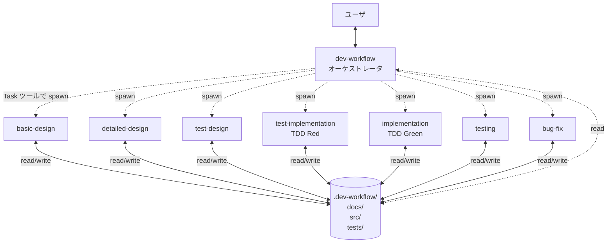
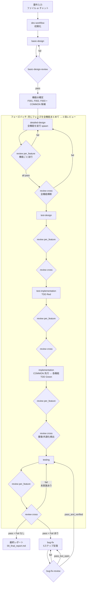
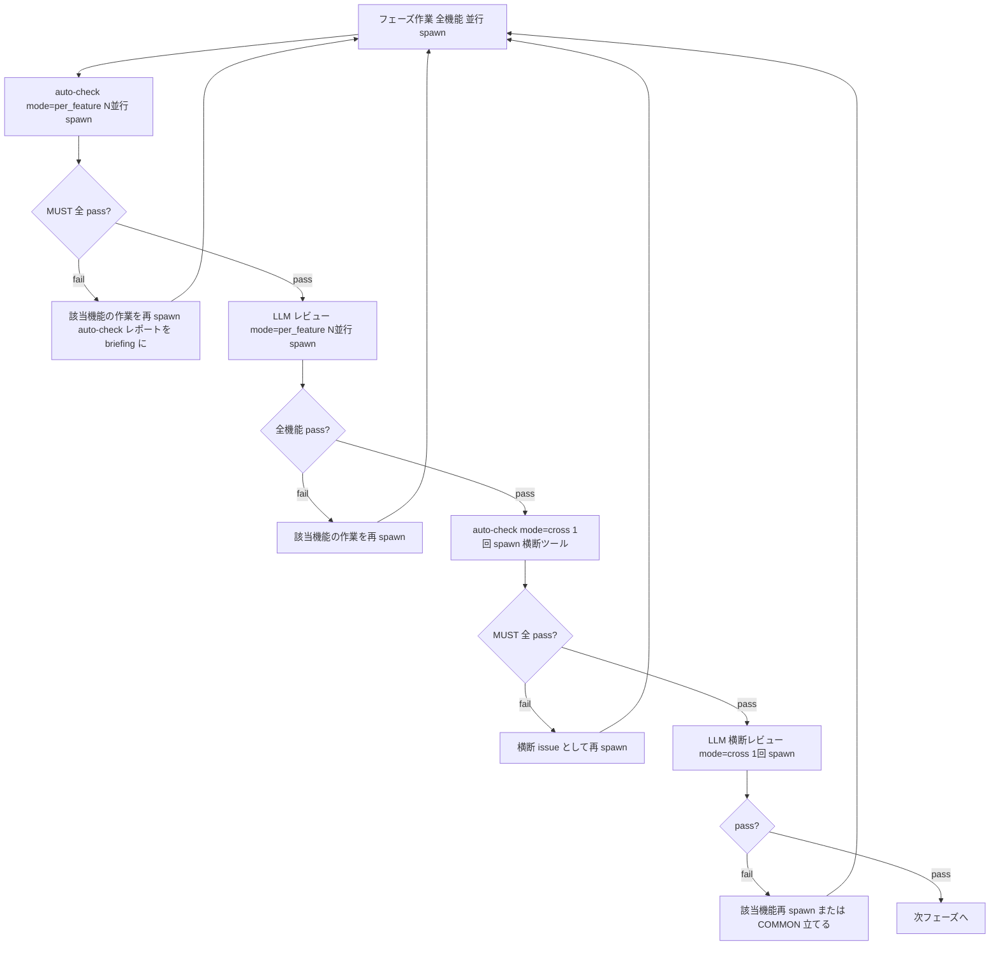
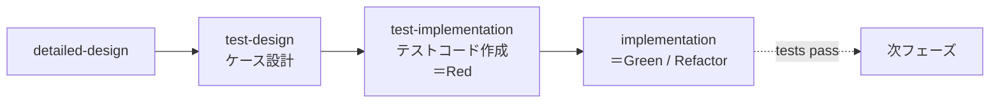
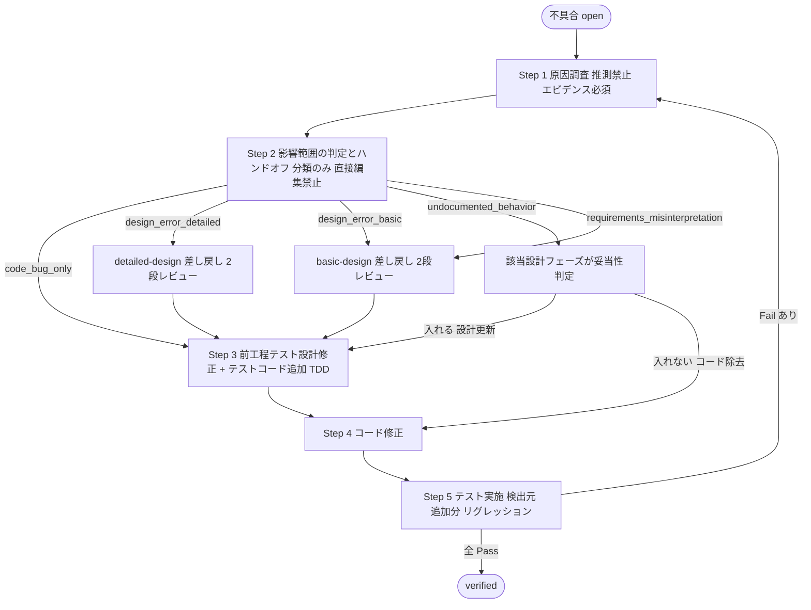
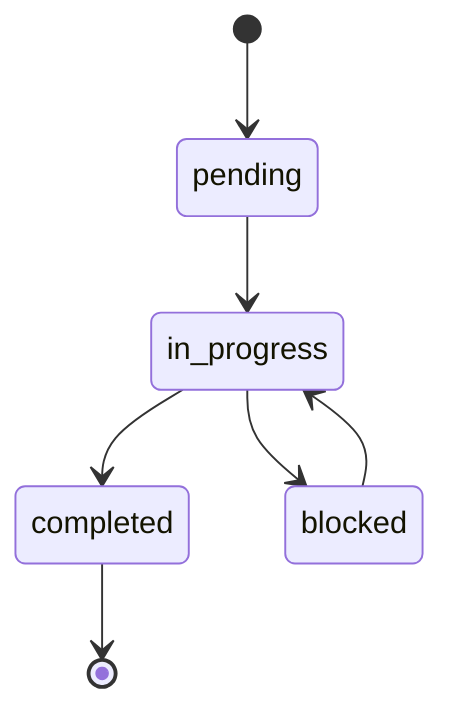

# ワークフロー全体像

## エージェント構成



- オーケストレータはユーザとの長期対話を担当。設計ドキュメントやコードは原則書かない。
- 各サブエージェントは **フレッシュコンテキスト** で起動し、必要情報をブリーフとファイルから取得して作業する。
- 状態の引き継ぎはすべて `.dev-workflow/` ファイル経由。

## 全体フロー



**重要なポイント:**
- フェーズはバッチで進む (機能ごとに最後まで通さない)
- 各フェーズは全機能の作業が揃ってから **auto-check (機械チェック) → 個別レビュー (per_feature, 並行) → 横断レビュー (cross, 1回)** の **3 段ゲート** を通って初めて次フェーズへ
- **auto-check** はツール (markdownlint / mermaid-cli / linter / typecheck / カバレッジ等) を MUST/SHOULD/MAY の 3 階層で実行する機械チェック。MUST が pass しなければ LLM レビューに進まない
- 個別レビューは「per-feature 内の整合」を、横断レビューは「機能間の一貫性と共通化機会」をそれぞれ集中して検証
- 改修・新機能追加で1機能だけ進める場合も同じフロー (バッチ対象が1機能になるだけで、cross も自動的に縮退)

## 3 段ゲートの動作 (auto-check → per_feature → cross)

各フェーズ完了直後、LLM レビューの前段に必ず **auto-check** が走る。



- **auto-check 自体は新規スキル** (`~/.claude/skills/auto-check/`) として配置
- 走るツールは `<PROJECT_ROOT>/.dev-workflow/rules/stack/stack-config.md` の「自動チェック (MUST / SHOULD / MAY)」セクションで宣言 (stack-presets が提供するスタックごとのプリセットを使うのが標準)
- 未インストールツールは **skip + warn** で扱われ、ゲートは止まらない (本来 fail すべきだったケースは CI 側で検出する前提)
- 横断スキャン系ツール (jscpd / lychee 等) がない場合、cross モードの auto-check は skip 可

## TDD の規律

詳細設計の後、プロダクトコードを書くより前に必ずテストコードを書く。



- `test-implementation` のゴール: 全テストが **必ず Fail** することを確認 (Red)
- `implementation` のゴール: 失敗テストを **最小実装で Pass** させる (Green)、その後 Refactor
- `implementation` の中で **新規テストを書くことは禁止** (必要なら test-implementation か bug-fix に戻る)

## bug-fix の5ステップ反復ループ (設計差し戻し型)

**bug-fix は設計を直接編集しない**。設計変更が必要な場合は該当設計フェーズ (`basic-design` / `detailed-design`) に差し戻し、そこの 2 段レビュー (per_feature + cross) を通って初めて設計が確定。bug-fix は調整役。



**Step 2 の分類と差し戻し先:**

| 分類                            | 差し戻し先                                  |
| ------------------------------- | ------------------------------------------- |
| `code_bug_only`                 | なし (Step 3 へ)                            |
| `design_error_detailed`         | `detailed-design`                           |
| `design_error_basic`            | `basic-design`                              |
| `undocumented_behavior`         | 該当設計フェーズで「入れるべきか」判断       |
| `requirements_misinterpretation`| `basic-design` (必要なら要件もユーザ確認)    |

**前工程テスト設計修正の適用ルール (Step 3):**

| 検出層 | 補強対象の前工程層 |
|--------|--------------------|
| unit | なし。スキップ可 |
| integration | unit |
| e2e | unit と integration |

反復が 5 回を超えても解消しない不具合 (特に差し戻しが繰り返される場合) は、設計の根本欠陥の可能性が高い → ユーザにエスカレーション。

## フェーズと成果物の対応

| フェーズ                 | 成果物のパス                                                    | 形式 |
| ------------------------ | --------------------------------------------------------------- | ---- |
| 要件入力                 | `docs/requirements/requirements.md`                             | md   |
| 基本設計                 | `docs/01_basic_design/{system-overview, feature-list, system-architecture, non-functional}.md` | md + Mermaid |
| 詳細設計 (機能毎)        | `docs/02_detailed_design/<FID>/{ui-design, functional-design, state-transition, db-design, sequence}.md` | md + Mermaid |
| テスト設計 (機能毎)      | `docs/03_test_design/<FID>/{unit-test, integration-test, e2e-test}.md` | md   |
| テストコード (機能毎)    | `tests/{unit,integration,e2e}/<FID>/...` (プロジェクト固有)    | コード |
| Red 確認ログ (機能毎)    | `docs/04_test_results/<FID>/*.md` の Red 確認セクション         | md   |
| 実装                     | `src/...` (プロジェクト固有)                                   | コード |
| テスト実行 (機能毎)      | `docs/04_test_results/<FID>/{unit-test-result, integration-test-result, e2e-test-result}.md` | md   |
| 不具合票                 | `docs/05_bug_reports/B<番号>.md`                               | md   |
| レビュー票               | `docs/06_reviews/<basic | <FID>/<phase>>-review.md`            | md   |

## 進捗管理ファイル

```
.dev-workflow/
├─ project.json             # プロジェクト全体の進捗 (current_phase, features 配列)
├─ open-questions.md        # 未解決の確認事項
├─ decisions.md             # 確定した決定事項
└─ features/
   └─ <FID>/
      ├─ status.json        # 機能ごとのフェーズ状態
      ├─ tasks/<TID>.json   # 実装タスクごとの状態
      └─ bugs/<BID>.json    # 不具合ごとの状態
```

## セッション間の継続のしかた

1. ユーザが `dev-workflow` を再度起動
2. スキルが `.dev-workflow/project.json` を Read
3. 各機能の `status.json` を Read
4. `open-questions.md` の open 項目を読み上げ
5. **再開サマリ** をユーザに提示し、次のアクションを確認
6. 適切なフェーズスキルに引き継ぐ

## 確認のハイブリッド方針

| 確認タイミング   | 対象                                                                |
| ---------------- | ------------------------------------------------------------------- |
| **即時**         | 要件の解釈、アーキ選定、機能スコープ、DB既存データ影響、セキュリティ、設計外の実装判断 |
| **チェックポイント (フェーズ末)** | カバレッジ目標、軽微なUI挙動、エラーメッセージ文言、コードスタイルなど |

いずれも質問する前に必ず `open-questions.md` に追記する。回答が確定したら `decisions.md` に転記する。

## ID 採番ルールの実装メモ

- 機能ID: `basic-design` が連番採番。`project.json` の `features` 配列順 + 1。
- タスクID: `implementation` が機能ごとに採番。`<FID>-T<連番2桁>`。
- 不具合ID: `testing` が **プロジェクト全体で一意** に採番。`project.json` の `next_bug_id` カウンタを参照・更新。
- テストID: `test-design` が機能ごと層ごとに採番。

## 状態の遷移ルール (簡易版)



- `blocked` は `open-questions.md` で未解決の質問待ちなどで使う。
- 中断時は `in_progress` のまま `notes` を残す (`blocked` ではない)。
