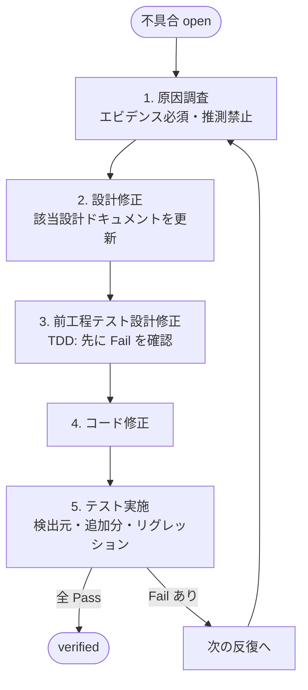

# bug-fix — 不具合修正スキル

## サブエージェント実行前提

このスキルは原則 `dev-workflow` オーケストレータから **別エージェント (サブエージェント) として spawn される** ことを想定する。

重要:
- コンテキストはフレッシュ。必要情報はブリーフとファイルから取得すること。
- 1回の spawn で扱う不具合は、ブリーフで明示された **1件のみ** が標準。
- 状態は必ず `.dev-workflow/features/<FID>/status.json` と `bugs/<BID>.json` に書き戻す。
- 修正により詳細設計が変わる場合は `docs/02_detailed_design/<FID>/` も更新し `decisions.md` に追記する。
- 作業終了時は以下を返す: `summary` / `updated_files` / `open_questions` / `next_action` / `blockers`。戻り値に **対象 bug_id と最終 status と反復回数** を含めること。
- 重要度 high の不明点 (特に設計外の判断) は即時 ユーザに確認 (チャットで質問)。

## 役割

不具合1件につき、以下の **5ステップを1反復として実施** する。テスト実施で Fail が残った場合、次の反復に進む。



## 不具合のライフサイクル (拡張版)

| status            | 意味                                                    |
| ----------------- | ------------------------------------------------------- |
| `open`            | 起票直後・未着手                                        |
| `investigating`   | 反復中。原因調査または設計/テスト/コード修正の途中      |
| `fixed`           | 修正コード投入済み・テスト実施前                        |
| `verified`        | 反復のテスト実施で全 Pass・検証完了                     |
| `closed`          | リリース可能 (基本 verified と等価。運用フラグ用)       |

## 成果物

- `docs/05_bug_reports/B<番号>.md` (反復ごとにセクション追記)
- `.dev-workflow/features/<FID>/bugs/B<番号>.json` (反復ログを構造化保存)
- `docs/02_detailed_design/<FID>/...` (設計修正があった場合)
- `docs/03_test_design/<FID>/...` (テスト設計修正があった場合)
- `docs/04_test_results/<FID>/...` (検証結果を追記)
- `decisions.md` (設計判断を追記)

---

## 手順

### Step 0 : 対象不具合の選定

1. `status.json` の `phases.bug_fix.open_bugs` を読む。
2. 重要度順 (`critical → high → medium → low`)・依存関係を踏まえ、着手対象を1件確定。
3. その `bug.json` を読み、現在の `iteration_count` と最新反復の `sub_phases` を把握 (途中再開対応)。
4. 新しい反復を開始する場合は `bug.json` の `iterations[]` に新エントリを追加し `iteration_count` を +1。

ステータスを `investigating` に更新。

---

### Step 1 : 原因調査 (Investigation) — **推測禁止 / エビデンス必須**

**絶対にやらないこと:**
- ログを見ずに「たぶんここが原因」と決めつける
- スタックトレースの最後の行だけ見て直す
- 1回の再現で原因を断定する (タイミング/データ依存の見落としを防ぐ)

**必ずやること:**
1. **再現** を行う。最低1回は実環境/テスト環境で再現させる。
   - 再現できない場合は「再現条件の絞り込み」を行う (環境差・データ依存・並行性・タイミング)
   - それでも再現しない時は **絶対に「再現不可」でクローズしない**。`open-questions.md` に追記しユーザに確認。
2. **デバッグの仕掛け** を入れる (最低1つは実施):
   - 関連箇所にログ出力を追加 (`print` / `logger.debug` / `console.log` 等)
   - デバッガでブレークポイントを置いて変数を観察
   - スタックトレース全体を取得
   - DB クエリログ / HTTP リクエスト/レスポンスをキャプチャ
   - テストランナーの詳細出力を取得
3. **観察結果を採取** する。実際のログ出力・変数値・スタックトレースを bug.json の `iterations[i].sub_phases.investigation.evidence[]` と bug-report.md の「観察結果」セクションに **生のテキストで** 残す。
4. **Root Cause を特定** する。観察結果から導かれる原因をファイル名:行番号レベルで指定。
5. **検証**: `is_speculation = false` にできるか自問する。「これは推測ではなく観察に基づく」と言い切れること。言い切れないなら追加調査。

**デバッグコードの後始末:**
- 一時的に追加したデバッグログ等は、コード修正フェーズが終わるまでは残してよいが、最終的なコミットには含めないこと。
- 「観測のためにここを変えた」場所は `code_fix` の `changed_files` から除外しておく。

`bug.json` 更新:
```
iterations[i].sub_phases.investigation:
  status = "completed"
  method = "log_injection | debugger | trace | query_log | ..."
  debug_artifacts = ["<追加したログのスニペットや出力ファイルパス>"]
  evidence = ["<観察結果テキスト>"]
  root_cause = "<観察に基づく原因>"
  is_speculation = false
```

bug-report.md の「1. 原因調査」セクションも同じ内容を埋める。

---

### Step 2 : 原因箇所の設計修正 (Design Fix)

不具合の原因に応じて以下に分岐:

| 原因の種類                                            | 設計修正の要否 |
| ----------------------------------------------------- | -------------- |
| 設計どおりに実装したが設計自体が誤り                  | **必須**       |
| 設計に記載がない振る舞いをコードで実装していた        | **必須** (設計に追記)  |
| 設計どおりだが実装にバグがあった                      | 不要 (理由を記録) |
| 仕様の見落とし (要件解釈ミス)                         | 基本設計から確認 → 必須 |

設計修正が必要な場合:

1. 影響を受けるドキュメントを特定:
   - `docs/02_detailed_design/<FID>/functional-design.md`
   - `docs/02_detailed_design/<FID>/state-transition.md`
   - `docs/02_detailed_design/<FID>/db-design.md`
   - `docs/02_detailed_design/<FID>/sequence.md`
   - `docs/02_detailed_design/<FID>/ui-design.md`
   - 影響が大きい場合は `docs/01_basic_design/*.md`
2. **設計の変更点が広範囲にわたる場合は必ずユーザに即時確認** (チャットで質問)。
3. 該当ドキュメントを Edit で更新。
4. `decisions.md` に「B<番号>: 設計変更の判断と理由」を追記。

`bug.json` 更新:
```
iterations[i].sub_phases.design_fix:
  status = "completed"
  applicable = true | false
  updated_design_files = ["..."]
  summary = "<変更の要点>"
```

設計修正不要の場合は `applicable = false` とし `summary` に理由を記載。

---

### Step 3 : 前工程テスト設計の修正 + テストコード追加 (Test Design & Code Fix) — **必ず TDD**

**前工程の定義:**
不具合の検出層より **左側 (より細かい層)** がそれにあたる。

| 検出層        | 前工程テスト層            | 該当する設計ドキュメント                                  |
| ------------- | ------------------------- | --------------------------------------------------------- |
| `unit`        | (なし)                    | このステップはスキップ可                                  |
| `integration` | `unit`                    | `docs/03_test_design/<FID>/unit-test.md`                  |
| `e2e`         | `unit` + `integration`    | `unit-test.md` と `integration-test.md` の両方            |

なぜか:
- 検出層より細かい層で検出できなかった → その層のテスト設計とテストコードが不十分だった → 補強する
- 同じ性質の不具合の **再発を防ぐ網** が現状の設計に欠けている

#### 手順 (テスト設計 → テストコードの順に、必ず両方更新する)

1. **適用範囲を確定**: 上の表に従い、補強する層を決める。
2. **テスト設計ドキュメントを更新**: ステップ2で更新した設計に整合するテストケースを追加/修正する。
   - 新規ケースIDを採番 (`UT-<FID>-NNN` または `IT-<FID>-NNN`)
   - 既存ケースの観点修正でも可
3. **テストコードを書く (test-implementation と同じ TDD Red 規律で)**:
   - ステップ2で追加/修正したテストケースに対応する **実行可能なテストコード** をテストツリーに追加
   - 新規ケースIDが関数名/コメントで対応づけられていること
4. **TDD の手順を厳密に守る**:
   - **(a) 修正前のコード** で、追加/修正したテストを実行 → **Fail することを必ず確認**
   - これにより「テスト自体がバグの再発を検出できる」ことを保証
   - Fail しなかった場合: テストケース自体が不十分なので、観点を強化してやり直す
5. テスト実行ログを `docs/04_test_results/<FID>/<該当層>-result.md` に **「TDD 確認」セクションとして追記**。
6. 既存層のテストコード本体だけ追加した場合も、`docs/03_test_design/<FID>/*.md` のテスト一覧に必ず反映 (設計とコードのトレーサビリティ維持)。

スキップ条件:
- 検出層が `unit` で、それより細かい層が定義上存在しない場合
- 設計上「この機能は当該層をテスト不要」と決定済み (該当する `decisions.md` 参照)

`bug.json` 更新:
```
iterations[i].sub_phases.test_design_fix:
  status = "completed"
  applicable = true | false
  applicable_layers = ["unit", "integration"]
  updated_test_design_files = ["docs/03_test_design/..."]
  added_test_code_paths = ["tests/unit/F001/test_xxx.py", ...]
  new_test_case_ids = ["UT-F001-008", ...]
  red_confirmed = true
  summary = "<追加観点とコードの要点>"
```

スキップする場合は `applicable = false` と理由を記載。

---

### Step 4 : コード修正 (Code Fix)

1. ステップ2の設計と、ステップ3で追加したテストを満たす最小の修正を行う。
2. 仮に投入したデバッグログ・一時コードは取り除く (ステップ1の `debug_artifacts` を参考に)。
3. ローカルで該当ファイルの単体テストを軽く回し、致命的な壊れ方をしていないか確認。
4. 大規模変更を伴う場合 (アーキ変更、データ移行を含むなど) は **必ずユーザに即時確認**。

`bug.json` 更新:
```
iterations[i].sub_phases.code_fix:
  status = "completed"
  changed_files = ["src/...", ...]
  summary = "<変更の要点>"
```

---

### Step 5 : テスト実施 (Verification)

以下の順で実行し、すべての結果を記録する:

1. **検出元のテスト** (`found_in_test_case_id`)
2. **ステップ3で追加・修正したテスト** (今回の反復で TDD 用に書いたケース)
3. **同一機能のリグレッション全件** (`docs/03_test_design/<FID>/*.md` の全テスト)
4. **横断的影響範囲のテスト** (該当時): 設計修正が他機能に波及する場合、その機能のテストも実行

結果を `docs/04_test_results/<FID>/<層>-result.md` に **反復番号付きで追記**。

`bug.json` 更新:
```
iterations[i].sub_phases.test_execution:
  status = "completed"
  executed_test_ids = [...]
  pass_count = N
  fail_count = M
  failed_test_ids = [...]
  result_doc = "docs/04_test_results/<FID>/..."

iterations[i].ended_at = "<ISO8601>"
iterations[i].result = "pass" if fail_count == 0 else "fail"
```

#### 反復判定 (5ステップ完了時)

各反復 (5ステップ1セット) が終わったら、戻り値で **「bug-fix-review を spawn してほしい」** とオーケストレータに伝える。本スキル単独で `verified` に進めることは禁止 (レビューゲート)。

bug-fix-review の判定に従い:

- **`pass_and_verified`** (全項目 OK かつ `fail_count == 0`):
  - 反復終了
  - `bug.json` の `status = "verified"`, `verified_at = 現在時刻`
  - `regression_test_cases` に Step 3 で追加したテストIDを記録
  - `status.json` の `open_bugs` から `closed_bugs` へ移動

- **`pass_but_open_iteration`** (規律 OK だが `fail_count > 0`):
  - `bug.json` の `status` は `investigating` のまま
  - **次の反復を開始**: `iterations[]` に新エントリを追加し Step 1 へ
  - 反復 #2 以降の Step 1 (原因調査) では、**前反復の修正後に何が変わって/変わらず Fail しているか** を必ず観察すること

- **`fail`** (規律違反あり):
  - 該当ステップに戻して同反復内で再実施
  - bug-fix-review の `issues[]` を反映

- 反復回数が **5回** を超えても解消しない場合は **ユーザに即時報告** (deep escalation)。深い設計欠陥の可能性。

---

## 反復ガイドライン

| 反復回数 | 推奨アクション                                                       |
| -------- | -------------------------------------------------------------------- |
| 1        | 通常どおり実施                                                       |
| 2        | 前反復の Root Cause を再点検。修正で副作用が出ていないか観察         |
| 3        | 設計の根本見直しが必要か検討。ユーザ相談 (チャットで質問) を推奨                 |
| 4 以上   | 必ずユーザに確認 (チャットで質問) しエスカレーション。ブロッカ扱い               |

## チェックリスト (不具合の verified 判定)

- [ ] 原因調査は **観察エビデンスに基づく** (推測ではない)
- [ ] 設計修正の要否が判定済み・必要なら反映済み
- [ ] 前工程テスト層の補強が **TDD で** 行われている (修正前 Fail / 修正後 Pass を確認)
- [ ] コード修正で投入したデバッグコードが残っていない
- [ ] 検出元・追加分・機能内リグレッションがすべて Pass
- [ ] `bug.json` の最新反復 `iterations[-1].result = "pass"`, `status = "verified"`
- [ ] `status.json` の `open_bugs` から `closed_bugs` に移動済み
- [ ] `decisions.md` への追記が完了 (設計変更があった場合)
