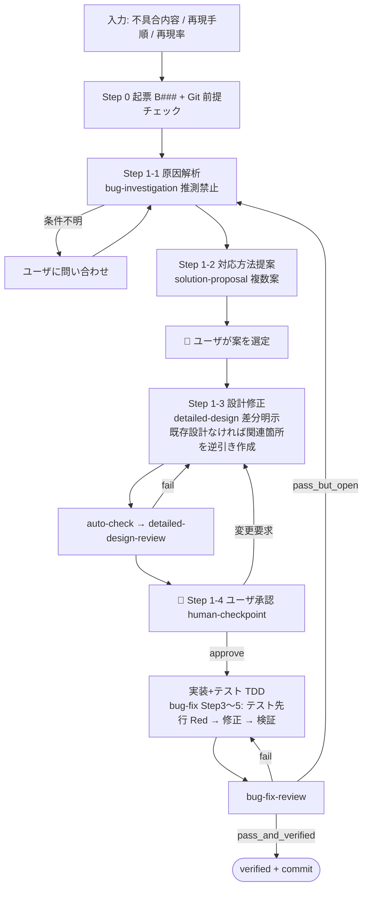

# bugfix-workflow — 不具合修正ワークフロー

## 対象外 (自明な修正)

以下をすべて満たす依頼は本ワークフローを起動せず、直接修正でよい:

- 変更が 1〜数行に収まる
- ユーザが解決策 (原因と直し方) を指定済みで、原因解析・対応方法提案のステップが不要

ただし直接修正の場合も次の 3 点をセットで必ず行う (省略禁止):

1. コード修正
2. 関連設計書の整合更新 (コード行番号の参照があればそのずれも反映)
3. テスト追加・更新と Green 確認

影響範囲が不明 / 複数機能 (F###) にまたがる / 原因が未特定 / 再現条件の調査が必要、のいずれかに当てはまる場合は対象外にせず本ワークフローを使う。迷う場合はユーザに確認する。

## ベース規約の継承

本スキルは `dev-workflow` の規約をそのまま継承する。以下は **ベース `~/.claude/skills/dev-workflow/SKILL.md` の該当節に従う** (本ファイルでは繰り返さない):

- サブエージェント呼び出し仕様 (ブリーフテンプレート・戻り値形式・共有ファイル/Git の扱い)
- ファイルの所有権分離 (`project.json` / `open-questions.md` / `decisions.md` はオーケストレータ専任)
- **Git 統合**: 開始時の専用ブランチ確認 (main/master では開始しない)、ゲート通過時 commit、**commit 前に必ずユーザ確認 (提案メッセージ・対象ブランチ・変更サマリを提示し承認を得てから実行。承認なしの自動 commit 禁止)**、push は人、履歴改変禁止
- テンプレ解決順と初期化時の `.dev-workflow/templates/` 集約コピー
- 3 段ゲート (auto-check → LLM レビュー) とレビュー回避の禁止

なお、ベース SKILL.md の上記各節は要点のみで、**詳細手順はベースの `resources/reference/` に分割されている**。該当場面ではベース側の対応ファイルを Read してから実行すること (Git 統合 → `git-integration.md`、human-checkpoint → `human-checkpoint.md`、レビューゲート → `review-gates.md`、auto-check → `auto-check-gate.md`、testing/red-green → `testing-gates.md`、設計差し戻し → `bugfix-design-handoff.md`)。

## 入力 (必須 3 点)

| 項目 | 内容 |
|---|---|
| 不具合内容 | 期待した動作と実際の動作 |
| 再現手順 | 操作/リクエストの手順 (具体的な入力値を含む) |
| 再現率 | 常に / ときどき (頻度) / 1 回のみ 等 |

**3 点のうち欠けがあれば、作業を始める前にユーザに確認する** (Cowork では `AskUserQuestion`)。再現率が 100% でない場合は、わかっている範囲の発生条件 (環境・データ・タイミング) も聞いておく。

## 全体フロー

## 手順

### Step 0 : 起票と前提チェック

1. **Git 前提チェック** (ベース §「Git 統合」): 専用ブランチ上であることを確認。main/master なら停止して切替を依頼
2. `.dev-workflow/` が無ければ最小初期化 (project.json / open-questions.md / decisions.md / `templates/` 集約コピー)。既存の dev-workflow 管理プロジェクトならそのまま使う
3. 入力 3 点を確認し、不具合票を起票: `.dev-workflow/features/<FID>/bugs/B<NNN>.json` + `docs/05_bug_reports/B<NNN>.md` (テンプレは testing Agent の resources)。対象 FID が不明な時は暫定 `F000` で起票し、Step 1-1 の解析後に確定する
4. 再現手順・再現率を bug-report.md にそのまま転記 (要約しない)

### Step 1-1 : 原因解析 — `bug-investigation` (推測禁止)

`Task(subagent_type="bug-investigation", ...)` で spawn。ブリーフに BID / iteration / 入力 3 点を含める。

- 調査は **観察エビデンス必須・推測禁止** (Agent の規律)
- **再現条件が不明で観測でも確定できない場合**: 戻り値の `open_questions` を受けて **オーケストレータがユーザに問い合わせる** (環境・データ・並行性・タイミング)。回答を得たら bug-investigation を再 spawn。**条件不明のまま Step 1-2 に進むことは禁止**
- 戻り値: root_cause (ファイル:行番号) / evidence / suggested_classification / confidence

confidence が low のままユーザ回答も得られない場合は、わかっている範囲と次の観測案をユーザに提示して判断を仰ぐ。

### Step 1-2 : 対応方法提案 — `solution-proposal`

`Task(subagent_type="solution-proposal", ...)` で spawn (種別=bug、インプット=調査レポート)。

1. **「あるべき姿 (理想設計)」案を必須** に、最小修正案を含む 2〜4 案 + 推奨案が返る (必要な設計を考慮した理想を基準点に、各案のあるべき姿との乖離・技術的負債が明示される)
2. **オーケストレータがユーザに選択肢を提示** (Cowork では `AskUserQuestion`、推奨案を先頭に)。あるべき姿との乖離と先送りにする負債もあわせて提示する
3. ユーザの選定結果と理由を `decisions.md` に記録 (理想案を選ばなかった場合は **先送りにした技術的負債も記録**)。proposal レポートの「選定結果」を埋める

### Step 1-3 : 設計修正 — `detailed-design` (差分明示)

選定案をブリーフに含めて `Task(subagent_type="detailed-design", ...)` を spawn。

- **既存設計がある場合**: 該当ドキュメント (functional / state / sequence / UI / DB のうち関連分) を更新し、**変更点を「現行 → 変更後」の差分表** でドキュメント冒頭または変更箇所に明示する
- **既存設計が無い場合**: まず関連箇所のみ **現行コードから逆引きで最小の設計を作成** し (フル 9 章は不要、関連する章のみ)、その上で変更点を同じ差分表で示す。「逆引き部分 (現行の事実)」と「変更部分」を明確に区別すること
- アーキテクチャ・機能分割に影響する場合のみ `basic-design` の該当ドキュメントも差分更新
- 完了後、`auto-check` (phase=detailed-design, 対象 FID) → `detailed-design-review` (mode=per_feature、対象 1 機能に縮退) を通す。fail なら再 spawn

### Step 1-4 : ユーザ承認 (human-checkpoint) → 実装・テスト

1. **🛑 設計差分をユーザに提示して承認を待つ**: 変更ドキュメントのパス一覧、差分表の要約、選定案、影響範囲。応答パターンはベース §「人間チェックポイント」と同じ (approve / 変更要求 / skip checkpoint)。approve 時は `decisions.md` 記録 + **commit (commit 前にメッセージ・変更サマリを提示しユーザ確認。承認と commit 確認は 1 メッセージに統合可)** (`[bugfix-workflow] checkpoint: B<NNN> design approved`)
2. **TDD 実装**: `Task(subagent_type="bug-fix", ...)` を **Step 3 から** spawn (調査は完了済み・設計は承認済みであることをブリーフに明記)。順序は必ず **設計修正 → テスト設計 → テストコード修正 (Red) → 実装** とする:
   - Step 3-0: **再現テストの確保 (実装より前・スキップ不可)**。本ワークフローの入力は報告ベース (失敗テストが存在しない) なので、**再現手順を自然な層の失敗テストとして書き起こし、修正前コードで Fail (Red) を必ず確認**する。これを `found_in_test_case_id` に記録
   - Step 3-1: 検出層より細かい前工程の補強テストを追加 (該当する場合)。同じく修正前 Red を確認
   - Step 4: 承認済み設計に沿った最小のコード修正 (= 実装)。**Step 3 のテストが Red の状態から着手する**
   - Step 5: 再現テスト (Green 化を確認) + 追加分 + 同一機能リグレッション + 横断影響分を実行
3. `bug-fix-review` を spawn:
   - `pass_and_verified` → `status = verified`。**commit (実行前にユーザ確認)** (`[bugfix-workflow] bug-fix B<NNN>: verified`)。完了報告
   - `pass_but_open_iteration` → 次反復: Step 1-1 (bug-investigation の再 spawn) に戻る
   - `fail` → 該当ステップを再実施
4. 影響範囲が広い場合は仕上げに `testing` (mode=retry, layer=検出層, 対象機能群) でリグレッション全体を確認

## 完了の定義

- `bug.json` が `verified` / 検出元・追加・リグレッションが全 Pass
- 設計差分がユーザ承認済み (`decisions.md` に記録)
- 追加したテストが恒久のリグレッション網として残っている (TDD Red → Green の記録あり)
- ゲート commit が積まれている (push はユーザ)

## 注意

- 本ワークフローは不具合 **1 件ずつ** 処理する。複数件は 1 件ずつ直列に回す (バッチが必要な規模ならフルの `dev-workflow` を使う)
- 解析の結果、設計レベルの根本欠陥 (機能分割・アーキの誤り) が疑われる場合は、本ワークフローで完結させず `dev-workflow` への移行をユーザに提案する
