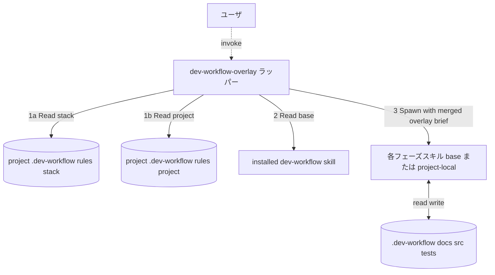

# dev-workflow-overlay — プロジェクトルール対応ラッパー

## このスキルの役割

ベース dev-workflow ワークフロー (インストール済みの `dev-workflow` スキル) **そのもの** に、プロジェクト固有のカスタマイズを **被せて (overlay)** 実行する。

ベース層は一切変更しない。本スキルが提供する 3 つの上書き機構:

1. **ルール上書き 2 層 (標準)**: プロジェクトルールを以下の **2 つの層** に分けて適用する:
   - **stack 層** (`<project>/.dev-workflow/rules/stack/`) — 言語/フレームワーク共通ルール (同じ技術スタックの複数プロジェクトで再利用可能)
   - **project 層** (`<project>/.dev-workflow/rules/project/`) — このプロジェクト固有のルール
   - 各層の `<phase>.md` の `ADD` / `OVERRIDE` / `DISABLE` を **合成** して各フェーズに適用 (詳細は §「2 層ルールの合成と優先順位」)
2. **フェーズ追加 (任意)**: `stack/extra-phases.md` および `project/extra-phases.md` で定義された追加フェーズを、フェーズ遷移に挿入する。両層で定義されている場合は両方とも採用 (project 側で同 ID の上書きがあれば project が勝つ)。
3. **スキル本体上書き (Advanced・通常は使わない)**: 同名のスキルが `<project>/.claude/skills/<skill>/` に置かれていれば、そちらを優先して spawn する。ルールでは表現できない大幅な挙動変更が必要なときだけ使う。

## 起動条件

ユーザがプロジェクト固有のカスタマイズを使いたい場合、`dev-workflow` ではなく **本スキル** (`dev-workflow-overlay`) を起動する。
プロジェクトルールが何もなくても本スキルは動作する (その場合はベース dev-workflow と同じ挙動)。

## ベース層との関係



## 手順

### Step 0 : プロジェクトルールの読み込み (2 層)

`<PROJECT_ROOT>/.dev-workflow/rules/` 配下を **2 つの層** に分けて Read する:

#### stack 層: `<PROJECT_ROOT>/.dev-workflow/rules/stack/`

言語/フレームワーク/テストツール等、**技術スタック共通** のルール。同じスタックの複数プロジェクトで再利用しやすい。

| ファイル                       | 役割                                                                 |
| ------------------------------ | -------------------------------------------------------------------- |
| `stack-config.md`              | スタック全体共通ルール (言語/FW/規約・テスト基盤・CIなど)              |
| `requirements.md`              | requirements フェーズへのスタック由来ルール                           |
| `basic-design.md`              | basic-design フェーズへのスタック由来ルール                           |
| `detailed-design.md`           | detailed-design フェーズへのスタック由来ルール                        |
| `test-design.md`               | test-design フェーズへのスタック由来ルール                            |
| `test-implementation.md`       | test-implementation フェーズへのスタック由来ルール                    |
| `implementation.md`            | implementation フェーズへのスタック由来ルール                         |
| `testing.md`                   | testing フェーズへのスタック由来ルール                                |
| `bug-fix.md`                   | bug-fix フェーズへのスタック由来ルール                                |
| `<phase>-review.md` 各種        | 各レビューフェーズへのスタック由来追加チェックリスト                   |
| `extra-phases.md`              | スタック由来の追加フェーズ (例: lint/security-scan 等)                |

#### project 層: `<PROJECT_ROOT>/.dev-workflow/rules/project/`

このプロジェクト **固有** のルール。プロジェクト名・ドメイン用語・外部依存・例外的な規約など。

| ファイル                       | 役割                                                                 |
| ------------------------------ | -------------------------------------------------------------------- |
| `project-config.md`            | プロジェクト固有のメタ情報・ドメイン用語・例外的規約                  |
| `<phase>.md` 各種              | 各フェーズへのプロジェクト固有ルール                                  |
| `<phase>-review.md` 各種        | 各レビューへのプロジェクト固有追加チェック                            |
| `extra-phases.md`              | プロジェクト固有の追加フェーズ                                        |

#### 動作

- いずれのファイルも **任意** (存在しないファイルは「該当ルールなし」扱い)
- stack 層・project 層のどちらか一方だけ使うこともできる
- 両方使う場合は §「2 層ルールの合成と優先順位」 に従って合成する

#### 後方互換 (旧 1 層構造)

旧バージョンの `<PROJECT_ROOT>/.dev-workflow/rules/<file>.md` (サブディレクトリなし) も後方互換でサポート: 該当ファイルがあれば **project 層と同じ扱い** で読み込む。可能なら `project/` 配下に移すことを推奨する旨を `decisions.md` に記録。

### Step 0b : 2 層ルールの合成と優先順位

両層のルールは **合成** して各フェーズに適用する。優先順位 (高→低):

| 順位 | ルール種別                                                  |
| ---- | ----------------------------------------------------------- |
| 1    | `project/<phase>.md` の `OVERRIDE` / `DISABLE`              |
| 2    | `project/<phase>.md` の `ADD` / `ADDITIONAL_ARTIFACTS`      |
| 3    | `stack/<phase>.md` の `OVERRIDE` / `DISABLE`                |
| 4    | `stack/<phase>.md` の `ADD` / `ADDITIONAL_ARTIFACTS`        |
| 5    | ベース `~/.claude/agents/<phase>/<phase>.md` (system prompt) |

**合成ルール:**
- `ADD` は両層分を **すべて加算** (重複は内容を見て統合)
- `OVERRIDE` / `DISABLE` は project が stack より優先 (同じ対象に矛盾する指示があれば project が勝つ)
- `ADDITIONAL_ARTIFACTS` も両層分を加算
- `REVIEW_EXTRAS` も両層分を加算 (重複チェック項目は統合)

両層が同じ項目について矛盾する指示を出した場合、その旨を `decisions.md` に「ルール矛盾の解消: project が stack を上書き — 内容: ...」として記録すること。

### Step 1 : ベースワークフロー指示の取り込み

Claude Code のスキル探索順に従い、インストール済みの **ベース `dev-workflow` スキル** の SKILL.md を `Read` する:

| 優先 | パス                                                       |
| ---- | ---------------------------------------------------------- |
| 1    | `<PROJECT_ROOT>/.claude/skills/dev-workflow/SKILL.md`      |
| 2    | `~/.claude/skills/dev-workflow/SKILL.md` (ユーザグローバル) |

以降、**ベースの手順を全面的に踏襲** する。違いはサブエージェント spawn の作法のみ (次 Step)。

### Step 2 : Agent 解決順序 (Precedence)

ベース指示で「フェーズ `<P>` のサブエージェントを spawn」とあった場合、`Task(subagent_type="<P>")` を呼ぶ。
Claude Code は以下の順で Agent 定義を解決する:

| 優先度 | パス                                                                                                                    | 用途                                |
| ------ | ----------------------------------------------------------------------------------------------------------------------- | ----------------------------------- |
| 1      | `<PROJECT_ROOT>/.claude/agents/<P>.md` または `.claude/agents/<P>/<P>.md` (**Advanced**・プロジェクトローカル上書き Agent) | 大幅な挙動変更が必要なときだけ      |
| 2      | `~/.claude/agents/<P>/<P>.md` (**標準**・ユーザグローバルにインストールされた Agent)                                     | 通常はこちら                        |

Claude Code が `subagent_type` 名で agent カタログを引いて、優先度の高い定義から自動的に選択する。**通常は優先度2 (ベース) が使われる**。優先度1 を使う場合は層B のルールでは表現できない理由を `decisions.md` に記録する。

### Step 3 : ブリーフのオーバーレイ

サブエージェントへのブリーフ (ベース仕様の §「サブエージェント呼び出し仕様」) を組み立てる際、**末尾に必ず以下のオーバーレイ節を追加する**:

```
【プロジェクト固有ルール (2 層)】
本プロジェクトには 2 層のオーバーレイルールが定義されています。
ベースの指示と矛盾する場合は project > stack > base の順で優先してください
(矛盾を発見したら decisions.md に
 「project ルールにより X を Y に変更」または
 「stack ルールにより X を Y に変更」と記録)。

【stack 層 — 言語/フレームワーク共通ルール】
ルールファイル (存在するもののみ参照):
- <PROJECT_ROOT>/.dev-workflow/rules/stack/stack-config.md
- <PROJECT_ROOT>/.dev-workflow/rules/stack/<phase-name>.md

【project 層 — このプロジェクト固有のルール】
ルールファイル (存在するもののみ参照):
- <PROJECT_ROOT>/.dev-workflow/rules/project/project-config.md
- <PROJECT_ROOT>/.dev-workflow/rules/project/<phase-name>.md

【適用手順】
1. stack 層と project 層を **両方 Read** してください (どちらも任意なので欠けていても可)。
2. 以下の節を解釈し、両層を合成して適用してください:
   - ADD                  : 追加ルール (両層分を加算、本フェーズ内のチェック項目に追加)
   - OVERRIDE             : 置き換えルール (project が stack より優先、stack がベースより優先)
   - DISABLE              : 無効化ルール (同上)
   - ADDITIONAL_ARTIFACTS : 追加成果物 (両層分を加算)
   - REVIEW_EXTRAS        : レビュー時の追加チェック (レビュー spawn 時のブリーフに転送)
3. 矛盾があれば project 層が勝ち、その旨を decisions.md に記録してください。
```

レビュースキルを spawn する場合は、対応するフェーズの両層分の `REVIEW_EXTRAS` 節と、`stack/<phase>-review.md` および `project/<phase>-review.md` の中身も同様にブリーフに追加する。

### Step 4 : extra-phases の取り込み (2 層)

`<PROJECT_ROOT>/.dev-workflow/rules/stack/extra-phases.md` および `<PROJECT_ROOT>/.dev-workflow/rules/project/extra-phases.md` が存在する場合、それぞれの内容をパースしてフェーズ遷移表に統合する。

**両層の統合ルール:**
- 異なる `PHASE: <id>` は両方とも採用 (フェーズが増える)
- 同じ `PHASE: <id>` を両層で定義していた場合は **project が勝つ** (フィールド単位で project の値で上書き)。`decisions.md` に「extra-phase `<id>` を project が上書き」と記録

スキーマ:

```
## PHASE: <id>
position: <before|after> <既存フェーズ識別子>
skill: <スキル名>
project_local: <yes|no>           # yes ならプロジェクトローカルスキル必須
gating: <blocks_next_phase_on_fail | warn_only_on_fail>
artifact_path: <相対パス (任意)>
description: <1行説明 (任意)>
```

例 (セキュリティレビューは現在ベース正式 Agent のため、ここでは別観点の追加例):

```
## PHASE: a11y-review
position: after security_review
skill: a11y-review
project_local: yes
gating: blocks_next_phase_on_fail
artifact_path: docs/08_a11y/<FID>/
description: 実装後にアクセシビリティ観点の追加レビューを行う
```

#### 解釈ルール

- `position: after implementation_review` → ベースの implementation_review 完了直後、testing 開始直前に挿入
- `position: before testing` → 同上 (equivalent)
- `gating: blocks_next_phase_on_fail` → fail なら次フェーズに進まない (ベースのレビューゲートと同じ扱い)
- `gating: warn_only_on_fail` → fail でも警告のみで次に進む (`decisions.md` に記録)
- `project_local: yes` の場合、`<PROJECT_ROOT>/.claude/skills/<skill>/SKILL.md` が無ければ起動できない (ユーザに通知)
- 追加フェーズの状態も `feature.json` の `phases.<id>` として管理 (自動追加)

### Step 5 : 進捗とレビューゲート

追加フェーズも含め、すべてのフェーズで `status.json` の `phases.<id>` を更新する。`gating: blocks_next_phase_on_fail` の場合、レビューが pass しないと次に進めない (ベースのレビューゲート規律を継承)。

### Step 6 : auto-check (機械チェックゲート) の取り扱い

ベース dev-workflow は各 per_feature レビューの直前に `auto-check` スキルを spawn する 3 段ゲートを持つ。overlay でもこれを **そのまま継承** し、2 層ルールから読み取った `stack-config.md` の「自動チェック (MUST / SHOULD / MAY)」セクションを `auto-check` のスタック設定として渡す。

**動作:**
- overlay 起動時、`<PROJECT_ROOT>/.dev-workflow/rules/stack/stack-config.md` の存在を確認
- 存在しなければ `auto-check` はベース側で skip 扱い (overlay 未使用の素の dev-workflow と同じ挙動)
- 存在すれば各レビュー spawn の直前で `auto-check` を spawn (per_feature N 並行 / cross 1回)
- 未インストールツールは `auto-check` が skip + warn 扱いで処理 (overlay は介入しない)

**ブリーフへの上乗せ:**
auto-check spawn のブリーフ末尾に以下を追記:

```
【overlay 経由情報】
- stack-config.md 配置: <PROJECT_ROOT>/.dev-workflow/rules/stack/stack-config.md
- project 層上書き有無: <yes|no>
  (yes の場合 <PROJECT_ROOT>/.dev-workflow/rules/project/stack-config.md も Read してマージ)
- project ルールが auto-check を DISABLE / 部分的に DISABLE している場合は project-config.md を優先
```

**未インストールツール時の運用:**
- ローカル開発では skip + warn でゲートを通す (ベース仕様)
- CI 側では必ず全 MUST が走る前提。overlay は CI 設定 (例: `.github/workflows/`) には触らないが、プロジェクトの `project-config.md` の `CI 必須チェック` セクションに MUST ツール一覧を載せるよう促す

## ベースに対する非破壊性の保証

本スキルは以下を **絶対に変更しない**:

- インストール済みのベース Skill (`~/.claude/skills/dev-workflow/`) と Agent 群 (`~/.claude/agents/requirements/`, `~/.claude/agents/basic-design/`, `~/.claude/agents/implementation/`, ... の 23 個)、ただし `dev-workflow-overlay` 自身を除く
- ベース側のテンプレート群 (本スキルセットがインストール元の git リポジトリ等にある場合、そこも触らない)

書き込みはすべて `<PROJECT_ROOT>/` 配下に限定する。

## 起動方法 (ユーザ向け)

Claude Code への最初の発話例:

```
dev-workflow-overlay スキルで開発を進めたい。
プロジェクトルート: C:\Users\<user>\projects\my-app

プロジェクト固有ルールを <project>/.dev-workflow/rules/ 配下に置いてある。
ベースのワークフローはそのまま、プロジェクトルールを優先しながら進めてほしい。
```

ルールが何もない場合でも本スキルは動作し、その場合は素のベース dev-workflow と完全に同じ挙動になる。

## チェックリスト

- [ ] Step 0 でプロジェクトルールを **2 層 (stack + project) ともに** Read 済み (どちらか/両方欠けていてもよい)
- [ ] Step 0b の合成/優先順位ルールを把握済み
- [ ] Step 1 でベース dev-workflow SKILL.md を Read 済み
- [ ] サブエージェント spawn 時にスキル precedence (project-local 優先) を適用
- [ ] サブエージェント spawn 時にブリーフ末尾に **2 層オーバーレイ節** を追加
- [ ] extra-phases.md があれば (両層分)、定義どおりフェーズ遷移に挿入
- [ ] 2 層間で矛盾があれば project を優先し、その旨を `decisions.md` に記録
- [ ] インストール済みのベース Skill (`~/.claude/skills/dev-workflow/`) と Agent 群 (`~/.claude/agents/<name>/`) のファイルを一切書き換えていない
