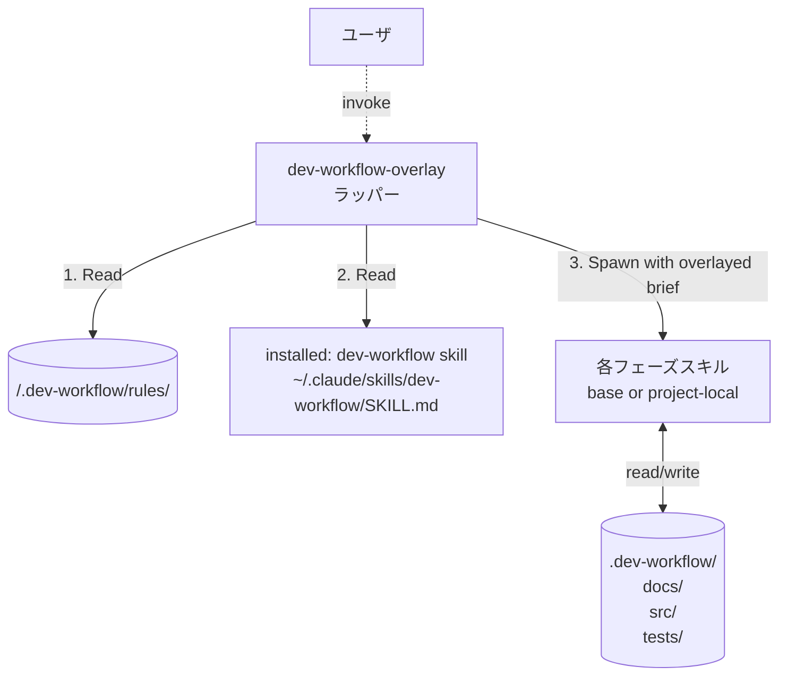

# dev-workflow-overlay — プロジェクトルール対応ラッパー

## このスキルの役割

ベース dev-workflow ワークフロー (インストール済みの `dev-workflow` スキル) **そのもの** に、プロジェクト固有のカスタマイズを **被せて (overlay)** 実行する。

ベース層は一切変更しない。本スキルが提供する3つの上書き機構:

1. **ルール上書き (標準)**: 各フェーズの作業内容に、プロジェクトルールファイル (`<project>/.dev-workflow/rules/<phase>.md`) の `ADD` / `OVERRIDE` / `DISABLE` を適用する。プロジェクト直下に置くのは原則これだけ。
2. **フェーズ追加 (任意)**: `<project>/.dev-workflow/rules/extra-phases.md` で定義された追加フェーズを、フェーズ遷移に挿入する。
3. **スキル本体上書き (Advanced・通常は使わない)**: 同名のスキルが `<project>/.claude/skills/<skill>/` に置かれていれば、そちらを優先して spawn する。ルールでは表現できない大幅な挙動変更が必要なときだけ使う。

## 起動条件

ユーザがプロジェクト固有のカスタマイズを使いたい場合、`dev-workflow` ではなく **本スキル** (`dev-workflow-overlay`) を起動する。
プロジェクトルールが何もなくても本スキルは動作する (その場合はベース dev-workflow と同じ挙動)。

## ベース層との関係



## 手順

### Step 0 : プロジェクトルールの読み込み

`<PROJECT_ROOT>/.dev-workflow/rules/` 配下のファイルを Read で確認する。存在するものをメモリに保持して以降の判断に使う。期待されるファイル群 (すべて任意):

| ファイル                       | 役割                                                              |
| ------------------------------ | ----------------------------------------------------------------- |
| `project-config.md`            | プロジェクト全体に適用される基本ルール (言語/FW/規約)              |
| `basic-design.md`              | basic-design フェーズへの追加/上書きルール                         |
| `detailed-design.md`           | detailed-design フェーズへの追加/上書きルール                      |
| `test-design.md`               | test-design フェーズへの追加/上書きルール                          |
| `test-implementation.md`       | test-implementation フェーズへの追加/上書きルール                  |
| `implementation.md`            | implementation フェーズへの追加/上書きルール                       |
| `testing.md`                   | testing フェーズへの追加/上書きルール                              |
| `bug-fix.md`                   | bug-fix フェーズへの追加/上書きルール                              |
| `basic-design-review.md` 他     | 各レビューフェーズへの追加チェックリスト                            |
| `extra-phases.md`              | ワークフローに挿入する追加フェーズの定義                            |

存在しないファイルは「該当ルールなし」として扱う。

### Step 1 : ベースワークフロー指示の取り込み

Claude Code のスキル探索順に従い、インストール済みの **ベース `dev-workflow` スキル** の SKILL.md を `Read` する:

| 優先 | パス                                                       |
| ---- | ---------------------------------------------------------- |
| 1    | `<PROJECT_ROOT>/.claude/skills/dev-workflow/SKILL.md`      |
| 2    | `~/.claude/skills/dev-workflow/SKILL.md` (ユーザグローバル) |

以降、**ベースの手順を全面的に踏襲** する。違いはサブエージェント spawn の作法のみ (次 Step)。

### Step 2 : スキル解決順序 (Precedence)

ベース指示で「フェーズ `<P>` のサブエージェントを spawn」とあった場合、本ラッパーは spawn 先を以下の順で決定する:

| 優先度 | パス                                                                                                       | 用途                                |
| ------ | ---------------------------------------------------------------------------------------------------------- | ----------------------------------- |
| 1      | `<PROJECT_ROOT>/.claude/skills/<P>/SKILL.md` (**Advanced**・プロジェクトローカル上書きスキルが存在する場合) | 大幅な挙動変更が必要なときだけ      |
| 2      | `~/.claude/skills/<P>/SKILL.md` (**標準**・ユーザグローバルにインストールされたベーススキル)                | 通常はこちら                        |

優先度1のスキルがある場合、それを spawn 先とし、ブリーフのスキル定義パスもそちらに差し替える。
**通常は優先度2 (ベース) が使われる**。優先度1 を使う場合は層B のルールでは表現できない理由を `decisions.md` に記録する。

### Step 3 : ブリーフのオーバーレイ

サブエージェントへのブリーフ (ベース仕様の §「サブエージェント呼び出し仕様」) を組み立てる際、**末尾に必ず以下のオーバーレイ節を追加する**:

```
【プロジェクト固有ルール】
以下のルールを本フェーズの作業に適用してください。
ベースの指示と矛盾する場合はプロジェクトルールが優先します
(矛盾を発見したら decisions.md に「プロジェクトルールにより X を Y に変更」と記録)。

ルールファイル (存在するもののみ参照):
- <PROJECT_ROOT>/.dev-workflow/rules/project-config.md
- <PROJECT_ROOT>/.dev-workflow/rules/<phase-name>.md

これらを冒頭で必ず Read し、以下の節を解釈してください:
- ADD            : 追加ルール (本フェーズ内のチェック項目に加算)
- OVERRIDE       : 置き換えルール (ベース指示の該当部分を差し替える)
- DISABLE        : 無効化ルール (ベース指示の該当部分をスキップ)
- ADDITIONAL_ARTIFACTS : 追加成果物 (新規ファイル作成・列挙)
- REVIEW_EXTRAS  : レビュー時の追加チェック (レビュー spawn 時のブリーフに転送)
```

レビュースキルを spawn する場合は、対応するフェーズの `REVIEW_EXTRAS` 節と、`<phase>-review.md` の中身も同様にブリーフに追加する。

### Step 4 : extra-phases の取り込み

`<PROJECT_ROOT>/.dev-workflow/rules/extra-phases.md` が存在する場合、その内容をパースしてフェーズ遷移表に統合する。スキーマ:

```
## PHASE: <id>
position: <before|after> <既存フェーズ識別子>
skill: <スキル名>
project_local: <yes|no>           # yes ならプロジェクトローカルスキル必須
gating: <blocks_next_phase_on_fail | warn_only_on_fail>
artifact_path: <相対パス (任意)>
description: <1行説明 (任意)>
```

例:

```
## PHASE: security-review
position: after implementation_review
skill: security-review
project_local: yes
gating: blocks_next_phase_on_fail
artifact_path: docs/07_security/<FID>/
description: 実装後にセキュリティ観点の追加レビューを行う
```

#### 解釈ルール

- `position: after implementation_review` → ベースの implementation_review 完了直後、testing 開始直前に挿入
- `position: before testing` → 同上 (equivalent)
- `gating: blocks_next_phase_on_fail` → fail なら次フェーズに進まない (ベースのレビューゲートと同じ扱い)
- `gating: warn_only_on_fail` → fail でも警告のみで次に進む (`decisions.md` に記録)
- `project_local: yes` の場合、`<PROJECT_ROOT>/.claude/skills/<skill>/SKILL.md` が無ければ起動できない (ユーザに通知)
- 追加フェーズの状態も `feature.json` の `phases.<id>` として管理 (自動追加)

### Step 5 : 進捗とレビューゲート

追加フェーズも含め、すべてのフェーズで `status.json` の `phases.<id>` を更新する。`gating: blocks_next_phase_on_fail` の場合、レビューが pass しないと次に進めない (ベースのレビューゲート規律を継承)。

## ベースに対する非破壊性の保証

本スキルは以下を **絶対に変更しない**:

- インストール済みのベーススキル群 (`~/.claude/skills/dev-workflow/`, `~/.claude/skills/basic-design/`, ... など、`dev-workflow-overlay` 以外のすべて)
- ベース側のテンプレート群 (本スキルセットがインストール元の git リポジトリ等にある場合、そこも触らない)

書き込みはすべて `<PROJECT_ROOT>/` 配下に限定する。

## 起動方法 (ユーザ向け)

Claude Code への最初の発話例:

```
dev-workflow-overlay スキルで開発を進めたい。
プロジェクトルート: C:\Users\<user>\projects\my-app

プロジェクト固有ルールを <project>/.dev-workflow/rules/ 配下に置いてある。
ベースのワークフローはそのまま、プロジェクトルールを優先しながら進めてほしい。
```

ルールが何もない場合でも本スキルは動作し、その場合は素のベース dev-workflow と完全に同じ挙動になる。

## チェックリスト

- [ ] Step 0 でプロジェクトルールをすべて Read 済み
- [ ] Step 1 でベース dev-workflow SKILL.md を Read 済み
- [ ] サブエージェント spawn 時にスキル precedence (project-local 優先) を適用
- [ ] サブエージェント spawn 時にブリーフ末尾にオーバーレイ節を追加
- [ ] extra-phases.md があれば、定義どおりフェーズ遷移に挿入
- [ ] インストール済みのベーススキル群 (`~/.claude/skills/<base-skill>/` 等) のファイルを一切書き換えていない
