# dev-workflow — 開発ワークフロー オーケストレータ

## 役割

要件入力から不具合修正までの全フェーズを統括する。各フェーズの実作業は **`Task` ツール (Cowork では `Agent`) でサブエージェントを spawn して委譲** する。オーケストレータ本体 (このスキルが動くエージェント) は、

- プロジェクト全体の進捗を把握する
- 次にやるべきフェーズと対象機能を決定する
- サブエージェントに **自己完結のブリーフ** を渡して起動する
- サブエージェント終了後、`.dev-workflow/` 配下の状態ファイルを読み直して次の判断をする

ことだけを行う。コード本体や設計ドキュメントを直接書くのは原則サブエージェントの仕事。

## アーキテクチャ図

```mermaid
flowchart TD
    User[ユーザ] <--> Orch[dev-workflow オーケストレータ 長期コンテキスト]
    Orch -->|spawn| REQ[requirements]
    Orch -->|spawn| REQR[requirements-review]
    Orch -->|spawn| BD[basic-design]
    Orch -->|spawn| BDR[basic-design-review]

    subgraph Batch [各フェーズはバッチ 全機能を同時に処理して横断レビュー]
      direction TB
      Orch -->|parallel per FID| DD[detailed-design F001..Fn]
      Orch -->|spawn 1回| DDR[detailed-design-review 全機能横断]
      Orch -->|parallel per FID| TD[test-design F001..Fn]
      Orch -->|spawn 1回| TDR[test-design-review 全機能横断]
      Orch -->|parallel per FID| TI[test-implementation TDD Red F001..Fn]
      Orch -->|spawn 1回| TIR[test-implementation-review 全機能横断]
      Orch -->|COMMON先行 parallel per FID| Impl[implementation TDD Green F001..Fn]
      Orch -->|spawn 1回| IR[implementation-review 全機能横断]
      Orch -->|per_feature + cross| SR[security-review セキュリティゲート]
      Orch -->|parallel per FID| Test[testing F001..Fn]
      Orch -->|spawn 1回 per layer| TR[unit/integration/e2e-test-review 全機能横断]
    end

    Orch -->|per iteration| BI[bug-investigation 調査専門 修正禁止]
    Orch -->|per bug| Bug[bug-fix Step2から]
    Orch -->|per iteration| BFR[bug-fix-review]
    REQ & REQR & BD & BDR & DD & DDR & TD & TDR & TI & TIR & Impl & IR & SR & Test & TR & BI & Bug & BFR <-->|read write| State[(.dev-workflow docs src tests)]
    Orch <-->|read only| State
```



ポイント:
- サブエージェントはフレッシュコンテキストで起動する。状態は **ファイル経由でしか引き継がれない**。
- **ファイルの所有権分離 (書き込み競合防止)**:
  - **オーケストレータ専任**: `project.json` / `open-questions.md` / `decisions.md` (プロジェクト共有ファイル)。サブエージェントは並行 spawn されるため、共有ファイルへの直接書き込みは禁止。サブエージェントは記録すべき内容を **戻り値 (`open_questions` / `decisions`) で返し**、オーケストレータが一元追記する。
  - **サブエージェント所有**: 機能別状態 (`features/<FID>/status.json`, `tasks/`, `bugs/`) と成果物 (`docs/`, `src/`, `tests/`)。同一 FID を並行 spawn しない規律により競合しない。
- サブエージェントは作業終了時に「やったこと・更新したファイル・未解決の質問・記録すべき決定・推奨次アクション」を **要約して返す**。

## 基本原則 (全フェーズ共通)

1. **推測で決めない。** 不明点は必ずユーザに確認する。重要度が高ければ即時、軽微なら各フェーズ完了時にまとめて確認する (ハイブリッド方針)。
2. **進捗は常にファイルに記録する。** 状態はメモリではなく `.dev-workflow/` 配下に保存する。
3. **タスクは小さく保つ。** 1タスクは「1〜2セッションで完了する」程度の粒度に分割する。
4. **要件→設計→テスト→実装→テスト結果→バグの全てがトレース可能であること。** 各成果物はIDで相互参照する。
5. **設計は二段階。** 全体の基本設計 → 機能単位の詳細設計。

## 参照ドキュメント (progressive disclosure)

詳細仕様は本スキルディレクトリ配下の `resources/reference/` に分割してある。**該当する場面に入る前に必ず対応ファイルを Read してから実行する** (要点は本文に残してあるが、手順の正は参照ドキュメント側):

| ファイル | Read するタイミング |
|---|---|
| `resources/reference/review-gates.md` | レビューフェーズの運用時 (3 段ゲートのフロー・ブリーフテンプレ・結果ハンドリング) |
| `resources/reference/git-integration.md` | Git 前提チェック時と commit 実行前 (commit ポイント表・commit 前ユーザ確認・禁止事項) |
| `resources/reference/human-checkpoint.md` | cross review pass を検出した時 (サマリ提示フォーマット・応答分岐・無効化設定) |
| `resources/reference/testing-gates.md` | testing フェーズ、および test-implementation / implementation 完了直後 (3 層シリアル化・red/green 確認モード) |
| `resources/reference/auto-check-gate.md` | auto-check を spawn する直前 (ブリーフ・結果ハンドリング・スキップ条件) |
| `resources/reference/bugfix-design-handoff.md` | bug-fix の戻り値が `blocked_for_design_rerun` だった時 (Pause / Resume 手順) |

## 起動時の手順

### Step 1 : プロジェクトルートの特定と Git 前提チェック

1. 現在の作業対象ディレクトリ (`PROJECT_ROOT`) をユーザに確認する。
2. **Git 前提チェック (§「Git 統合」参照)**: `git rev-parse --abbrev-ref HEAD` で現在ブランチを確認する。
   - `main` / `master` / `develop` 等の保護対象ブランチ上なら **開始せず停止**。ユーザに専用ブランチ (例: `dev-workflow/<プロジェクト名>`) の作成・切替を依頼する (ユーザ承認のもと `git switch -c` で作成してよい)
   - git リポジトリでない場合はユーザに確認: `git init` + 専用ブランチで始めるか、Git 統合なしで進めるか (`decisions.md` に記録)
3. `PROJECT_ROOT/.dev-workflow/project.json` の有無で初回起動か再開かを判定。

### Step 2-A : 初回起動の場合

1. 本スキルディレクトリ配下の `resources/progress/` から `project.json`, `open-questions.md`, `decisions.md` をコピーして `.dev-workflow/` 配下に配置 (オーケストレータが直接書いてよい)。
2. **テンプレートの集約コピー**: 各 Agent のテンプレート (`~/.claude/agents/<name>/resources/`、標準インストール先) を `<PROJECT_ROOT>/.dev-workflow/templates/<name>/` にコピーする。サブエージェントは実行時に自分の定義ファイルの場所を解決できないため、**必ずここに集約しておく** (サブエージェントのテンプレ解決順: `.dev-workflow/templates/<name>/` → `~/.claude/agents/<name>/resources/`)。`~/.claude/agents/` が標準と異なる場所にある場合は、ユーザに Agent 群の設置場所を確認してそこからコピーする。
3. ユーザに以下を確認 (Cowork なら `AskUserQuestion`、Claude Code ではチャットで質問):
   - **要件の入力方法**: ファイル (パス指定) / チャットで口頭 / 両方
   - **要件の形式**: 自由フォーマット / USDM (`R-###`, `S-###-##`) / その他
   - **プロジェクト名**
4. `current_phase` を `requirements` とし、**`requirements` サブエージェントを spawn** する。要件のファイル配置 (`docs/requirements/`)・チャット入力の書き起こし・要件ID (`R-###`) 付与・受入条件の明示化は requirements Agent の責務。ユーザから聞いた入力方法/形式/ファイルパスと、チャットで聞き取った要件本文をブリーフに含める。
5. **USDM の場合**: ファイルは **ユーザ管理の原本** として扱い、本ワークフロー側からの書き換えを禁止。requirements Agent は構造検証のみ行う。`R-###` / `S-###-##` を機能ID/サブ機能IDにマッピングし、`feature-list.md` のトレーサビリティ表で双方向に追跡できるよう指示を `basic-design` に渡す。USDM の「理由」フィールドは `decisions.md` に書く際に **そのまま引用** する (要約禁止)。
6. requirements 完了後は `requirements-review` → **human-checkpoint (requirements)** を経て `basic_design` に進む (§「フェーズスキルの呼び分け」参照)。

### Step 2-B : 再開の場合

1. `.dev-workflow/project.json` を Read。各機能の `.dev-workflow/features/<FID>/status.json` も Read。
2. `open-questions.md` を Read し `open` 項目を抽出。
3. **再開サマリ** をユーザに提示:
   - 現在のフェーズ
   - 機能ごとの進捗 (表)
   - 未解決の確認事項
   - 推奨次アクション
4. ユーザに継続可否と未解決質問の回答を確認。
5. 該当フェーズのサブエージェントを spawn。

### Step 2-C : 改修トリガを検出した場合

ユーザの最初のプロンプトに「**改修**」「**既存プロジェクト**」「**追加してほしい**」「**変更してほしい**」「**修正してほしい**」等のキーワードがある、または USDM の差分要求書 (`usdm-rev*.md` のようなファイル) を渡された場合は、Step 2-A/2-B 分岐の前に以下を判断する:

| `.dev-workflow/project.json` | 既存コード/docs | 取る動作                                                                          |
| ---------------------------- | --------------- | --------------------------------------------------------------------------------- |
| あり                         | 不問            | Step 2-B (再開) に進み、影響を受ける機能の `status.json` を必要なフェーズに戻す      |
| なし                         | あり            | **逆引きモード**: 既存コード/docs を読み、`feature-list.md` を逆生成 → ユーザにレビュー依頼 → 確定後 Step 2-A の続きから |
| なし                         | なし            | 改修トリガがあっても扱えない。ユーザに確認 (新規プロジェクトとして進めるか?)         |

改修案件で更新対象になった機能は、対応する `phases.<phase>.status` を `pending` か `in_progress` に戻し、`current_phase` も該当フェーズに更新する。**触る必要のない機能には手を出さない**。

USDM 差分要求書を受け取った場合は、ファイルを Read で読み「追加 / 変更 / 削除」の各項目を `feature-list.md` の対応するマッピング表に反映してから、該当機能の `detailed-design` (変更) または `basic-design` (追加分の新規 F### 採番) を spawn する。

### Step 3 : フェーズスキルの呼び分け

| 状況                                                                                                    | spawn するサブエージェント                                       |
| ------------------------------------------------------------------------------------------------------- | ---------------------------------------------------------------- |
| `init` / `requirements` 未完                                                                            | `requirements`                                                   |
| `requirements` 完了、`auto_check` 未実行                                                                | **`auto-check`** (phase=requirements, target=ALL。組み込みの ID 検証のみ) |
| `requirements.auto_check` MUST pass、`requirements.review` 未実行                                       | **`requirements-review`** (プロジェクト全体・1回)                |
| `requirements.review` pass、`checkpoints.requirements` 未承認 (= status が `pending`)                   | **🛑 human-checkpoint (requirements)**: 要件サマリ (R-### 一覧・残 open_questions) を提示し承認を待つ |
| `basic_design` 未完 (`checkpoints.requirements = approved` または `skipped` 後)                          | `basic-design`                                                   |
| `basic_design` 完了、`auto_check` 未実行                                                                | **`auto-check`** (phase=basic-design, mode=per_feature, target=ALL) |
| `basic_design.auto_check` MUST pass、`basic_design.review` 未実行                                       | **`basic-design-review`** (プロジェクト全体)                     |
| `basic_design.review` pass、`checkpoints.basic_design` 未承認 (= status が `pending`)                   | **🛑 human-checkpoint (basic-design)**: ユーザに完了サマリを提示し承認を待つ |
| 全機能のうち `detailed_design` 未完なものがある (`checkpoints.basic_design = approved` または `skipped` 後) | `detailed-design` (機能ごとに並行 spawn)                         |
| 全機能 `detailed_design` 完了、いずれかの機能の `auto_check.per_feature` 未実行                         | **`auto-check`** (phase=detailed-design, mode=per_feature) 機能ごと並行 |
| 全機能の `auto_check.per_feature` MUST pass、いずれかの `review.per_feature` 未実行                     | **`detailed-design-review` (mode=per_feature)** 機能ごと並行     |
| 全機能 `review.per_feature` pass、`auto_check.cross` 未実行 (横断ツールあり時)                          | **`auto-check`** (phase=detailed-design, mode=cross) 1回         |
| 全機能 `review.per_feature` pass、`review.cross` 未実行                                                 | **`detailed-design-review` (mode=cross)** 1回                    |
| `detailed_design` cross review pass、`checkpoints.detailed_design` 未承認                              | **🛑 human-checkpoint (detailed-design)**: ユーザに完了サマリを提示し承認を待つ |
| 全機能のうち `test_design` 未完なものがある (`checkpoints.detailed_design = approved` または `skipped` 後) | `test-design` (機能ごとに並行 spawn)                             |
| 全機能 `test_design` 完了、いずれかの機能の `auto_check.per_feature` 未実行                             | **`auto-check`** (phase=test-design, mode=per_feature) 機能ごと並行 |
| 全機能の `auto_check.per_feature` MUST pass、いずれかの `review.per_feature` 未実行                     | **`test-design-review` (mode=per_feature)** 機能ごと並行         |
| 全機能 `review.per_feature` pass、`review.cross` 未実行                                                 | **`test-design-review` (mode=cross)** 1回 (必要なら直前に auto-check cross) |
| 全機能のうち `test_implementation` 未完なものがある                                                     | `test-implementation` (機能ごとに並行 spawn)                     |
| 全機能 `test_implementation` 完了、いずれかの機能の `test_run.red` 未実行                               | **`testing`** (phase=test-implementation, mode=red) 機能ごと並行 |
| 全機能の `test_run.red` PASS、いずれかの機能の `auto_check.per_feature` 未実行                          | **`auto-check`** (phase=test-implementation, mode=per_feature) 機能ごと並行 |
| 全機能の `auto_check.per_feature` MUST pass、いずれかの `review.per_feature` 未実行                     | **`test-implementation-review` (mode=per_feature)** 機能ごと並行 |
| 全機能 `review.per_feature` pass、`review.cross` 未実行                                                 | **`test-implementation-review` (mode=cross)** 1回 (必要なら直前に auto-check cross) |
| 共通実装の特定タスクが pending                                                                          | `implementation` (擬似機能 `COMMON` を最初に処理)                |
| 全機能のうち `implementation` 未完なものがある                                                          | `implementation` (機能ごとに並行 spawn)                          |
| 全機能 `implementation` 完了、いずれかの機能の `test_run.green` 未実行                                  | **`testing`** (phase=implementation, mode=green) 機能ごと並行   |
| 全機能の `test_run.green` PASS、いずれかの機能の `auto_check.per_feature` 未実行                        | **`auto-check`** (phase=implementation, mode=per_feature) 機能ごと並行 |
| 全機能の `auto_check.per_feature` MUST pass、いずれかの `review.per_feature` 未実行                     | **`implementation-review` (mode=per_feature)** 機能ごと並行      |
| 全機能 `review.per_feature` pass、`auto_check.cross` 未実行 (jscpd 等あり時)                            | **`auto-check`** (phase=implementation, mode=cross) 1回          |
| 全機能 `review.per_feature` pass、`review.cross` 未実行                                                 | **`implementation-review` (mode=cross)** 1回                     |
| `implementation` review.cross pass、いずれかの機能の `security_review.per_feature` 未実行              | **`security-review` (mode=per_feature)** 機能ごと並行            |
| 全機能 `security_review.per_feature` pass、`security_review.cross` 未実行                              | **`security-review` (mode=cross)** 1回                           |
| **[Layer 1: 単体]** `security_review.cross` pass、全機能 `phases.testing.layers.unit.status` が `pending` | **`testing` (layer=unit)** 機能ごと並行 spawn                    |
| 全機能 `layers.unit` 実行済み、`auto_check.testing.unit.per_feature` 未実行                            | **`auto-check`** (phase=testing, mode=per_feature, layer=unit) 機能ごと並行 |
| `auto_check` MUST pass、`unit-test-review (mode=per_feature)` 未実行                                    | **`unit-test-review` (mode=per_feature)** 機能ごと並行           |
| 全機能 `review.per_feature` pass、`unit-test-review (mode=cross)` 未実行                                | **`unit-test-review` (mode=cross)** 1 回                         |
| **`layers.unit.open_bugs` が非空** (review pass 後)                                                    | `bug-investigation` (調査) → `bug-fix` (修正、バグごと) → 完了後に **`testing` (layer=unit, mode=retry)** を再 spawn (リグレッション含む全実行) |
| 全機能 `layers.unit.open_bugs = []` かつ `layers.unit.status = completed`                              | **[Layer 2: 結合]** へ進む (下記)                                |
| **[Layer 2: 結合]** 全機能 `layers.integration.status` が `pending`                                    | **`testing` (layer=integration)** 機能ごと並行 spawn             |
| 全機能 `layers.integration` 実行済み、`auto_check.testing.integration.per_feature` 未実行              | **`auto-check`** (phase=testing, mode=per_feature, layer=integration) 機能ごと並行 |
| `auto_check` MUST pass、`integration-test-review (mode=per_feature)` 未実行                            | **`integration-test-review` (mode=per_feature)** 機能ごと並行    |
| 全機能 `review.per_feature` pass、`integration-test-review (mode=cross)` 未実行                        | **`integration-test-review` (mode=cross)** 1 回                  |
| **`layers.integration.open_bugs` が非空** (review pass 後)                                             | `bug-investigation` (調査) → `bug-fix` (修正、バグごと) → 完了後に **`testing` (layer=integration, mode=retry)** を再 spawn |
| 全機能 `layers.integration.open_bugs = []` かつ `layers.integration.status = completed`                | **[Layer 3: E2E]** へ進む                                        |
| **[Layer 3: E2E]** 全機能 `layers.e2e.status` が `pending`                                             | **`testing` (layer=e2e)** 機能ごと並行 spawn                     |
| 全機能 `layers.e2e` 実行済み、`auto_check.testing.e2e.per_feature` 未実行                              | **`auto-check`** (phase=testing, mode=per_feature, layer=e2e) 機能ごと並行 |
| `auto_check` MUST pass、`e2e-test-review (mode=per_feature)` 未実行                                    | **`e2e-test-review` (mode=per_feature)** 機能ごと並行            |
| 全機能 `review.per_feature` pass、`e2e-test-review (mode=cross)` 未実行                                | **`e2e-test-review` (mode=cross)** 1 回                          |
| **`layers.e2e.open_bugs` が非空** (review pass 後)                                                     | `bug-investigation` (調査) → `bug-fix` (修正、バグごと) → 完了後に **`testing` (layer=e2e, mode=retry)** を再 spawn |
| 全 3 layer の `status = completed` かつ全 `open_bugs = []`                                              | `phases.testing.status = completed`、次フェーズ / プロジェクト完了 |
| bug への着手時 / 新しい反復の開始時                                                                     | **`bug-investigation`** (BID + iteration を渡す、修正禁止の調査専門)。完了後に `bug-fix` を Step 2 から spawn |
| `bug-fix` の各反復完了直後                                                                              | **`bug-fix-review`** (auto-check は不要、bug-fix は対象範囲が小さく LLM 判定中心) |
| 全機能・全バグが終了                                                                                    | (なし。最終レポート提示)                                         |

**フェーズ進行の原則: フェーズバッチ**

要件が複数機能 (`F001, F002, F003, ...`) ある場合、ベース dev-workflow は **「機能ごとに最後まで」ではなく「同じフェーズを全機能まとめて」** 進める。

```
requirements (要件ID・受入条件の確定) → requirements-review → 🛑 checkpoint
  ↓
basic-design (全機能ID確定)
  ↓
detailed-design        [F001 ‖ F002 ‖ F003 並行] → detailed-design-review        (全機能横断)
  ↓
test-design            [F001 ‖ F002 ‖ F003 並行] → test-design-review            (全機能横断)
  ↓
test-implementation    [F001 ‖ F002 ‖ F003 並行] → test-implementation-review    (全機能横断)
  ↓
implementation         [必要なら COMMON 最初 → F001 ‖ F002 ‖ F003] → implementation-review (全機能横断)
                                                                    → security-review (per_feature ‖ → cross : セキュリティゲート)
  ↓
testing layer=unit         → unit-test-review          (層完了確認)
testing layer=integration  → integration-test-review   (層完了確認)
testing layer=e2e          → e2e-test-review           (層完了確認)
  ↓
bug-investigation (調査) → bug-fix (バグごと反復) → bug-fix-review (反復ごと)
```

**バッチモデルの利点:**
- **横断的な一貫性**: 同じフェーズの全機能の成果物がレビュー時に揃っているため、命名規約・設計パターン・データ構造の不統一を検出できる
- **共通化の発見**: 複数機能を見比べることで、共通サブ機能・共通モジュール・共通テストユーティリティを抽出できる
- **矛盾検出の早期化**: DB スキーマや API のあいだの矛盾を、実装に進む前に発見できる

**バッチ進行のルール:**
1. 同じフェーズで複数機能を扱う場合、独立な機能は **並行 spawn** する (各サブエージェントは1機能を担当)
2. `depends_on` 関係がある場合は依存先を先に完了させてから依存元を spawn する
3. **同一フェーズの全機能が完了するまで** 対応するレビューは spawn しない (中途半端な状態で横断レビューしても無意味)
4. レビューは **全機能の成果物を一括で読む** (横断一貫性を判定)
5. レビュー fail で問題が出た機能だけを再 spawn (全機能のやり直しではない)
6. `test_implementation` は **設計後・実装前** に必ず通る (TDD)。全層 (unit/integration/e2e) の失敗テスト (Red) が整備されてから次の `implementation` に進む

**改修・新機能追加で1機能だけ進めたい場合:**
バッチモデルの対象が1機能だけになるだけで、フローは同じ。レビューもその1機能を対象に走る (横断チェックは自動的に縮退)。

## サブエージェント呼び出し仕様

サブエージェントは Claude の `Agent` ツールで起動する。

### 共通ルール

- `subagent_type`: **対象 Agent の `name`** を渡す (例: `Task(subagent_type="basic-design", ...)`)。Claude Code が `~/.claude/agents/<name>/<name>.md` の system prompt を自動注入する。**`general-purpose` は使わない** (Agent 定義が見つからない環境でのフォールバックに限り、該当 Agent 定義ファイルを Read し、frontmatter を除く本文をブリーフ冒頭に貼り付けた上で `general-purpose` を使ってよい)
- **Cowork ではこのフォールバックが標準経路** になる (Cowork の Agent ツールはカスタム subagent_type を受け付けないため)。フォールバック時は frontmatter の `tools` / `model` 制約が強制されないので、当該 Agent のツール制約 (例: 調査系の変更禁止) を **ブリーフに禁止事項として明記** すること。詳細は リポジトリの USAGE.md「補足: Cowork で使う場合」
- `description`: 3〜5語の短い説明 (例: "F001 詳細設計を作成")
- `prompt`: **自己完結のブリーフ**。サブエージェントはこの会話履歴を見られないので、必要な情報すべてを含める。

### ブリーフテンプレート

サブエージェントの **system prompt は Claude Code が `~/.claude/agents/<name>/<name>.md` から自動で注入** する。オーケストレータは `Task(subagent_type="<name>", prompt=...)` で呼び出し、ブリーフ本文には「今回のスコープ」と「既知の前提」だけを書けばよい (手順や役割の説明は不要)。

```
プロジェクトルート: <PROJECT_ROOT 絶対パス>
対象機能ID: <FID> または "全体"

【今回のスコープ】
<オーケストレータが決めた具体的スコープ。例: 「F001 の単体・結合・E2E のテスト設計を完成させる」「F001-T03 の実装のみ」など>

【既知の前提・参考情報】
<オーケストレータがユーザとのやりとりで把握済みの、ファイルに書かれていない補足。例: 言語選定、最近のユーザ指示、関連する他機能の進捗など>

【完了時の戻り値】
作業を終えたら、以下の形式で1メッセージを返してください (250字以内):
- summary: 何を完了したか
- updated_files: 更新/作成したファイルの一覧
- open_questions: ユーザ確認が必要な未解決事項 (なければ "なし")
- decisions: decisions.md に記録すべき決定事項 (なければ "なし")
- next_action: 推奨される次のアクション
- blockers: 完了できなかった場合のブロッカ (なければ "なし")

【共有ファイルの扱い】
project.json / open-questions.md / decisions.md には直接書き込まないこと
(オーケストレータが戻り値から一元追記する)。

【Git の扱い】
git 操作 (add / commit / reset / push / branch 等) は一切行わないこと。
commit はオーケストレータがゲート通過時に行う。
```

`subagent_type` に渡す値は agents/ 配下の `name` (frontmatter):
- `requirements`, `basic-design`, `detailed-design`, `test-design`, `test-implementation`, `implementation`, `testing`, `bug-investigation`, `bug-fix`
- `requirements-review`, `basic-design-review`, `detailed-design-review`, `test-design-review`, `test-implementation-review`, `implementation-review`, `security-review`, `unit-test-review`, `integration-test-review`, `e2e-test-review`, `bug-fix-review`
- `auto-check`

### サブエージェント呼び出しの例

#### 例1: 初回の基本設計

```
Task(
  description="基本設計を作成",
  subagent_type="basic-design",
  prompt="""
プロジェクトルート: <PROJECT_ROOT>
対象機能ID: 全体

【今回のスコープ】
要件定義書から基本設計4種を作成し、機能IDを採番すること。

【既知の前提】
- プロジェクト名: <project name>
- 言語/FW: ユーザはまだ決めていない。基本設計の中で確認すること。

【完了時の戻り値】
summary / updated_files / open_questions / next_action / blockers を返してください。
"""
)
```

#### 例2: 特定機能の実装タスク1つ

```
Task(
  description="F001-T03 実装",
  subagent_type="implementation",
  prompt="""
プロジェクトルート: <PROJECT_ROOT>
対象機能ID: F001
対象タスク: F001-T03 のみ

【今回のスコープ】
タスク F001-T03 のみ完遂すること。他タスクには手を出さない。

【既知の前提】
- 言語: Python 3.12 / FastAPI (decisions.md 参照)
- テスト: pytest

【完了時の戻り値】
summary / updated_files / open_questions / next_action / blockers を返してください。
"""
)
```

### 並行 spawn (バッチモデルの標準)

フェーズバッチでは「同じフェーズ × 複数機能」を 1 メッセージで並行 spawn する。これがデフォルトの進め方:

```
[同時に 1 メッセージで投げる]
Task(description="F001 詳細設計", subagent_type="detailed-design", prompt="...FID=F001...")
Task(description="F002 詳細設計", subagent_type="detailed-design", prompt="...FID=F002...")
Task(description="F003 詳細設計", subagent_type="detailed-design", prompt="...FID=F003...")

[全部の結果が揃うのを待つ]

[次に横断レビューを 1 つだけ spawn]
Task(description="詳細設計 横断レビュー", subagent_type="detailed-design-review",
     prompt="mode=cross 対象: F001, F002, F003 全機能...")
```

**ルール:**
- **同じ機能IDの作業を並行起動してはいけない** (status.json の同時編集で破綻する)
- **共有ファイル (`project.json` / `open-questions.md` / `decisions.md`) はサブエージェントに書かせない**。戻り値で受け取り、全結果が揃ってからオーケストレータが一元追記する
- **不具合IDの採番はオーケストレータが管理**: `testing` を並行 spawn する際、各ブリーフに重複しない採番開始値 (`bug_id_start`) を渡す (例: F001 → B010 から、F002 → B020 から)。戻り値の `new_bugs` を見て `project.json` の `next_bug_id` をオーケストレータが更新する
- `depends_on` がある場合は段階分けで投げる (例: F001 が前提なら先に完了させてから F002, F003 を並行)
- すべての結果が揃ってから次フェーズ/レビューに進む
- 各機能のサブエージェントには「他機能の同フェーズ成果物が同時並行で作られている。命名規約・設計パターンは事前合意 (基本設計時の取り決め) に従い、レビューで横断一貫性が検証される」と伝えること

### 共通化の発見と取り扱い (`COMMON` 擬似機能)

バッチで進めると、複数機能に共通する設計/コードが見つかりやすい。これを扱うために **`COMMON` という擬似機能ID** を用意する。

**発生源:**
- 各フェーズのサブエージェントが「これは他機能でも使えそう」と判断した時、`open-questions.md` に「[COMMON 候補] ...」として記録
- 横断レビューが類似要素を発見した時、`issues[]` に「COMMON への昇格を推奨」と記録

**昇格判断 (レビュー時):**
- 横断レビューサブエージェントが、複数機能に共通する要素を `COMMON` 機能として正式に立てるか判断
- 立てる場合、`feature-list.md` に `COMMON` を追加し、`.dev-workflow/features/COMMON/status.json` を作成
- `COMMON` のフェーズはオーケストレータが他機能より **先に** 進める (依存関係: 他機能 `depends_on: COMMON`)

**実装フェーズでの扱い:**
- `implementation` フェーズに入る前に、`COMMON` の `implementation` を完了させる
- 他機能の `implementation` サブエージェントには「`COMMON` の実装が完了している。重複コードを書かず、`COMMON` を呼び出すこと」と伝える

## レビューゲートの仕様

各フェーズ完了直後、対応するレビュースキルを **必ず自動 spawn** する。レビューが `pass` を返さない限り次フェーズには進まない。

**3 段ゲート (auto-check → per_feature → cross):**
LLM レビューの前段に、ツールによる **機械チェック (auto-check)** を必ず挟む。
auto-check は `stack-config.md` で宣言された MUST/SHOULD/MAY ツール (linter / typecheck / markdownlint / mermaid-cli / カバレッジ等) を順次走らせ、MUST 失敗があればフェーズを差し戻す。MUST が通れば LLM レビュー (per_feature → cross) に進む。詳細は §「自動チェックゲート (auto-check)」を参照。

### レビュースキルの対応表 (auto-check を含む 3 段ゲート)

詳細設計以降の各フェーズは **auto-check** → **個別レビュー (per_feature)** → **横断レビュー (cross)** の 3 段。
ブリーフで `mode=per_feature` か `mode=cross` を渡し、同じ review スキルを 2 段階で使う。
auto-check は per_feature の直前と、(cross スキャン系ツールがある場合は) cross の直前にも spawn する。

| フェーズ              | レビュースキル                | 段1: 個別 (mode=per_feature)                              | 段2: 横断 (mode=cross)                               |
| --------------------- | ----------------------------- | --------------------------------------------------------- | ---------------------------------------------------- |
| `requirements`        | `requirements-review`         | (プロジェクト全体・1回のみ。モード不要)                   | -                                                    |
| `basic_design`        | `basic-design-review`         | (プロジェクト全体・1回のみ。モード不要)                   | -                                                    |
| `detailed_design`     | `detailed-design-review`      | 機能ごとに N 並行 spawn                                   | 全機能まとめて 1回 spawn                             |
| `test_design`         | `test-design-review`          | 同上                                                      | 同上                                                 |
| `test_implementation` | `test-implementation-review`  | 同上                                                      | 同上                                                 |
| `implementation`      | `implementation-review`       | 同上                                                      | 同上                                                 |
| `implementation` (セキュリティ) | `security-review`     | 機能ごとに N 並行 spawn                                   | 全機能まとめて 1回 spawn                             |
| `testing` layer=unit  | `unit-test-review`            | 同上                                                      | 同上                                                 |
| `testing` layer=integration | `integration-test-review` | 同上                                                      | 同上                                                 |
| `testing` layer=e2e   | `e2e-test-review`             | 同上                                                      | 同上                                                 |
| `bug_fix` (各反復)    | `bug-fix-review`              | (バグごと・1回。モード不要)                               | -                                                    |

### 3 段ゲートの動作・ブリーフ・結果ハンドリング (詳細は参照ドキュメント)

**レビューフェーズの運用時は `resources/reference/review-gates.md` を Read してから実行する** (3 段ゲートのフロー図、ハンドリング 8 項目、per_feature / cross のレビューブリーフテンプレート、結果ハンドリングを定義)。

要点:
- 順序は **auto-check (per_feature) → LLM レビュー (per_feature) → auto-check (cross、横断ツールあり時) → LLM レビュー (cross)**
- fail は該当機能だけを issues をブリーフに含めて再 spawn → 修正後に同じゲートを再 spawn
- **3 回連続 fail はユーザにエスカレーション**
- pass 時: `status.json` 更新 → commit ポイント該当なら commit 前ユーザ確認 → commit → 次フェーズへ

### レビュー回避の禁止

- レビューが fail だった場合、その判定を無視して次フェーズに進めることは禁止
- ただしユーザが明示的に「このフェーズのレビューはスキップして進めて」と指示した場合のみ、`decisions.md` に「ユーザによるレビュースキップ承認」を記録した上で進めてよい

## Git 統合 (commit ゲート)

**Git 前提チェック時と commit 実行前は `resources/reference/git-integration.md` を Read してから実行する** (commit ポイント表、commit 前ユーザ確認の手順と応答分岐、禁止事項の完全なリストを定義)。

要点 (絶対規律):
- **git 操作はオーケストレータのみ** (サブエージェントは禁止)
- **保護対象ブランチ (`main` / `master` / `develop` 等) 上では開始しない**。専用ブランチ (例: `dev-workflow/<プロジェクト名>`) で作業する
- ゲート通過時のみ commit する (`[dev-workflow] <phase>: ...` 形式)。fail → 修正中は commit しない
- **すべての commit は実行前にユーザへ提案メッセージ・対象ブランチ・変更サマリを提示し、承認を得てから実行する** (WIP・revert も例外なし)。承認待ちでターンを終えること
- **`git push` をしない** (push は人)。**履歴改変 (`reset` / `rebase` / `--amend` / `--force` / 変更破棄) を一切しない**。やり直しは前方修正 (`git revert` は可) のみ

## 人間チェックポイント (human-checkpoint)

**cross review pass を検出したら `resources/reference/human-checkpoint.md` を Read してから実行する** (完了サマリの提示フォーマット、応答分岐の詳細、スキップの厳格化、project レベル無効化の設定方法を定義)。

要点:
- **発生タイミングは 3 つ**: `requirements-review` pass 直後 / `basic-design` cross review pass 直後 / `detailed-design` cross review pass 直後。ツール・LLM レビューが全 pass しても **次フェーズに進まず、完了サマリを提示してユーザの明示承認を待つ** (承認待ちでターンを終える)
- 応答分岐: `approve` → decisions.md + status.json 記録 → commit (前確認あり) → 次フェーズ / `<変更要求>` → 該当 Agent 再 spawn → ゲート → 再 checkpoint / `skip checkpoint` (明示文字列のみ・理由 1 行を記録) → 次フェーズ
- 有効/無効の設定は `.dev-workflow/rules/project/project-config.md` のみ (single source of truth。`project.json` の checkpoints は実行状態のみ保持し `enabled` フラグは持たない)。デフォルトは 3 つとも有効

## testing フェーズの 3 層シリアル化 / テスト実行ゲート (red・green)

**testing フェーズ、および test-implementation / implementation 完了直後は `resources/reference/testing-gates.md` を Read してから実行する** (3 層の規律・連動フロー図・spawn ブリーフ・red/green 確認モードの判定とハンドリングを定義)。

要点:
- **3 層 (unit → integration → e2e) を厳密にシリアル** に実行。常に 1 層のみ・前層の `open_bugs = []` かつ completed が次層の前提。層内の bug 全解消 (bug-fix → testing mode=retry のリグレッション込み再走) まで次層に進まない
- レビューは layer 対応の専用 Agent (`unit-test-review` / `integration-test-review` / `e2e-test-review`) を呼ぶ
- **red/green 確認モード**: `test-implementation` 完了直後は `testing (mode=red)` で全 Fail を、`implementation` 完了直後は `testing (mode=green)` で全 Pass を確認してから auto-check → LLM レビューに進む。FAIL は該当フェーズへ差し戻し、3 回連続 FAIL でユーザにエスカレーション
- 実装系フェーズの順序: **testing (mode=red/green) → auto-check → LLM レビュー (per_feature → cross)**

## 自動チェックゲート (auto-check)

**auto-check を spawn する直前は `resources/reference/auto-check-gate.md` を Read してから実行する** (spawn ブリーフ、結果ハンドリング、スキップ条件を定義)。

要点:
- LLM レビューの前段で走る機械チェック。各フェーズの per_feature レビュー直前に機能数ぶん並行 spawn、cross レビュー直前に横断ツールあり時 1 回 spawn
- MUST fail → 該当フェーズ差し戻し (3 回連続でユーザにエスカレーション)。SHOULD / MAY は LLM レビューのブリーフに引き渡す。未インストールツールは skip + warn (ゲートは止めない)
- 組み込みチェック (ID トレーサビリティ検証) があるため **stack-config.md が無くても原則常に spawn する**

## bug-fix からの設計差し戻し (Pause / Resume)

**bug-fix の戻り値に `status = "blocked_for_design_rerun"` が含まれていたら `resources/reference/bugfix-design-handoff.md` を Read してから実行する** (受信時の判定、Pause / Resume の 6 ステップ、`undocumented_behavior` 特有フロー、状態遷移図を定義)。

要点:
- bug-fix は設計エラー系の分類 (`design_error_detailed` / `design_error_basic` / `undocumented_behavior` / `requirements_misinterpretation`) では自分で設計を編集せず、オーケストレータに差し戻しを要請する
- オーケストレータは bug-fix を一時停止 → 対象機能を該当設計フェーズに戻して spawn → per_feature / cross の 2 段ゲートを通す → `bug.json` に結果を書き戻し → **bug-fix を Step 3 から再 spawn**
- 同一不具合の反復が 5 回を超えて設計差し戻しが複数回発生したら、ユーザに即時エスカレーション

## サブエージェント結果のハンドリング

サブエージェントが結果を返してきたら、以下を行う:

1. 返り値の `summary` / `updated_files` をユーザに簡潔に提示。
2. **共有ファイルへの一元追記 (オーケストレータの専任)**: 戻り値の `open_questions` を `open-questions.md` に、`decisions` を `decisions.md` に追記する。並行 spawn の結果が複数返った場合は、全結果が揃ってからまとめて追記する (機能ID を明記)。
3. 該当 `status.json` を Read で読み直し、状態が正しく更新されているか確認。
4. `open_questions` のうち重要度が高そうなものは、その場でユーザに確認 (チャットで質問)。
5. `blockers` があれば、その内容を踏まえてリカバリ計画を立てる (別のサブエージェントを spawn する/ユーザに確認する 等)。
6. ブロッカもなく次フェーズに進めるなら、オーケストレータが `project.json` の `current_phase` と `updated_at` を直接更新し、次のフェーズのサブエージェントを spawn。

**重要**: サブエージェントの `summary` だけを信じない。必ず状態ファイルを Read で確認する。

## ディレクトリ仕様

スキル使用時、プロジェクトルート配下に以下の構造を作る。

```
<PROJECT_ROOT>/
├─ .dev-workflow/              # 進捗・状態
│  ├─ project.json
│  ├─ open-questions.md
│  ├─ decisions.md
│  ├─ templates/<agent名>/     # 初期化時に各 Agent の resources/ を集約コピー
│  ├─ rules/                   # (任意) overlay の 2 層ルール + checkpoint 設定
│  │  ├─ stack/                #   言語/FW 共通ルール (stack-config.md 等)
│  │  └─ project/              #   プロジェクト固有ルール (project-config.md 等)
│  ├─ debug/<BID>/             # (任意) bug-investigation の再現スクリプト等 (一時計装は終了時に除去)
│  └─ features/
│     └─ <FID>/
│        ├─ status.json
│        ├─ tasks/<TID>.json
│        └─ bugs/<BID>.json
└─ docs/
   ├─ 00_final_report.md       # プロジェクト完了時 (reverse-design-workflow では 00_reverse_report.md)
   ├─ requirements/
   ├─ 01_basic_design/
   ├─ 02_detailed_design/<FID>/
   ├─ 03_test_design/<FID>/
   ├─ 04_test_results/<FID>/
   ├─ 05_bug_reports/
   ├─ 06_reviews/              # レビュー票 + auto-check レポート
   │  ├─ <FID>/                #   per_feature 分 (各 <phase>-review-per-feature.md / <phase>-auto-check.md)
   │  └─ _cross/               #   横断分 (<phase>-cross-review.md / <phase>-auto-check.md)
   ├─ 07_analysis/             # 調査・解析・提案レポート
   │  ├─ _survey/              #   code-survey (コード棚卸し)
   │  └─ <解析ID>/             #   current-analysis / solution-proposal
   └─ 08_security/<FID>/       # security-review の詳細所見 (findings.md)。09 以降は overlay の追加フェーズ用に予約
```

- `FID`: 機能ID。`F001` 形式。
- `TID`: タスクID。`<FID>-T<連番2桁>` 形式 (例: `F001-T01`)。
- `B<連番3桁>`: 不具合ID (例: `B001`)。

テンプレートはリポジトリ上は **各 Agent ディレクトリ配下の `resources/`** に同梱されているが、サブエージェントは実行時に自分の定義ファイルの場所を解決できない。そのため **初期化時 (Step 2-A) にオーケストレータが `<PROJECT_ROOT>/.dev-workflow/templates/<agent名>/` に集約コピー** し、サブエージェントは新規ファイル作成時に必ずそこからテンプレートをコピーする (fallback: `~/.claude/agents/<agent名>/resources/`)。

## 進捗更新ルール

- サブエージェントが作業を始めるとき: `phases.<phase>.status = "in_progress"`, `started_at = 現在時刻` (各機能の `status.json`)
- 終えるとき: `status = "completed"`, `completed_at = 現在時刻`
- 中断する時は `in_progress` のまま `notes` 欄に「どこまで終わったか」を1〜3行で残す。
- `project.json` (`current_phase`, `updated_at`, `features`, `next_bug_id` 等) の更新は **オーケストレータのみ** が行う (サブエージェントは戻り値で必要な更新内容を伝える)。
- 状態値: `pending` / `in_progress` / `completed` / `blocked`。
- **ゲート系フィールドの解釈 (schema 1.6)**: `auto_check` / `test_run` / `security_review.per_feature|cross` / `conformance.<layer>` / `project.json` の `cross_auto_check.<phase>` は、テンプレでは **`null` (または空) で初期化されており、`null`・キー不在は「未実行」と解釈する**。実行した Agent が該当キーを結果オブジェクトで置き換える。テンプレに定義の無いキーを新設する場合はオーケストレータの判断とし `decisions.md` に記録する。

## ユーザ確認のルール (オーケストレータ視点)

オーケストレータ自身がユーザに確認するのは以下の場面:

- プロジェクト初期化時のメタ情報
- サブエージェント spawn の前にスコープを最終確認したい時 (任意)
- サブエージェントから返ってきた `open_questions` のうち重要度が高いもの
- フェーズ完了時の総合レビュー (チェックポイント確認)

軽微な質問はサブエージェントが戻り値 `open_questions` で返し、オーケストレータが `open-questions.md` に集約しているので、フェーズ末でまとめて確認すればよい。

## 完了の定義

プロジェクトが完了したと言えるのは以下を全て満たす場合:

- すべての機能が `phases.*.status = "completed"`
- `open-questions.md` に `open` の項目がない
- `open_bugs` が空
- 全テスト結果が記録され Pass
- 要件 → 基本設計 → 詳細設計 → テスト → 実装のトレーサビリティが成立 (auto-check の `check-traceability.py` が全フェーズで PASS)

最後に `docs/00_final_report.md` を作成 (これもサブエージェントに任せてよい) し、機能一覧・テスト結果サマリ・既知の制約をまとめる。