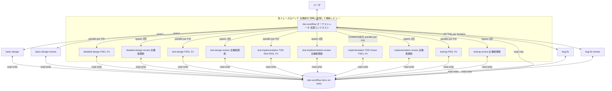
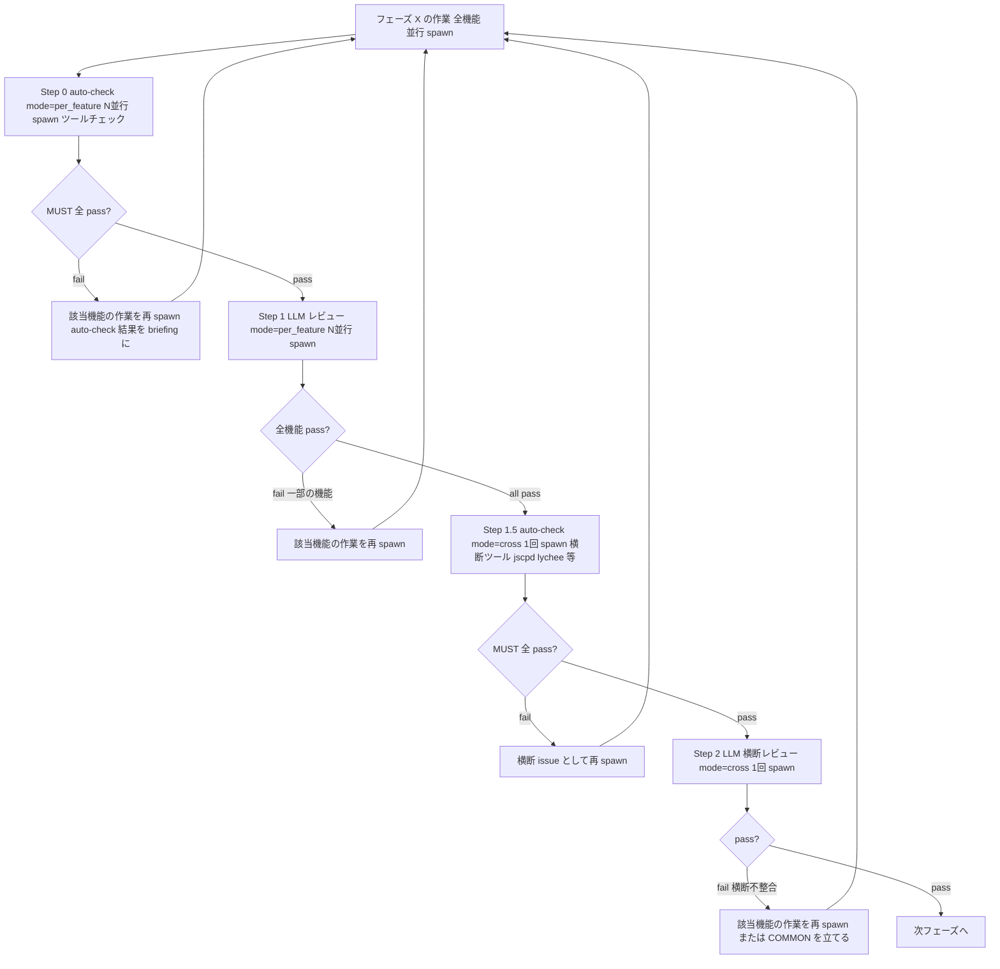
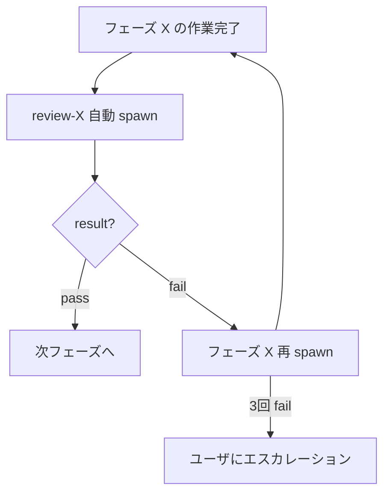
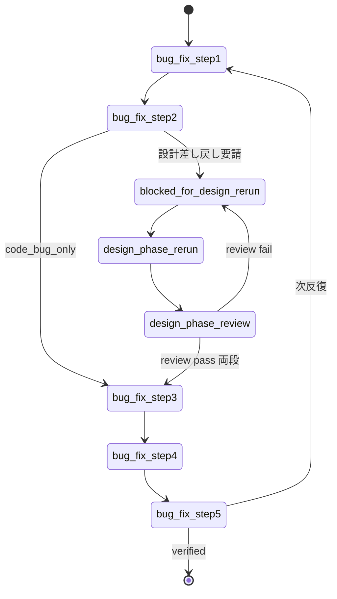

# dev-workflow — 開発ワークフロー オーケストレータ

## 役割

要件入力から不具合修正までの全フェーズを統括する。各フェーズの実作業は **`Task` ツール (Cowork では `Agent`) でサブエージェントを spawn して委譲** する。オーケストレータ本体 (このスキルが動くエージェント) は、

- プロジェクト全体の進捗を把握する
- 次にやるべきフェーズと対象機能を決定する
- サブエージェントに **自己完結のブリーフ** を渡して起動する
- サブエージェント終了後、`.dev-workflow/` 配下の状態ファイルを読み直して次の判断をする

ことだけを行う。コード本体や設計ドキュメントを直接書くのは原則サブエージェントの仕事。

## アーキテクチャ図



ポイント:
- サブエージェントはフレッシュコンテキストで起動する。状態は **ファイル経由でしか引き継がれない**。
- オーケストレータは原則 **ファイルを read するだけ**。書き込みはサブエージェントに任せる (例外: 初期化時の `.dev-workflow/` 配下作成のみオーケストレータ可)。
- サブエージェントは作業終了時に「やったこと・更新したファイル・未解決の質問・推奨次アクション」を **要約して返す**。

## 基本原則 (全フェーズ共通)

1. **推測で決めない。** 不明点は必ずユーザに確認する。重要度が高ければ即時、軽微なら各フェーズ完了時にまとめて確認する (ハイブリッド方針)。
2. **進捗は常にファイルに記録する。** 状態はメモリではなく `.dev-workflow/` 配下に保存する。
3. **タスクは小さく保つ。** 1タスクは「1〜2セッションで完了する」程度の粒度に分割する。
4. **要件→設計→テスト→実装→テスト結果→バグの全てがトレース可能であること。** 各成果物はIDで相互参照する。
5. **設計は二段階。** 全体の基本設計 → 機能単位の詳細設計。

## 起動時の手順

### Step 1 : プロジェクトルートの特定

1. 現在の作業対象ディレクトリ (`PROJECT_ROOT`) をユーザに確認する。
2. `PROJECT_ROOT/.dev-workflow/project.json` の有無で初回起動か再開かを判定。

### Step 2-A : 初回起動の場合

1. 本スキルディレクトリ配下の `resources/progress/` から `project.json`, `open-questions.md`, `decisions.md` をコピーして `.dev-workflow/` 配下に配置 (オーケストレータが直接書いてよい)。
2. ユーザに以下を確認 (Cowork なら `AskUserQuestion`、Claude Code ではチャットで質問):
   - **要件の入力方法**: ファイル (パス指定) / チャットで口頭 / 両方
   - **要件の形式**: 自由フォーマット / USDM (`R-###`, `S-###-##`) / その他
   - **プロジェクト名**
3. 要件をファイルで受け取った場合は `docs/requirements/` 配下に配置し、`project.json` の `requirements.source_path` を更新。チャット入力の場合はその場で `docs/requirements/requirements.md` に書き起こしてからユーザに最終確認。
4. **USDM の場合**: ファイルは **ユーザ管理の原本** として扱い、本ワークフロー側からの書き換えを禁止。`R-###` / `S-###-##` を機能ID/サブ機能IDにマッピングし、`feature-list.md` のトレーサビリティ表で双方向に追跡できるよう指示を `basic-design` に渡す。USDM の「理由」フィールドは `decisions.md` に書く際に **そのまま引用** する (要約禁止)。
5. `current_phase` を `basic_design` に進め、**`basic-design` サブエージェントを spawn** する (詳細は §「サブエージェント呼び出し仕様」)。

### Step 2-B : 再開の場合

1. `.dev-workflow/project.json` を Read。各機能の `.dev-workflow/features/<FID>/status.json` も Read。
2. `open-questions.md` を Read し `open` 項目を抽出。
3. **再開サマリ** をユーザに提示:
   - 現在のフェーズ
   - 機能ごとの進捗 (表)
   - 未解決の確認事項
   - 推奨次アクション
4. ユーザに継続可否と未解決質問の回答を確認。
5. 該当フェーズのサブエージェントを spawn。

### Step 2-C : 改修トリガを検出した場合

ユーザの最初のプロンプトに「**改修**」「**既存プロジェクト**」「**追加してほしい**」「**変更してほしい**」「**修正してほしい**」等のキーワードがある、または USDM の差分要求書 (`usdm-rev*.md` のようなファイル) を渡された場合は、Step 2-A/2-B 分岐の前に以下を判断する:

| `.dev-workflow/project.json` | 既存コード/docs | 取る動作                                                                          |
| ---------------------------- | --------------- | --------------------------------------------------------------------------------- |
| あり                         | 不問            | Step 2-B (再開) に進み、影響を受ける機能の `status.json` を必要なフェーズに戻す      |
| なし                         | あり            | **逆引きモード**: 既存コード/docs を読み、`feature-list.md` を逆生成 → ユーザにレビュー依頼 → 確定後 Step 2-A の続きから |
| なし                         | なし            | 改修トリガがあっても扱えない。ユーザに確認 (新規プロジェクトとして進めるか?)         |

改修案件で更新対象になった機能は、対応する `phases.<phase>.status` を `pending` か `in_progress` に戻し、`current_phase` も該当フェーズに更新する。**触る必要のない機能には手を出さない**。

USDM 差分要求書を受け取った場合は、ファイルを Read で読み「追加 / 変更 / 削除」の各項目を `feature-list.md` の対応するマッピング表に反映してから、該当機能の `detailed-design` (変更) または `basic-design` (追加分の新規 F### 採番) を spawn する。

### Step 3 : フェーズスキルの呼び分け

| 状況                                                                                                    | spawn するサブエージェント                                       |
| ------------------------------------------------------------------------------------------------------- | ---------------------------------------------------------------- |
| `init` / `basic_design` 未完                                                                            | `basic-design`                                                   |
| `basic_design` 完了、`auto_check` 未実行                                                                | **`auto-check`** (phase=basic-design, mode=per_feature, target=ALL) |
| `basic_design.auto_check` MUST pass、`basic_design.review` 未実行                                       | **`basic-design-review`** (プロジェクト全体)                     |
| 全機能のうち `detailed_design` 未完なものがある                                                         | `detailed-design` (機能ごとに並行 spawn)                         |
| 全機能 `detailed_design` 完了、いずれかの機能の `auto_check.per_feature` 未実行                         | **`auto-check`** (phase=detailed-design, mode=per_feature) 機能ごと並行 |
| 全機能の `auto_check.per_feature` MUST pass、いずれかの `review.per_feature` 未実行                     | **`detailed-design-review` (mode=per_feature)** 機能ごと並行     |
| 全機能 `review.per_feature` pass、`auto_check.cross` 未実行 (横断ツールあり時)                          | **`auto-check`** (phase=detailed-design, mode=cross) 1回         |
| 全機能 `review.per_feature` pass、`review.cross` 未実行                                                 | **`detailed-design-review` (mode=cross)** 1回                    |
| 全機能のうち `test_design` 未完なものがある                                                             | `test-design` (機能ごとに並行 spawn)                             |
| 全機能 `test_design` 完了、いずれかの機能の `auto_check.per_feature` 未実行                             | **`auto-check`** (phase=test-design, mode=per_feature) 機能ごと並行 |
| 全機能の `auto_check.per_feature` MUST pass、いずれかの `review.per_feature` 未実行                     | **`test-design-review` (mode=per_feature)** 機能ごと並行         |
| 全機能 `review.per_feature` pass、`review.cross` 未実行                                                 | **`test-design-review` (mode=cross)** 1回 (必要なら直前に auto-check cross) |
| 全機能のうち `test_implementation` 未完なものがある                                                     | `test-implementation` (機能ごとに並行 spawn)                     |
| 全機能 `test_implementation` 完了、いずれかの機能の `test_run.red` 未実行                               | **`test-run`** (phase=test-implementation, mode=red) 機能ごと並行 |
| 全機能の `test_run.red` PASS、いずれかの機能の `auto_check.per_feature` 未実行                          | **`auto-check`** (phase=test-implementation, mode=per_feature) 機能ごと並行 |
| 全機能の `auto_check.per_feature` MUST pass、いずれかの `review.per_feature` 未実行                     | **`test-implementation-review` (mode=per_feature)** 機能ごと並行 |
| 全機能 `review.per_feature` pass、`review.cross` 未実行                                                 | **`test-implementation-review` (mode=cross)** 1回 (必要なら直前に auto-check cross) |
| 共通実装の特定タスクが pending                                                                          | `implementation` (擬似機能 `COMMON` を最初に処理)                |
| 全機能のうち `implementation` 未完なものがある                                                          | `implementation` (機能ごとに並行 spawn)                          |
| 全機能 `implementation` 完了、いずれかの機能の `test_run.green` 未実行                                  | **`test-run`** (phase=implementation, mode=green) 機能ごと並行   |
| 全機能の `test_run.green` PASS、いずれかの機能の `auto_check.per_feature` 未実行                        | **`auto-check`** (phase=implementation, mode=per_feature) 機能ごと並行 |
| 全機能の `auto_check.per_feature` MUST pass、いずれかの `review.per_feature` 未実行                     | **`implementation-review` (mode=per_feature)** 機能ごと並行      |
| 全機能 `review.per_feature` pass、`auto_check.cross` 未実行 (jscpd 等あり時)                            | **`auto-check`** (phase=implementation, mode=cross) 1回          |
| 全機能 `review.per_feature` pass、`review.cross` 未実行                                                 | **`implementation-review` (mode=cross)** 1回                     |
| 全機能のうち `testing` 未完なものがある                                                                 | `testing` (機能ごとに並行 spawn)                                 |
| 全機能 `testing` 完了、いずれかの機能の `auto_check.per_feature` 未実行                                 | **`auto-check`** (phase=testing, mode=per_feature) 機能ごと並行  |
| 全機能の `auto_check.per_feature` MUST pass、いずれかの `review.per_feature` 未実行                     | **`testing-review` (mode=per_feature)** 機能ごと並行             |
| 全機能 `review.per_feature` pass、`review.cross` 未実行                                                 | **`testing-review` (mode=cross)** 1回                            |
| `testing-review (cross)` の判定で `open_bugs` が非空                                                    | `bug-fix` (バグごと)                                             |
| `bug-fix` の各反復完了直後                                                                              | **`bug-fix-review`** (auto-check は不要、bug-fix は対象範囲が小さく LLM 判定中心) |
| 全機能・全バグが終了                                                                                    | (なし。最終レポート提示)                                         |

**フェーズ進行の原則: フェーズバッチ**

要件が複数機能 (`F001, F002, F003, ...`) ある場合、ベース dev-workflow は **「機能ごとに最後まで」ではなく「同じフェーズを全機能まとめて」** 進める。

```
basic-design (全機能ID確定)
  ↓
detailed-design        [F001 ‖ F002 ‖ F003 並行] → detailed-design-review        (全機能横断)
  ↓
test-design            [F001 ‖ F002 ‖ F003 並行] → test-design-review            (全機能横断)
  ↓
test-implementation    [F001 ‖ F002 ‖ F003 並行] → test-implementation-review    (全機能横断)
  ↓
implementation         [必要なら COMMON 最初 → F001 ‖ F002 ‖ F003] → implementation-review (全機能横断)
  ↓
testing                [F001 ‖ F002 ‖ F003 並行] → testing-review                (全機能横断)
  ↓
bug-fix (バグごと反復) → bug-fix-review (反復ごと)
```

**バッチモデルの利点:**
- **横断的な一貫性**: 同じフェーズの全機能の成果物がレビュー時に揃っているため、命名規約・設計パターン・データ構造の不統一を検出できる
- **共通化の発見**: 複数機能を見比べることで、共通サブ機能・共通モジュール・共通テストユーティリティを抽出できる
- **矛盾検出の早期化**: DB スキーマや API のあいだの矛盾を、実装に進む前に発見できる

**バッチ進行のルール:**
1. 同じフェーズで複数機能を扱う場合、独立な機能は **並行 spawn** する (各サブエージェントは1機能を担当)
2. `depends_on` 関係がある場合は依存先を先に完了させてから依存元を spawn する
3. **同一フェーズの全機能が完了するまで** 対応するレビューは spawn しない (中途半端な状態で横断レビューしても無意味)
4. レビューは **全機能の成果物を一括で読む** (横断一貫性を判定)
5. レビュー fail で問題が出た機能だけを再 spawn (全機能のやり直しではない)
6. `test_implementation` は **設計後・実装前** に必ず通る (TDD)。全層 (unit/integration/e2e) の失敗テスト (Red) が整備されてから次の `implementation` に進む

**改修・新機能追加で1機能だけ進めたい場合:**
バッチモデルの対象が1機能だけになるだけで、フローは同じ。レビューもその1機能を対象に走る (横断チェックは自動的に縮退)。

## サブエージェント呼び出し仕様

サブエージェントは Claude の `Agent` ツールで起動する。

### 共通ルール

- `subagent_type`: **"general-purpose"** を使う (全ツールアクセスが必要なため)
- `description`: 3〜5語の短い説明 (例: "F001 詳細設計を作成")
- `prompt`: **自己完結のブリーフ**。サブエージェントはこの会話履歴を見られないので、必要な情報すべてを含める。

### ブリーフテンプレート

```
あなたは dev-workflow スキルセットのサブエージェントです。
フェーズ: <basic-design | detailed-design | test-design | test-implementation | implementation | testing | bug-fix>
対象機能ID: <FID> または "全体"
プロジェクトルート: <PROJECT_ROOT 絶対パス>
スキル: <phase>   (このスキルの SKILL.md を Claude Code のスキル探索順で見つけて Read してください)

【作業手順】
1. ユーザグローバルにインストールされた `~/.claude/skills/<phase>/SKILL.md` から本フェーズの SKILL.md を Read し、その指示に厳密に従う。
   ※ Claude Code は仕様上 `<PROJECT_ROOT>/.claude/skills/<phase>/` があればそちらを優先するが、本ベースワークフローでは通常そこには何も置かない (プロジェクトローカル上書きは `dev-workflow-overlay` 経由の Advanced 機能)。
2. プロジェクトルート配下の以下を必要に応じて Read:
   - .dev-workflow/project.json
   - .dev-workflow/features/<FID>/status.json (機能単位の場合)
   - .dev-workflow/open-questions.md
   - .dev-workflow/decisions.md
   - docs/ 配下の関連設計ドキュメント
3. SKILL.md の手順に従い作業を実施。状態ファイルは必ずあなた自身が更新すること。
4. 重要度 high の不明点が出たら即時ユーザに確認 (チャットで質問) する。軽微なものは open-questions.md に追記。

【今回のスコープ】
<オーケストレータが決めた具体的スコープ。例: 「F001 の単体・結合・E2E のテスト設計を完成させる」「F001-T03 の実装のみ」など>

【既知の前提・参考情報】
<オーケストレータがユーザとのやりとりで把握済みの、ファイルに書かれていない補足。例: 言語選定、最近のユーザ指示、関連する他機能の進捗など>

【完了時の戻り値】
作業を終えたら、以下の形式で1メッセージを返してください (250字以内):
- summary: 何を完了したか
- updated_files: 更新/作成したファイルの一覧
- open_questions: ユーザ確認が必要な未解決事項 (なければ "なし")
- next_action: 推奨される次のアクション
- blockers: 完了できなかった場合のブロッカ (なければ "なし")
```

### サブエージェント呼び出しの例

#### 例1: 初回の基本設計

```
Task(
  description="基本設計を作成",
  subagent_type="general-purpose",
  prompt="""
あなたは dev-workflow スキルセットのサブエージェントです。
フェーズ: basic-design
対象機能ID: 全体
プロジェクトルート: <PROJECT_ROOT>
スキル: basic-design

【作業手順】
1. `~/.claude/skills/basic-design/SKILL.md` を Read し、指示に従う。
   (通常はユーザグローバルに置かれている。プロジェクトローカル上書きは Advanced で別途 `dev-workflow-overlay` を使う)
2. .dev-workflow/project.json と docs/requirements/requirements.md を読む。
3. 基本設計4ドキュメントを作成、機能IDを採番、各機能の status.json を作成。
4. 不明点はユーザに確認 (重要度に応じて即時/蓄積)。

【今回のスコープ】
要件定義書から基本設計4種を作成し、機能IDを採番すること。

【既知の前提】
- プロジェクト名: <project name>
- 言語/FW: ユーザはまだ決めていない。基本設計の中で確認すること。

【完了時の戻り値】
summary / updated_files / open_questions / next_action / blockers を返してください。
"""
)
```

#### 例2: 特定機能の実装タスク1つ

```
Task(
  description="F001-T03 実装",
  subagent_type="general-purpose",
  prompt="""
あなたは dev-workflow スキルセットのサブエージェントです。
フェーズ: implementation
対象機能ID: F001
プロジェクトルート: <PROJECT_ROOT>
スキル: implementation

【作業手順】
1. Claude Code のスキル探索順で `implementation` スキルの SKILL.md を見つけて Read し、指示に従う。
2. .dev-workflow/features/F001/status.json と tasks/F001-T03.json を読む。
3. docs/02_detailed_design/F001/ の関連ドキュメントを読む。
4. F001-T03 のみ実装し、対応する単体テストを書く。

【今回のスコープ】
タスク F001-T03 のみ完遂すること。他タスクには手を出さない。

【既知の前提】
- 言語: Python 3.12 / FastAPI (decisions.md 参照)
- テスト: pytest

【完了時の戻り値】
summary / updated_files / open_questions / next_action / blockers を返してください。
"""
)
```

### 並行 spawn (バッチモデルの標準)

フェーズバッチでは「同じフェーズ × 複数機能」を 1 メッセージで並行 spawn する。これがデフォルトの進め方:

```
[同時に 1 メッセージで投げる]
Task(description="F001 詳細設計", subagent_type="general-purpose", prompt="...FID=F001...")
Task(description="F002 詳細設計", subagent_type="general-purpose", prompt="...FID=F002...")
Task(description="F003 詳細設計", subagent_type="general-purpose", prompt="...FID=F003...")

[全部の結果が揃うのを待つ]

[次に横断レビューを 1 つだけ spawn]
Task(description="詳細設計 横断レビュー", subagent_type="general-purpose",
     prompt="...対象: F001, F002, F003 全機能...")
```

**ルール:**
- **同じ機能IDの作業を並行起動してはいけない** (status.json の同時編集で破綻する)
- `depends_on` がある場合は段階分けで投げる (例: F001 が前提なら先に完了させてから F002, F003 を並行)
- すべての結果が揃ってから次フェーズ/レビューに進む
- 各機能のサブエージェントには「他機能の同フェーズ成果物が同時並行で作られている。命名規約・設計パターンは事前合意 (基本設計時の取り決め) に従い、レビューで横断一貫性が検証される」と伝えること

### 共通化の発見と取り扱い (`COMMON` 擬似機能)

バッチで進めると、複数機能に共通する設計/コードが見つかりやすい。これを扱うために **`COMMON` という擬似機能ID** を用意する。

**発生源:**
- 各フェーズのサブエージェントが「これは他機能でも使えそう」と判断した時、`open-questions.md` に「[COMMON 候補] ...」として記録
- 横断レビューが類似要素を発見した時、`issues[]` に「COMMON への昇格を推奨」と記録

**昇格判断 (レビュー時):**
- 横断レビューサブエージェントが、複数機能に共通する要素を `COMMON` 機能として正式に立てるか判断
- 立てる場合、`feature-list.md` に `COMMON` を追加し、`.dev-workflow/features/COMMON/status.json` を作成
- `COMMON` のフェーズはオーケストレータが他機能より **先に** 進める (依存関係: 他機能 `depends_on: COMMON`)

**実装フェーズでの扱い:**
- `implementation` フェーズに入る前に、`COMMON` の `implementation` を完了させる
- 他機能の `implementation` サブエージェントには「`COMMON` の実装が完了している。重複コードを書かず、`COMMON` を呼び出すこと」と伝える

## レビューゲートの仕様

各フェーズ完了直後、対応するレビュースキルを **必ず自動 spawn** する。レビューが `pass` を返さない限り次フェーズには進まない。

**3 段ゲート (auto-check → per_feature → cross):**
LLM レビューの前段に、ツールによる **機械チェック (auto-check)** を必ず挟む。
auto-check は `stack-config.md` で宣言された MUST/SHOULD/MAY ツール (linter / typecheck / markdownlint / mermaid-cli / カバレッジ等) を順次走らせ、MUST 失敗があればフェーズを差し戻す。MUST が通れば LLM レビュー (per_feature → cross) に進む。詳細は §「自動チェックゲート (auto-check)」を参照。

### レビュースキルの対応表 (auto-check を含む 3 段ゲート)

詳細設計以降の各フェーズは **auto-check** → **個別レビュー (per_feature)** → **横断レビュー (cross)** の 3 段。
ブリーフで `mode=per_feature` か `mode=cross` を渡し、同じ review スキルを 2 段階で使う。
auto-check は per_feature の直前と、(cross スキャン系ツールがある場合は) cross の直前にも spawn する。

| フェーズ              | レビュースキル                | 段1: 個別 (mode=per_feature)                              | 段2: 横断 (mode=cross)                               |
| --------------------- | ----------------------------- | --------------------------------------------------------- | ---------------------------------------------------- |
| `basic_design`        | `basic-design-review`         | (プロジェクト全体・1回のみ。モード不要)                   | -                                                    |
| `detailed_design`     | `detailed-design-review`      | 機能ごとに N 並行 spawn                                   | 全機能まとめて 1回 spawn                             |
| `test_design`         | `test-design-review`          | 同上                                                      | 同上                                                 |
| `test_implementation` | `test-implementation-review`  | 同上                                                      | 同上                                                 |
| `implementation`      | `implementation-review`       | 同上                                                      | 同上                                                 |
| `testing`             | `testing-review`              | 同上                                                      | 同上                                                 |
| `bug_fix` (各反復)    | `bug-fix-review`              | (バグごと・1回。モード不要)                               | -                                                    |

### 3 段ゲートの動作 (auto-check → per_feature → cross)



**ハンドリングの詳細:**
1. フェーズ作業が完了したら、`auto-check (mode=per_feature)` を **機能数ぶん並行 spawn**
2. auto-check の MUST に fail があれば → 該当機能の作業を再 spawn (auto-check レポートをブリーフに含める)
3. 全機能の auto-check が MUST pass → `<phase>-review (mode=per_feature)` を **機能数ぶん並行 spawn**
4. 全機能の per_feature レビューが pass するまで待つ。fail があれば元のフェーズ作業を再 spawn
5. 全機能 per_feature pass → `auto-check (mode=cross)` を **1回 spawn** (jscpd / lychee 等の横断スキャン系ツールがある場合のみ。なければ skip)
6. cross auto-check MUST pass → `<phase>-review (mode=cross)` を **1回 spawn**
7. cross レビューが pass → 次フェーズへ
8. cross レビューが fail → 該当機能の作業を再 spawn、または `COMMON` 機能を立てる判断を `decisions.md` に記録

> auto-check の MUST がすべて pass でも SHOULD warning や MAY info があり得る。それらは LLM レビュー (per_feature / cross) のブリーフに渡し、LLM が判断 (accept なら `decisions.md` に記録)。

### 各レビュー spawn のブリーフ仕様

ブリーフテンプレート (per_feature の場合):

```
あなたは dev-workflow スキルセットのサブエージェントです。
レビュー: <phase>-review
mode: per_feature
対象機能ID: <FID>           (per_feature の場合は単一機能)
プロジェクトルート: <PROJECT_ROOT>

【作業手順】
1. `~/.claude/skills/<phase>-review/SKILL.md` を Read。
2. `mode=per_feature` の節 (§「個別チェック」) のみを評価対象とする。
3. 該当機能の per_feature レビュー票を `docs/06_reviews/<FID>/<phase>-review-per-feature.md` に出力。
4. status.json の `phases.<phase>.review.per_feature` を更新。

【戻り値】
- summary / result (pass|fail) / issues[] / next_action / updated_files
```

ブリーフテンプレート (cross の場合):

```
あなたは dev-workflow スキルセットのサブエージェントです。
レビュー: <phase>-review
mode: cross
対象機能ID: 全機能 (F001, F002, ...)   ← project.json から取得
プロジェクトルート: <PROJECT_ROOT>

【作業手順】
1. `~/.claude/skills/<phase>-review/SKILL.md` を Read。
2. `mode=cross` の節 (§「横断チェック」) のみを評価対象とする。
3. 全機能の成果物を Read し、横断的な一貫性と共通化の機会を検証。
4. 横断レビュー票を `docs/06_reviews/_cross/<phase>-cross-review.md` に出力。
5. 全機能の status.json の `phases.<phase>.review.cross` を更新。

【戻り値】
- summary / result (pass|fail) / issues[] / next_action / updated_files
- issues[] には COMMON 昇格推奨、命名統一指摘、データ型統一指摘などを含める
```

### レビュー spawn の流れ



### レビュー結果のハンドリング

レビューサブエージェントの戻り値:
- `result`: `pass` / `fail`
- `issues[]`: 不整合の一覧 (id / 重大度 / 種別 / 内容 / 該当箇所 / 推奨対応)
- `next_action`: 次の推奨動作 (`proceed` / `redo_phase` / `redo_previous_phase` / `escalate`)

ハンドリング:
1. **pass**:
   - `status.json` の `phases.<phase>.review.status = "completed"`, `last_result = "pass"`, `iteration += 1`
   - `current_phase` を次フェーズに進める
   - 次フェーズのサブエージェントを spawn
2. **fail**:
   - `status.json` の `phases.<phase>.review.status = "completed"`, `last_result = "fail"`, `iteration += 1`
   - `issues[]` をユーザに簡潔に提示
   - 該当フェーズのサブエージェントを **issues をブリーフに含めて** 再 spawn
   - 完了したら同じレビューを再 spawn (修正後の確認)
3. **3回連続 fail**:
   - ユーザにエスカレーション (チャットで質問)
   - 設計レベルでの判断が必要な可能性 → 前工程に戻すか、要件を見直すか確認

### レビュー回避の禁止

- レビューが fail だった場合、その判定を無視して次フェーズに進めることは禁止
- ただしユーザが明示的に「このフェーズのレビューはスキップして進めて」と指示した場合のみ、`decisions.md` に「ユーザによるレビュースキップ承認」を記録した上で進めてよい

## テスト実行ゲート (test-run)

実装系フェーズ (test-implementation / implementation) 完了直後、**LLM レビューと auto-check の前** に `test-run` スキルを spawn してテストを実行する。テスト実行をレビュースキルから完全に分離するための単一責務スキル。

### いつ呼ぶか

| フェーズ完了 | spawn する test-run | 期待 verdict |
|---|---|---|
| `test-implementation` 完了 | `test-run` (mode=red) を機能数ぶん並行 | 全テスト Fail (Red) であること |
| `implementation` 完了 | `test-run` (mode=green) を機能数ぶん並行 | 全テスト Pass (Green) であること |

### test-run spawn のブリーフ

```
あなたは dev-workflow スキルセットのサブエージェントです。
スキル: test-run
フェーズ: test-implementation | implementation
mode: red | green
対象機能ID: <FID>
プロジェクトルート: <PROJECT_ROOT>

【作業手順】
1. `~/.claude/skills/test-run/SKILL.md` を Read し、指示に従う。
2. `.dev-workflow/rules/stack/stack-config.md` の「テスト実行コマンド」セクションから
   unit / integration / e2e のコマンドを抽出 (<FID> を実 ID に置換)。
3. `resources/scripts/run-tests.sh` (Unix) または `run-tests.ps1` (Windows) を実行。
4. 結果レポートを `docs/04_test_results/<FID>/<phase>-<mode>-confirmation.md` に保存。
5. raw log を `docs/04_test_results/<FID>/<phase>-<mode>-run.log` に保存。
6. status.json の `phases.<phase>.test_run` を更新。

【判定の意味】
- mode=red で全 Fail かつ pass=0 → verdict=PASS (Red 確認 OK、次に進む)
- mode=red で 1 件でも pass → verdict=FAIL (test-implementation に差し戻し)
- mode=green で全 Pass かつ fail=0 → verdict=PASS (Green 確認 OK、次に進む)
- mode=green で 1 件でも fail → verdict=FAIL (implementation に差し戻し)

【戻り値】
- verdict (PASS | FAIL)
- executed, passed, failed, skipped, xfail (count)
- expected_state (red | green)
- report_path (str)
- log_path (str)
```

### test-run 結果のハンドリング

1. **PASS**: そのまま **auto-check (per_feature)** に進む。LLM レビュー (per_feature) はその後
2. **FAIL**:
   - mode=red FAIL → `test-implementation` を再 spawn (failing でないテストを Red にする修正)
   - mode=green FAIL → `implementation` を再 spawn (failing テストを Pass させる修正)
   - 戻り値のレポートをブリーフに貼付
3. **3 回連続で同じ FAIL**: ユーザにエスカレーション (設計レベルの欠陥の可能性)

### test-run が走らないケース

以下の場合のみ test-run を spawn しなくてよい:
- プロジェクトに `.dev-workflow/rules/stack/stack-config.md` が **存在しない**
- `stack-config.md` の「テスト実行コマンド」セクションが空 (テスト未整備プロジェクト)
- ユーザが `decisions.md` で「test-run スキップ」を明示承認している

それ以外では必ず spawn する。

### test-run と auto-check の関係

両者は **別目的**:

| スキル | 目的 | 走るテスト |
|---|---|---|
| **test-run** | 全テストの **状態確認** (Red / Green) | 対象 FID の全層 (unit / integration / e2e) を実行し、ステータスを確認 |
| **auto-check** | **構文・型・スタイル・カバレッジ** の機械チェック | stack-config.md の自動チェックセクションで宣言されたコマンド (テスト実行を含むこともあるが、目的はカバレッジ閾値等) |

実装系フェーズでは順序が決まっている: **test-run → auto-check → LLM レビュー (per_feature → cross)**。

## 自動チェックゲート (auto-check)

LLM レビューの前段で走る **機械チェック**。`auto-check` という汎用スキルを各フェーズ用に呼び出して使う。

### いつ呼ぶか

- 各フェーズの per_feature レビューの **直前**: 機能数ぶん並行 spawn
- 各フェーズの cross レビューの **直前**: cross スキャン系ツール (jscpd / lychee 等) が `stack-config.md` にあれば 1 回 spawn (なければ skip 可)

### auto-check spawn のブリーフ

```
あなたは dev-workflow スキルセットのサブエージェントです。
スキル: auto-check
フェーズ: <phase>            ← basic-design | detailed-design | ...
mode: <per_feature | cross>
対象機能ID: <FID> または "ALL"
プロジェクトルート: <PROJECT_ROOT>

【作業手順】
1. `~/.claude/skills/auto-check/SKILL.md` を Read し、指示に従う。
2. `.dev-workflow/rules/stack/stack-config.md` (および project 層) から
   「自動チェック (MUST / SHOULD / MAY)」セクションの本フェーズ向けコマンドを抽出。
3. `resources/scripts/run-checks.sh` (Unix) または `run-checks.ps1` (Windows) を実行。
4. 結果レポートを `docs/06_reviews/<FID>/<phase>-auto-check.md`
   (cross の場合 `docs/06_reviews/cross/<phase>-auto-check.md`) に出力。
5. 該当する status.json の `phases.<phase>.auto_check` を更新。

【判定の意味】
- MUST 全 pass (skipped 含む) → ゲート通過。次の LLM レビューへ
- MUST に fail あり → ゲート停止。本フェーズを差し戻し
- SHOULD warning / MAY info はレポートに記録するだけ。LLM レビューが見る

【戻り値】
- must_passed (bool)
- should_warnings (count)
- may_info (count)
- skipped_missing_tools (list)
- report_path (str)
- verdict ("PASS" | "FAIL")
```

### auto-check 結果のハンドリング

1. **PASS**: そのまま LLM レビュー (per_feature → cross) に進む。SHOULD warning と MAY info はレビューのブリーフに引き渡す
2. **FAIL (MUST 失敗あり)**:
   - 該当フェーズの作業を再 spawn (auto-check レポートを briefing に貼付)
   - 修正完了後に auto-check と LLM レビューを順に再 spawn
3. **未インストールツール (skipped_missing_tools 非空)**:
   - レポートに残し、`open-questions.md` に「ローカル環境で <tool> 未インストール」を 1 件追記
   - CI 側で必ず走ることをユーザに確認してもらう (ゲートは止めない)
4. **3 回連続で同じ MUST fail**: ユーザにエスカレーション (環境問題 / プロジェクトルール側の問題の可能性)

### auto-check スキップ条件

以下の場合に限り auto-check を spawn しなくてよい:
- プロジェクトに `.dev-workflow/rules/stack/stack-config.md` が **存在しない** (overlay 未使用の素の dev-workflow)
- ユーザが明示的に `decisions.md` で「auto-check は CI 側に寄せる」と決めている

それ以外では必ず spawn する。

## bug-fix からの設計差し戻し (Pause / Resume)

`bug-fix` の Step 2 (影響範囲の判定) で、ある分類 (`design_error_detailed` / `design_error_basic` / `undocumented_behavior` / `requirements_misinterpretation`) が選ばれた場合、**bug-fix は自分では設計を編集せず、オーケストレータに差し戻しを要請** する。本節はオーケストレータがそれを受けてどう動くかを定める。

### 受信時の判定

bug-fix サブエージェントの戻り値に以下が含まれていれば差し戻し要請とみなす:

```
status         = "blocked_for_design_rerun"
design_handoff:
  classification = "design_error_detailed" | "design_error_basic" | "undocumented_behavior" | "requirements_misinterpretation"
  target_phase   = "detailed_design" | "basic_design"
  target_FIDs    = [<差し戻し対象機能ID>]
  reason         = "<根拠>"
```

### オーケストレータの動作

1. **bug-fix を一時停止**: `bug.json` の `iterations[-1].sub_phases.design_handoff.status` は `in_progress` のまま保留
2. **対象機能の `status.json` を該当フェーズに戻す**: 例えば `target_phase = detailed_design` なら `phases.detailed_design.status = "in_progress"`, `current_phase = "detailed_design"`、レビューも `pending` に戻す
3. **該当フェーズを spawn** (バッチ規律を維持):
   - 単一機能なら 1 機能だけの spawn
   - 複数機能に影響するなら影響範囲全体をバッチで spawn
4. **per_feature レビュー → cross レビューの 2 段ゲート** を通常どおり通す
5. レビュー両方 pass を確認した時点で:
   - `bug.json` の `design_handoff` に書き戻し:
     ```
     design_rerun_completed_at        = 現在時刻
     design_review_per_feature_passed = true
     design_review_cross_passed       = true
     updated_design_files             = [<更新された設計ファイル>]
     status                           = "completed"
     ```
   - **`undocumented_behavior` の場合のみ**: 設計フェーズの結論 (「入れるべき/入れるべきでない」) を `design_handoff.decision_notes` に転記
6. **bug-fix を再 spawn** し、当該反復の **Step 3 から再開** するようブリーフで指示:
   ```
   再開: bug-fix iteration N
   Step 1, 2 はすでに完了済み (bug.json 参照)
   Step 3 (テストコード補強) から開始してください
   ```

### `undocumented_behavior` 特有のフロー

設計フェーズの判断結果に応じて bug-fix 側の Step 4 で取る動作が変わる:

| 設計フェーズの判断              | `decision_notes` 例                          | bug-fix Step 4 のアクション             |
| ------------------------------- | -------------------------------------------- | --------------------------------------- |
| 入れるべき → 設計を更新済み     | `"approved: 設計に追記し review pass"`       | 通常の Green 実装                       |
| 入れるべきでない                | `"rejected: 該当コード除去が妥当"`           | **当該コードを除去** (テストも要に応じて) |

### 反復ガード

bug-fix の同一不具合の反復が 5 回を超え、その中で複数回設計差し戻しが発生する場合は、設計の根本的な問題の可能性が高い。**ユーザに即時エスカレーション** し、進め方を確認する。

### 状態遷移サマリ



## サブエージェント結果のハンドリング

サブエージェントが結果を返してきたら、以下を行う:

1. 返り値の `summary` / `updated_files` をユーザに簡潔に提示。
2. `.dev-workflow/project.json` と該当 `status.json` を Read で読み直し、状態が正しく更新されているか確認。
3. `open_questions` があり重要度が高そうなら、その場でユーザに確認 (チャットで質問)。
4. `blockers` があれば、その内容を踏まえてリカバリ計画を立てる (別のサブエージェントを spawn する/ユーザに確認する 等)。
5. ブロッカもなく次フェーズに進めるなら、`current_phase` を更新する追加サブエージェントを spawn (または小さい更新はオーケストレータが直接 Edit してもよい) し、次のフェーズのサブエージェントを spawn。

**重要**: サブエージェントの `summary` だけを信じない。必ず状態ファイルを Read で確認する。

## ディレクトリ仕様

スキル使用時、プロジェクトルート配下に以下の構造を作る。

```
<PROJECT_ROOT>/
├─ .dev-workflow/              # 進捗・状態
│  ├─ project.json
│  ├─ open-questions.md
│  ├─ decisions.md
│  └─ features/
│     └─ <FID>/
│        ├─ status.json
│        ├─ tasks/<TID>.json
│        └─ bugs/<BID>.json
└─ docs/
   ├─ requirements/
   ├─ 01_basic_design/
   ├─ 02_detailed_design/<FID>/
   ├─ 03_test_design/<FID>/
   ├─ 04_test_results/<FID>/
   └─ 05_bug_reports/
```

- `FID`: 機能ID。`F001` 形式。
- `TID`: タスクID。`<FID>-T<連番2桁>` 形式 (例: `F001-T01`)。
- `B<連番3桁>`: 不具合ID (例: `B001`)。

テンプレートは **各スキルディレクトリ配下の `resources/`** に同梱されている (例: `basic-design` スキルなら `basic-design/resources/` 内)。サブエージェントは自身のスキル定義を Read した同じディレクトリ配下の `resources/` から、新規ファイル作成時に必ずテンプレートをコピーする。

## 進捗更新ルール

- サブエージェントが作業を始めるとき: `phases.<phase>.status = "in_progress"`, `started_at = 現在時刻`
- 終えるとき: `status = "completed"`, `completed_at = 現在時刻`
- 中断する時は `in_progress` のまま `notes` 欄に「どこまで終わったか」を1〜3行で残す。
- `project.json` の `updated_at` は変更のたびに必ず更新。
- 状態値: `pending` / `in_progress` / `completed` / `blocked`。

## ユーザ確認のルール (オーケストレータ視点)

オーケストレータ自身がユーザに確認するのは以下の場面:

- プロジェクト初期化時のメタ情報
- サブエージェント spawn の前にスコープを最終確認したい時 (任意)
- サブエージェントから返ってきた `open_questions` のうち重要度が高いもの
- フェーズ完了時の総合レビュー (チェックポイント確認)

軽微な質問はサブエージェントが直接 `open-questions.md` に追記しており、フェーズ末でまとめて確認すればよい。

## 完了の定義

プロジェクトが完了したと言えるのは以下を全て満たす場合:

- すべての機能が `phases.*.status = "completed"`
- `open-questions.md` に `open` の項目がない
- `open_bugs` が空
- 全テスト結果が記録され Pass
- 基本設計と詳細設計のトレーサビリティが成立

最後に `docs/00_final_report.md` を作成 (これもサブエージェントに任せてよい) し、機能一覧・テスト結果サマリ・既知の制約をまとめる。
