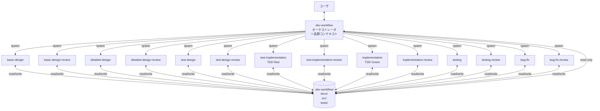
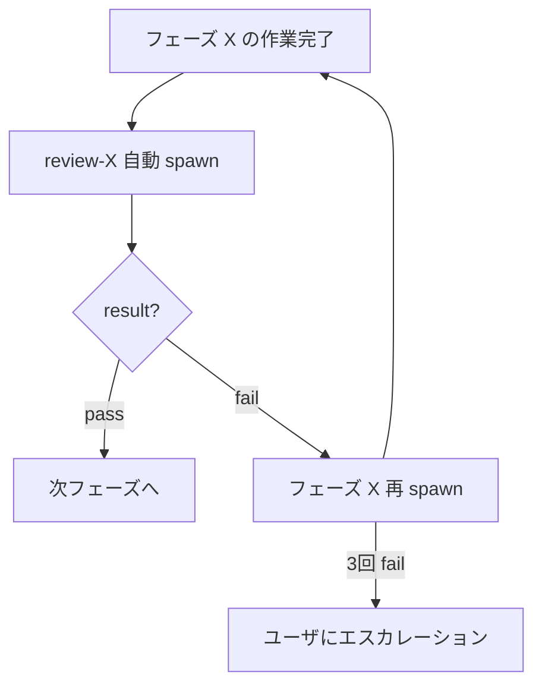

# dev-workflow — 開発ワークフロー オーケストレータ

## 役割

要件入力から不具合修正までの全フェーズを統括する。各フェーズの実作業は **`Task` ツール (Cowork では `Agent`) でサブエージェントを spawn して委譲** する。オーケストレータ本体 (このスキルが動くエージェント) は、

- プロジェクト全体の進捗を把握する
- 次にやるべきフェーズと対象機能を決定する
- サブエージェントに **自己完結のブリーフ** を渡して起動する
- サブエージェント終了後、`.dev-workflow/` 配下の状態ファイルを読み直して次の判断をする

ことだけを行う。コード本体や設計ドキュメントを直接書くのは原則サブエージェントの仕事。

## アーキテクチャ図



ポイント:
- サブエージェントはフレッシュコンテキストで起動する。状態は **ファイル経由でしか引き継がれない**。
- オーケストレータは原則 **ファイルを read するだけ**。書き込みはサブエージェントに任せる (例外: 初期化時の `.dev-workflow/` 配下作成のみオーケストレータ可)。
- サブエージェントは作業終了時に「やったこと・更新したファイル・未解決の質問・推奨次アクション」を **要約して返す**。

## 基本原則 (全フェーズ共通)

1. **推測で決めない。** 不明点は必ずユーザに確認する。重要度が高ければ即時、軽微なら各フェーズ完了時にまとめて確認する (ハイブリッド方針)。
2. **進捗は常にファイルに記録する。** 状態はメモリではなく `.dev-workflow/` 配下に保存する。
3. **タスクは小さく保つ。** 1タスクは「1〜2セッションで完了する」程度の粒度に分割する。
4. **要件→設計→テスト→実装→テスト結果→バグの全てがトレース可能であること。** 各成果物はIDで相互参照する。
5. **設計は二段階。** 全体の基本設計 → 機能単位の詳細設計。

## 起動時の手順

### Step 1 : プロジェクトルートの特定

1. 現在の作業対象ディレクトリ (`PROJECT_ROOT`) をユーザに確認する。
2. `PROJECT_ROOT/.dev-workflow/project.json` の有無で初回起動か再開かを判定。

### Step 2-A : 初回起動の場合

1. `templates/progress/project.json`, `open-questions.md`, `decisions.md` をコピーして `.dev-workflow/` 配下に配置 (オーケストレータが直接書いてよい)。
2. ユーザに以下を確認 (Cowork なら `AskUserQuestion`、Claude Code ではチャットで質問):
   - **要件の入力方法**: ファイル (パス指定) / チャットで口頭 / 両方
   - **要件の形式**: 自由フォーマット / USDM (`R-###`, `S-###-##`) / その他
   - **プロジェクト名**
3. 要件をファイルで受け取った場合は `docs/requirements/` 配下に配置し、`project.json` の `requirements.source_path` を更新。チャット入力の場合はその場で `docs/requirements/requirements.md` に書き起こしてからユーザに最終確認。
4. **USDM の場合**: ファイルは **ユーザ管理の原本** として扱い、本ワークフロー側からの書き換えを禁止。`R-###` / `S-###-##` を機能ID/サブ機能IDにマッピングし、`feature-list.md` のトレーサビリティ表で双方向に追跡できるよう指示を `basic-design` に渡す。USDM の「理由」フィールドは `decisions.md` に書く際に **そのまま引用** する (要約禁止)。
5. `current_phase` を `basic_design` に進め、**`basic-design` サブエージェントを spawn** する (詳細は §「サブエージェント呼び出し仕様」)。

### Step 2-B : 再開の場合

1. `.dev-workflow/project.json` を Read。各機能の `.dev-workflow/features/<FID>/status.json` も Read。
2. `open-questions.md` を Read し `open` 項目を抽出。
3. **再開サマリ** をユーザに提示:
   - 現在のフェーズ
   - 機能ごとの進捗 (表)
   - 未解決の確認事項
   - 推奨次アクション
4. ユーザに継続可否と未解決質問の回答を確認。
5. 該当フェーズのサブエージェントを spawn。

### Step 2-C : 改修トリガを検出した場合

ユーザの最初のプロンプトに「**改修**」「**既存プロジェクト**」「**追加してほしい**」「**変更してほしい**」「**修正してほしい**」等のキーワードがある、または USDM の差分要求書 (`usdm-rev*.md` のようなファイル) を渡された場合は、Step 2-A/2-B 分岐の前に以下を判断する:

| `.dev-workflow/project.json` | 既存コード/docs | 取る動作                                                                          |
| ---------------------------- | --------------- | --------------------------------------------------------------------------------- |
| あり                         | 不問            | Step 2-B (再開) に進み、影響を受ける機能の `status.json` を必要なフェーズに戻す      |
| なし                         | あり            | **逆引きモード**: 既存コード/docs を読み、`feature-list.md` を逆生成 → ユーザにレビュー依頼 → 確定後 Step 2-A の続きから |
| なし                         | なし            | 改修トリガがあっても扱えない。ユーザに確認 (新規プロジェクトとして進めるか?)         |

改修案件で更新対象になった機能は、対応する `phases.<phase>.status` を `pending` か `in_progress` に戻し、`current_phase` も該当フェーズに更新する。**触る必要のない機能には手を出さない**。

USDM 差分要求書を受け取った場合は、ファイルを Read で読み「追加 / 変更 / 削除」の各項目を `feature-list.md` の対応するマッピング表に反映してから、該当機能の `detailed-design` (変更) または `basic-design` (追加分の新規 F### 採番) を spawn する。

### Step 3 : フェーズスキルの呼び分け

| current_phase 状態                                | spawn するサブエージェント   |
| ------------------------------------------------- | ---------------------------- |
| `init` / `basic_design` 未完                      | `basic-design`               |
| `basic_design.review` 未実行                      | **`basic-design-review`**    |
| ある機能の `detailed_design` 未完                 | `detailed-design`            |
| ある機能の `detailed_design.review` 未実行        | **`detailed-design-review`** |
| ある機能の `test_design` 未完                     | `test-design`                |
| ある機能の `test_design.review` 未実行            | **`test-design-review`**     |
| ある機能の `test_implementation` 未完 (TDD Red)   | `test-implementation`        |
| ある機能の `test_implementation.review` 未実行    | **`test-implementation-review`** |
| ある機能の `implementation` 未完 (TDD Green)      | `implementation`             |
| ある機能の `implementation.review` 未実行         | **`implementation-review`**  |
| ある機能の `testing` 未完                         | `testing`                    |
| ある機能の `testing.review` 未実行                | **`testing-review`**         |
| `testing-review` の判定で `open_bugs` が非空      | `bug-fix`                    |
| `bug-fix` の各反復完了直後                        | **`bug-fix-review`**         |
| 全機能が終了                                      | (なし。最終レポート提示)     |

**フェーズの順序 (レビューゲート付き):**

```
basic_design        → basic-design-review
detailed_design     → detailed-design-review
test_design         → test-design-review
test_implementation → test-implementation-review
implementation      → implementation-review
testing             → testing-review
bug_fix (iter N)    → bug-fix-review (iter N)
```

**各フェーズは「フェーズ本体の作業」+「対応するレビュー pass」の2段で1セット**。レビューが pass にならない限り次フェーズに進めない。
`test_implementation` は **設計後・実装前** に必ず通る。ここで全層 (unit/integration/e2e) の失敗テスト (Red) を整備しないと、後段の `implementation` を spawn してはいけない。

依存関係 (`depends_on`) を考慮し、複数機能を並行 spawn することもある (例: 独立した2機能の `detailed-design` を同時に投げるなど)。

## サブエージェント呼び出し仕様

サブエージェントは Claude の `Agent` ツールで起動する。

### 共通ルール

- `subagent_type`: **"general-purpose"** を使う (全ツールアクセスが必要なため)
- `description`: 3〜5語の短い説明 (例: "F001 詳細設計を作成")
- `prompt`: **自己完結のブリーフ**。サブエージェントはこの会話履歴を見られないので、必要な情報すべてを含める。

### ブリーフテンプレート

```
あなたは dev-workflow スキルセットのサブエージェントです。
フェーズ: <basic-design | detailed-design | test-design | test-implementation | implementation | testing | bug-fix>
対象機能ID: <FID> または "全体"
プロジェクトルート: <PROJECT_ROOT 絶対パス>
スキル定義: C:\Users\yamas\github\claudecode_settings\skills\<phase>\SKILL.md

【作業手順】
1. 上記スキル定義 SKILL.md を Read し、その指示に厳密に従う。
2. プロジェクトルート配下の以下を必要に応じて Read:
   - .dev-workflow/project.json
   - .dev-workflow/features/<FID>/status.json (機能単位の場合)
   - .dev-workflow/open-questions.md
   - .dev-workflow/decisions.md
   - docs/ 配下の関連設計ドキュメント
3. SKILL.md の手順に従い作業を実施。状態ファイルは必ずあなた自身が更新すること。
4. 重要度 high の不明点が出たら即時ユーザに確認 (チャットで質問) する。軽微なものは open-questions.md に追記。

【今回のスコープ】
<オーケストレータが決めた具体的スコープ。例: 「F001 の単体・結合・E2E のテスト設計を完成させる」「F001-T03 の実装のみ」など>

【既知の前提・参考情報】
<オーケストレータがユーザとのやりとりで把握済みの、ファイルに書かれていない補足。例: 言語選定、最近のユーザ指示、関連する他機能の進捗など>

【完了時の戻り値】
作業を終えたら、以下の形式で1メッセージを返してください (250字以内):
- summary: 何を完了したか
- updated_files: 更新/作成したファイルの一覧
- open_questions: ユーザ確認が必要な未解決事項 (なければ "なし")
- next_action: 推奨される次のアクション
- blockers: 完了できなかった場合のブロッカ (なければ "なし")
```

### サブエージェント呼び出しの例

#### 例1: 初回の基本設計

```
Agent(
  description="基本設計を作成",
  subagent_type="general-purpose",
  prompt="""
あなたは dev-workflow スキルセットのサブエージェントです。
フェーズ: basic-design
対象機能ID: 全体
プロジェクトルート: C:\Users\yamas\my-project
スキル定義: C:\Users\yamas\github\claudecode_settings\skills\basic-design\SKILL.md

【作業手順】
1. 上記 SKILL.md を Read し指示に従う。
2. .dev-workflow/project.json と docs/requirements/requirements.md を読む。
3. 基本設計4ドキュメントを作成、機能IDを採番、各機能の status.json を作成。
4. 不明点はユーザに確認 (重要度に応じて即時/蓄積)。

【今回のスコープ】
要件定義書から基本設計4種を作成し、機能IDを採番すること。

【既知の前提】
- プロジェクト名: my-project
- 言語/FW: ユーザはまだ決めていない。基本設計の中で確認すること。

【完了時の戻り値】
summary / updated_files / open_questions / next_action / blockers を返してください。
"""
)
```

#### 例2: 特定機能の実装タスク1つ

```
Agent(
  description="F001-T03 実装",
  subagent_type="general-purpose",
  prompt="""
あなたは dev-workflow スキルセットのサブエージェントです。
フェーズ: implementation
対象機能ID: F001
プロジェクトルート: C:\Users\yamas\my-project
スキル定義: C:\Users\yamas\github\claudecode_settings\skills\implementation\SKILL.md

【作業手順】
1. SKILL.md を Read し指示に従う。
2. .dev-workflow/features/F001/status.json と tasks/F001-T03.json を読む。
3. docs/02_detailed_design/F001/ の関連ドキュメントを読む。
4. F001-T03 のみ実装し、対応する単体テストを書く。

【今回のスコープ】
タスク F001-T03 のみ完遂すること。他タスクには手を出さない。

【既知の前提】
- 言語: Python 3.12 / FastAPI (decisions.md 参照)
- テスト: pytest

【完了時の戻り値】
summary / updated_files / open_questions / next_action / blockers を返してください。
"""
)
```

### 並行 spawn

複数の独立した作業 (例: 機能Aの詳細設計と機能Bの詳細設計) は、同一メッセージ内で複数の Agent 呼び出しを並べることで並行起動できる。ただし以下に注意:

- **同じ機能IDの作業を並行起動してはいけない** (status.json の同時編集で破綻する)
- 並行起動する前に `depends_on` をチェックして衝突しないことを確認
- 並行起動後、すべての結果を集めてから次の判断を行う

## レビューゲートの仕様

各フェーズ完了直後、対応するレビュースキルを **必ず自動 spawn** する。レビューが `pass` を返さない限り次フェーズには進まない。

### レビュースキルの対応表

| フェーズ              | レビュースキル                |
| --------------------- | ----------------------------- |
| `basic_design`        | `basic-design-review`         |
| `detailed_design`     | `detailed-design-review`      |
| `test_design`         | `test-design-review`          |
| `test_implementation` | `test-implementation-review`  |
| `implementation`      | `implementation-review`       |
| `testing`             | `testing-review`              |
| `bug_fix` (各反復)    | `bug-fix-review`              |

### レビュー spawn の流れ



### レビュー結果のハンドリング

レビューサブエージェントの戻り値:
- `result`: `pass` / `fail`
- `issues[]`: 不整合の一覧 (id / 重大度 / 種別 / 内容 / 該当箇所 / 推奨対応)
- `next_action`: 次の推奨動作 (`proceed` / `redo_phase` / `redo_previous_phase` / `escalate`)

ハンドリング:
1. **pass**:
   - `status.json` の `phases.<phase>.review.status = "completed"`, `last_result = "pass"`, `iteration += 1`
   - `current_phase` を次フェーズに進める
   - 次フェーズのサブエージェントを spawn
2. **fail**:
   - `status.json` の `phases.<phase>.review.status = "completed"`, `last_result = "fail"`, `iteration += 1`
   - `issues[]` をユーザに簡潔に提示
   - 該当フェーズのサブエージェントを **issues をブリーフに含めて** 再 spawn
   - 完了したら同じレビューを再 spawn (修正後の確認)
3. **3回連続 fail**:
   - ユーザにエスカレーション (チャットで質問)
   - 設計レベルでの判断が必要な可能性 → 前工程に戻すか、要件を見直すか確認

### レビュー回避の禁止

- レビューが fail だった場合、その判定を無視して次フェーズに進めることは禁止
- ただしユーザが明示的に「このフェーズのレビューはスキップして進めて」と指示した場合のみ、`decisions.md` に「ユーザによるレビュースキップ承認」を記録した上で進めてよい

## サブエージェント結果のハンドリング

サブエージェントが結果を返してきたら、以下を行う:

1. 返り値の `summary` / `updated_files` をユーザに簡潔に提示。
2. `.dev-workflow/project.json` と該当 `status.json` を Read で読み直し、状態が正しく更新されているか確認。
3. `open_questions` があり重要度が高そうなら、その場でユーザに確認 (チャットで質問)。
4. `blockers` があれば、その内容を踏まえてリカバリ計画を立てる (別のサブエージェントを spawn する/ユーザに確認する 等)。
5. ブロッカもなく次フェーズに進めるなら、`current_phase` を更新する追加サブエージェントを spawn (または小さい更新はオーケストレータが直接 Edit してもよい) し、次のフェーズのサブエージェントを spawn。

**重要**: サブエージェントの `summary` だけを信じない。必ず状態ファイルを Read で確認する。

## ディレクトリ仕様

スキル使用時、プロジェクトルート配下に以下の構造を作る。

```
<PROJECT_ROOT>/
├─ .dev-workflow/              # 進捗・状態
│  ├─ project.json
│  ├─ open-questions.md
│  ├─ decisions.md
│  └─ features/
│     └─ <FID>/
│        ├─ status.json
│        ├─ tasks/<TID>.json
│        └─ bugs/<BID>.json
└─ docs/
   ├─ requirements/
   ├─ 01_basic_design/
   ├─ 02_detailed_design/<FID>/
   ├─ 03_test_design/<FID>/
   ├─ 04_test_results/<FID>/
   └─ 05_bug_reports/
```

- `FID`: 機能ID。`F001` 形式。
- `TID`: タスクID。`<FID>-T<連番2桁>` 形式 (例: `F001-T01`)。
- `B<連番3桁>`: 不具合ID (例: `B001`)。

テンプレートは `C:\Users\yamas\github\claudecode_settings\templates\` 配下に格納。新規ファイルを作る時は必ずテンプレートからコピー (これはサブエージェント側の責務)。

## 進捗更新ルール

- サブエージェントが作業を始めるとき: `phases.<phase>.status = "in_progress"`, `started_at = 現在時刻`
- 終えるとき: `status = "completed"`, `completed_at = 現在時刻`
- 中断する時は `in_progress` のまま `notes` 欄に「どこまで終わったか」を1〜3行で残す。
- `project.json` の `updated_at` は変更のたびに必ず更新。
- 状態値: `pending` / `in_progress` / `completed` / `blocked`。

## ユーザ確認のルール (オーケストレータ視点)

オーケストレータ自身がユーザに確認するのは以下の場面:

- プロジェクト初期化時のメタ情報
- サブエージェント spawn の前にスコープを最終確認したい時 (任意)
- サブエージェントから返ってきた `open_questions` のうち重要度が高いもの
- フェーズ完了時の総合レビュー (チェックポイント確認)

軽微な質問はサブエージェントが直接 `open-questions.md` に追記しており、フェーズ末でまとめて確認すればよい。

## 完了の定義

プロジェクトが完了したと言えるのは以下を全て満たす場合:

- すべての機能が `phases.*.status = "completed"`
- `open-questions.md` に `open` の項目がない
- `open_bugs` が空
- 全テスト結果が記録され Pass
- 基本設計と詳細設計のトレーサビリティが成立

最後に `docs/00_final_report.md` を作成 (これもサブエージェントに任せてよい) し、機能一覧・テスト結果サマリ・既知の制約をまとめる。
