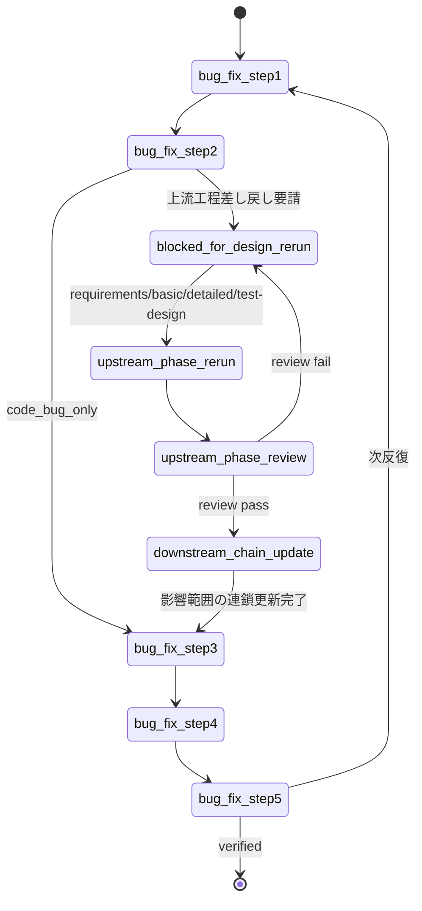

# bug-fix からの設計差し戻し (Pause / Resume) 詳細仕様

> `dev-workflow` SKILL.md §「bug-fix からの設計差し戻し」から参照される詳細仕様。
> bug-fix の戻り値に `blocked_for_design_rerun` が含まれていた場面で Read する。

`bug-fix` の Step 2 (影響範囲の判定) で、ある分類 (`test_design_gap` / `design_error_detailed` / `design_error_basic` / `undocumented_behavior` / `requirements_misinterpretation`) が選ばれた場合、**bug-fix は自分では要件・設計・テスト設計を編集せず、オーケストレータに差し戻しを要請** する。本書はオーケストレータがそれを受けてどう動くかを定める。

原則は「**根本原因が混入した最上流の工程からやり直し、そこから下流へ影響範囲を連鎖更新する**」。

## 受信時の判定

bug-fix サブエージェントの戻り値に以下が含まれていれば差し戻し要請とみなす:

```
status         = "blocked_for_design_rerun"
design_handoff:
  classification  = "test_design_gap" | "design_error_detailed" | "design_error_basic" | "undocumented_behavior" | "requirements_misinterpretation"
  target_phase    = "test_design" | "detailed_design" | "basic_design" | "requirements"
  target_FIDs     = [<差し戻し対象機能ID>]
  impacted_FIDs   = [<影響を受ける機能ID>]
  impacted_layers = [<影響を受けるテスト層>]
  impact_basis    = "<影響範囲の導出根拠>"
  reason          = "<根拠>"
```

## オーケストレータの動作

1. **bug-fix を一時停止**: `bug.json` の `iterations[-1].sub_phases.design_handoff.status` は `in_progress` のまま保留
2. **対象機能の `status.json` を該当フェーズに戻す**: 例えば `target_phase = detailed_design` なら `phases.detailed_design.status = "in_progress"`, `current_phase = "detailed_design"`、レビューも `pending` に戻す (`target_phase = requirements` の場合は `project.json` の requirements ブロックを戻す)
3. **差し戻し先の工程を spawn** (バッチ規律を維持):
   - 単一機能なら 1 機能だけの spawn
   - 複数機能に影響するなら影響範囲全体をバッチで spawn
   - `requirements` の場合: 要件定義書の修正は **ユーザ確認必須** (USDM 原本はユーザ管理のため書き換えず、修正提案をユーザに提示して更新してもらう)。完了後 `requirements-review` → **human-checkpoint (requirements)** を通す
4. **差し戻し先のレビューゲートを通す** (requirements は requirements-review、test-design 以降は auto-check → per_feature → cross)
5. **下流工程の連鎖更新 (上流からやり直す本体)**: 差し戻し先より下流の工程を `requirements → basic-design → detailed-design → test-design` の順で、**影響範囲 (`impacted_FIDs` / `impacted_layers`) に縮退した差分更新** として再実施し、各段のレビューゲートを通す:

   | target_phase | 連鎖更新する下流工程 (影響範囲のみ) |
   |---|---|
   | `requirements` | basic-design (影響 R-### に紐づく FID) → detailed-design (影響 FID) → test-design (影響 FID × 影響層) |
   | `basic_design` | detailed-design (影響 FID) → test-design (影響 FID × 影響層) |
   | `detailed_design` | test-design (対象 FID × 影響層。検出層より上位の層のテスト設計も含む) |
   | `test_design` | (下流なし。テスト設計の差分更新のみ) |

   - 上流の変更が当該段に **差分を生まない場合はその段を skip してよい** (「差分なし」の判断根拠を `decisions.md` に記録)
   - 実施/skip の結果を `design_handoff.downstream_rerun[]` に `{phase, fids, result: "updated"|"skipped", reason}` で記録する
6. すべて完了した時点で:
   - `bug.json` の `design_handoff` に書き戻し:
     ```
     design_rerun_completed_at        = 現在時刻
     design_review_per_feature_passed = true
     design_review_cross_passed       = true
     updated_design_files             = [<更新された要件/設計/テスト設計ファイル>]
     downstream_rerun                 = [{phase, fids, result, reason}, ...]
     status                           = "completed"
     ```
   - **`undocumented_behavior` の場合のみ**: 設計フェーズの結論 (「入れるべき/入れるべきでない」) を `design_handoff.decision_notes` に転記
7. **bug-fix を再 spawn** し、当該反復の **Step 3 から再開** するようブリーフで指示:
   ```
   再開: bug-fix iteration N
   Step 1, 2 はすでに完了済み (bug.json 参照)。上流工程の差し戻しと下流連鎖更新も完了済み
   Step 3 (テストコード補強) から開始してください
   ```
8. **反復完了後の影響範囲テスト**: bug-fix Step 5 は `impacted_FIDs` の該当層テストを必須で実行する。さらに verified 後、`impacted_FIDs` が複数機能に及ぶ場合はオーケストレータが `testing (mode=retry)` を影響機能群 × 影響層 (検出層より上位を含む) で spawn し、リグレッション全体を確認する

## `undocumented_behavior` 特有のフロー

設計フェーズの判断結果に応じて bug-fix 側の Step 4 で取る動作が変わる:

| 設計フェーズの判断              | `decision_notes` 例                          | bug-fix Step 4 のアクション             |
| ------------------------------- | -------------------------------------------- | --------------------------------------- |
| 入れるべき → 設計を更新済み     | `"approved: 設計に追記し review pass"`       | 通常の Green 実装                       |
| 入れるべきでない                | `"rejected: 該当コード除去が妥当"`           | **当該コードを除去** (テストも要に応じて) |

## 反復ガード

bug-fix の同一不具合の反復が 5 回を超え、その中で複数回設計差し戻しが発生する場合は、設計の根本的な問題の可能性が高い。**ユーザに即時エスカレーション** し、進め方を確認する。

## 状態遷移サマリ


