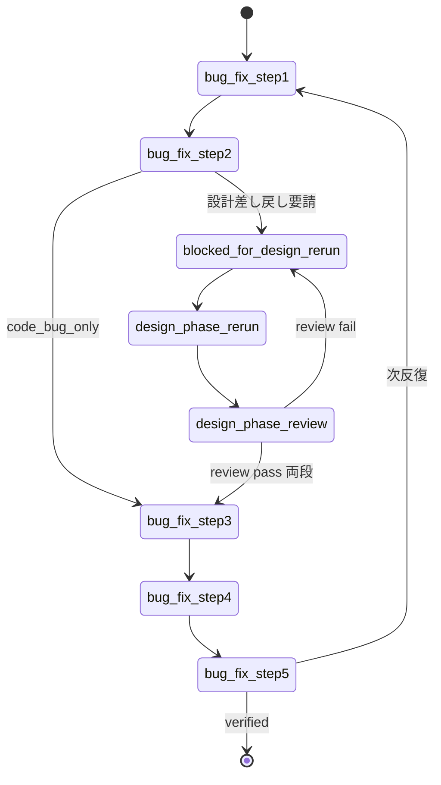

# bug-fix からの設計差し戻し (Pause / Resume) 詳細仕様

> `dev-workflow` SKILL.md §「bug-fix からの設計差し戻し」から参照される詳細仕様。
> bug-fix の戻り値に `blocked_for_design_rerun` が含まれていた場面で Read する。

`bug-fix` の Step 2 (影響範囲の判定) で、ある分類 (`design_error_detailed` / `design_error_basic` / `undocumented_behavior` / `requirements_misinterpretation`) が選ばれた場合、**bug-fix は自分では設計を編集せず、オーケストレータに差し戻しを要請** する。本書はオーケストレータがそれを受けてどう動くかを定める。

## 受信時の判定

bug-fix サブエージェントの戻り値に以下が含まれていれば差し戻し要請とみなす:

```
status         = "blocked_for_design_rerun"
design_handoff:
  classification = "design_error_detailed" | "design_error_basic" | "undocumented_behavior" | "requirements_misinterpretation"
  target_phase   = "detailed_design" | "basic_design"
  target_FIDs    = [<差し戻し対象機能ID>]
  reason         = "<根拠>"
```

## オーケストレータの動作

1. **bug-fix を一時停止**: `bug.json` の `iterations[-1].sub_phases.design_handoff.status` は `in_progress` のまま保留
2. **対象機能の `status.json` を該当フェーズに戻す**: 例えば `target_phase = detailed_design` なら `phases.detailed_design.status = "in_progress"`, `current_phase = "detailed_design"`、レビューも `pending` に戻す
3. **該当フェーズを spawn** (バッチ規律を維持):
   - 単一機能なら 1 機能だけの spawn
   - 複数機能に影響するなら影響範囲全体をバッチで spawn
4. **per_feature レビュー → cross レビューの 2 段ゲート** を通常どおり通す
5. レビュー両方 pass を確認した時点で:
   - `bug.json` の `design_handoff` に書き戻し:
     ```
     design_rerun_completed_at        = 現在時刻
     design_review_per_feature_passed = true
     design_review_cross_passed       = true
     updated_design_files             = [<更新された設計ファイル>]
     status                           = "completed"
     ```
   - **`undocumented_behavior` の場合のみ**: 設計フェーズの結論 (「入れるべき/入れるべきでない」) を `design_handoff.decision_notes` に転記
6. **bug-fix を再 spawn** し、当該反復の **Step 3 から再開** するようブリーフで指示:
   ```
   再開: bug-fix iteration N
   Step 1, 2 はすでに完了済み (bug.json 参照)
   Step 3 (テストコード補強) から開始してください
   ```

## `undocumented_behavior` 特有のフロー

設計フェーズの判断結果に応じて bug-fix 側の Step 4 で取る動作が変わる:

| 設計フェーズの判断              | `decision_notes` 例                          | bug-fix Step 4 のアクション             |
| ------------------------------- | -------------------------------------------- | --------------------------------------- |
| 入れるべき → 設計を更新済み     | `"approved: 設計に追記し review pass"`       | 通常の Green 実装                       |
| 入れるべきでない                | `"rejected: 該当コード除去が妥当"`           | **当該コードを除去** (テストも要に応じて) |

## 反復ガード

bug-fix の同一不具合の反復が 5 回を超え、その中で複数回設計差し戻しが発生する場合は、設計の根本的な問題の可能性が高い。**ユーザに即時エスカレーション** し、進め方を確認する。

## 状態遷移サマリ


