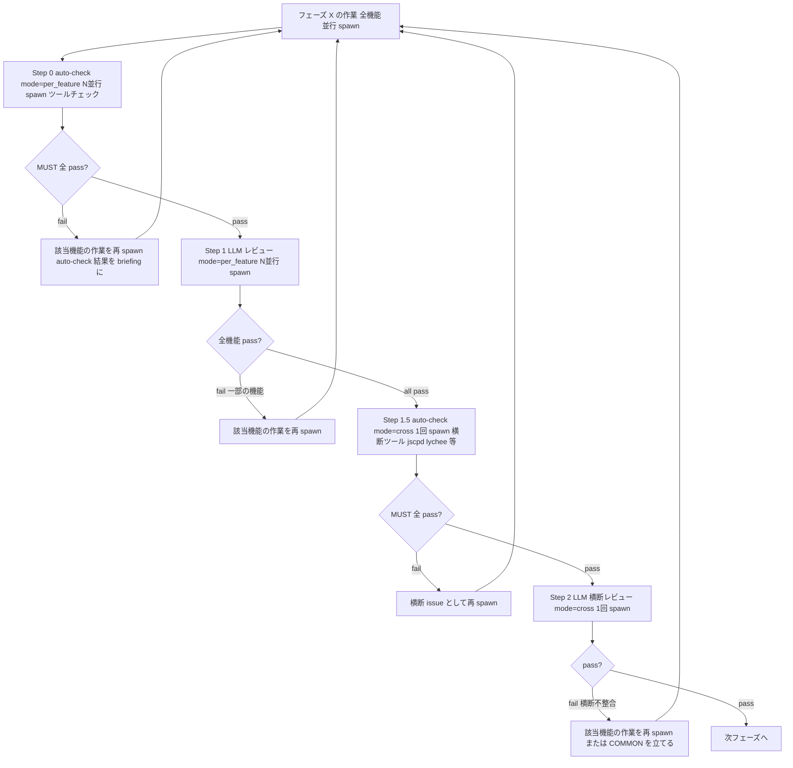
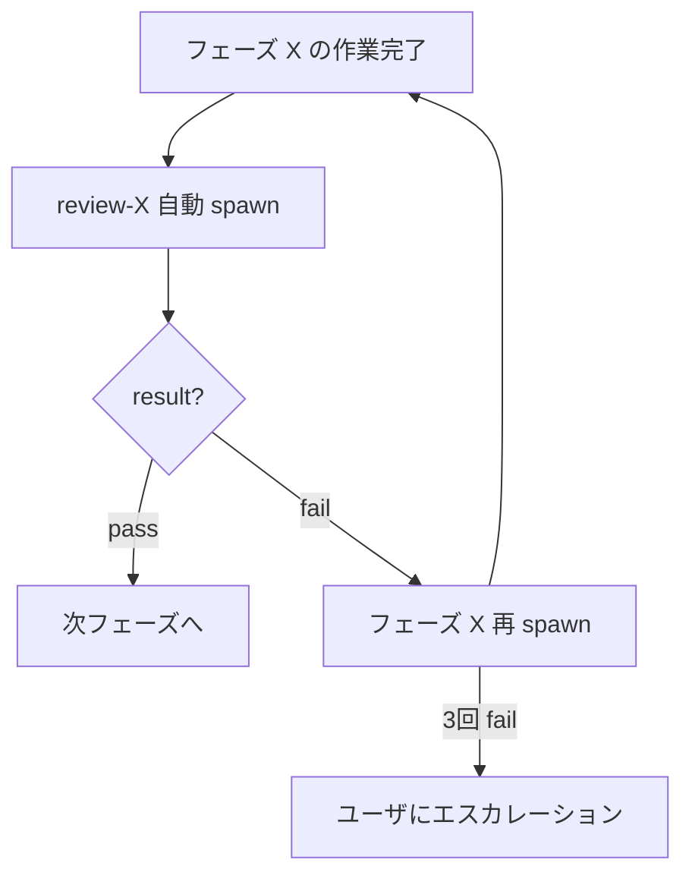

# レビューゲート詳細仕様 (review-gates)

> `dev-workflow` SKILL.md §「レビューゲートの仕様」から参照される詳細仕様。
> レビューフェーズ (auto-check → per_feature → cross) を運用する場面で Read する。

## 3 段ゲートの動作 (auto-check → per_feature → cross)



**ハンドリングの詳細:**
1. フェーズ作業が完了したら、`auto-check (mode=per_feature)` を **機能数ぶん並行 spawn**
2. auto-check の MUST に fail があれば → 該当機能の作業を再 spawn (auto-check レポートをブリーフに含める)
3. 全機能の auto-check が MUST pass → `<phase>-review (mode=per_feature)` を **機能数ぶん並行 spawn**
4. 全機能の per_feature レビューが pass するまで待つ。fail があれば元のフェーズ作業を再 spawn
5. 全機能 per_feature pass → `auto-check (mode=cross)` を **1回 spawn** (jscpd / lychee 等の横断スキャン系ツールがある場合のみ。なければ skip)
6. cross auto-check MUST pass → `<phase>-review (mode=cross)` を **1回 spawn**
7. cross レビューが pass → 次フェーズへ
8. cross レビューが fail → 該当機能の作業を再 spawn、または `COMMON` 機能を立てる判断を `decisions.md` に記録

> auto-check の MUST がすべて pass でも SHOULD warning や MAY info があり得る。それらは LLM レビュー (per_feature / cross) のブリーフに渡し、LLM が判断 (accept なら `decisions.md` に記録)。

## 各レビュー spawn のブリーフ仕様

ブリーフテンプレート (per_feature の場合):

```
あなたは dev-workflow スキルセットのサブエージェントです。
レビュー: <phase>-review
mode: per_feature
対象機能ID: <FID>           (per_feature の場合は単一機能)
プロジェクトルート: <PROJECT_ROOT>

【作業手順】
1. `mode=per_feature` の節 (§「個別チェック」) のみを評価対象とする (agent の system prompt に手順は組み込み済み)。
2. 該当機能の per_feature レビュー票を `docs/06_reviews/<FID>/<phase>-review-per-feature.md` に出力。
3. status.json の `phases.<phase>.review.per_feature` を更新。

【戻り値】
- summary / result (pass|fail) / issues[] / next_action / updated_files
```

ブリーフテンプレート (cross の場合):

```
あなたは dev-workflow スキルセットのサブエージェントです。
レビュー: <phase>-review
mode: cross
対象機能ID: 全機能 (F001, F002, ...)   ← project.json から取得
プロジェクトルート: <PROJECT_ROOT>

【作業手順】
1. `mode=cross` の節 (§「横断チェック」) のみを評価対象とする (agent の system prompt に手順は組み込み済み)。
2. 全機能の成果物を Read し、横断的な一貫性と共通化の機会を検証。
3. 横断レビュー票を `docs/06_reviews/_cross/<phase>-cross-review.md` に出力。
4. 全機能の status.json の `phases.<phase>.review.cross` を更新。

【戻り値】
- summary / result (pass|fail) / issues[] / next_action / updated_files
- issues[] には COMMON 昇格推奨、命名統一指摘、データ型統一指摘などを含める
```

## レビュー spawn の流れ



## レビュー結果のハンドリング

レビューサブエージェントの戻り値:
- `result`: `pass` / `fail`
- `issues[]`: 不整合の一覧 (id / 重大度 / 種別 / 内容 / 該当箇所 / 推奨対応)
- `next_action`: 次の推奨動作 (`proceed` / `redo_phase` / `redo_previous_phase` / `escalate`)

ハンドリング:
1. **pass**:
   - `status.json` の `phases.<phase>.review.status = "completed"`, `last_result = "pass"`, `iteration += 1`
   - §「Git 統合」の commit ポイントに該当する場合は **commit 前にユーザ確認を行い (§「commit 前のユーザ確認」)、承認を得てから commit** してから次へ
   - `current_phase` を次フェーズに進める
   - 次フェーズのサブエージェントを spawn
2. **fail**:
   - `status.json` の `phases.<phase>.review.status = "completed"`, `last_result = "fail"`, `iteration += 1`
   - `issues[]` をユーザに簡潔に提示
   - 該当フェーズのサブエージェントを **issues をブリーフに含めて** 再 spawn
   - 完了したら同じレビューを再 spawn (修正後の確認)
3. **3回連続 fail**:
   - ユーザにエスカレーション (チャットで質問)
   - 設計レベルでの判断が必要な可能性 → 前工程に戻すか、要件を見直すか確認
