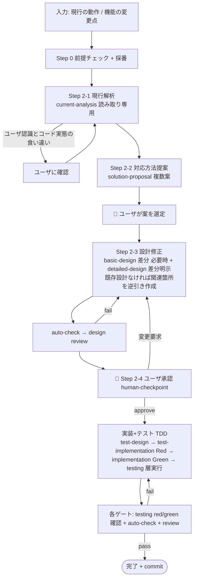

# feature-add-workflow — 機能追加ワークフロー

## ベース規約の継承

本スキルは `dev-workflow` の規約をそのまま継承する。以下は **ベース `~/.claude/skills/dev-workflow/SKILL.md` の該当節に従う** (本ファイルでは繰り返さない):

- サブエージェント呼び出し仕様 (ブリーフテンプレート・戻り値形式・共有ファイル/Git の扱い)
- ファイルの所有権分離 (`project.json` / `open-questions.md` / `decisions.md` はオーケストレータ専任)
- **Git 統合**: 開始時の専用ブランチ確認 (main/master では開始しない)、ゲート通過時 commit、**commit 前に必ずユーザ確認 (提案メッセージ・対象ブランチ・変更サマリを提示し承認を得てから実行。承認なしの自動 commit 禁止)**、push は人、履歴改変禁止
- テンプレ解決順と初期化時の `.dev-workflow/templates/` 集約コピー
- 3 段ゲート (auto-check → LLM レビュー) とレビュー回避の禁止
- TDD の規律 (テストコードはプロダクトコードより必ず先。Red 確認 → Green 化)

## 入力 (必須 2 点)

| 項目 | 内容 |
|---|---|
| 現行の動作 | いま何がどう動いているか (ユーザの認識) |
| 機能の変更点 | 何をどう変えたい / 追加したいか (期待する動作・受入条件があれば一緒に) |

**2 点のうち欠けがあれば、作業を始める前にユーザに確認する** (Cowork では `AskUserQuestion`)。

## 全体フロー

## 手順

### Step 0 : 前提チェックと採番

1. **Git 前提チェック** (ベース §「Git 統合」): 専用ブランチ上であることを確認。main/master なら停止して切替を依頼
2. `.dev-workflow/` が無ければ最小初期化 (project.json / open-questions.md / decisions.md / `templates/` 集約コピー)
3. **機能IDの扱い** (確定は Step 2-3 でよい):
   - 既存機能の変更 → 該当 `F###` を使う
   - 新規機能 → 新しい `F###` を採番
   - `feature-list.md` が無い (dev-workflow 未管理) 場合 → 対象機能だけを登録する最小の `feature-list.md` を作成し、他は「未管理」と注記 (レガシー適用の方針 B 部分適用と同じ)

### Step 2-1 : 現行解析 — `current-analysis` (読み取り専用)

`Task(subagent_type="current-analysis", ...)` で spawn。ブリーフに入力 2 点と対象範囲のヒントを含める。

- 現行の振る舞い・関連モジュール・既存設計/テストの有無マップ・影響範囲候補が返る
- **ユーザの「現行の動作」説明とコードの実態に食い違いがあれば**、解析を進める前にオーケストレータがユーザに確認する (どちらを正とするかで変更点の意味が変わるため)
- 既存テストのカバー状況は Step 2-4 のテスト計画の土台になる

### Step 2-2 : 対応方法提案 — `solution-proposal`

`Task(subagent_type="solution-proposal", ...)` で spawn (種別=feature、インプット=現行解析レポート)。

1. **「あるべき姿 (理想設計)」案を必須** に、最小修正案を含む 2〜4 案 + 推奨案が返る (必要な設計を考慮した理想を基準点に、各案のあるべき姿との乖離・技術的負債が明示される)
2. **オーケストレータがユーザに選択肢を提示** (Cowork では `AskUserQuestion`、推奨案を先頭に)。あるべき姿との乖離と先送りにする負債もあわせて提示する
3. 選定結果と理由を `decisions.md` に記録 (理想案を選ばなかった場合は **先送りにした技術的負債も記録**)。proposal レポートの「選定結果」を埋める

### Step 2-3 : 設計修正 — `basic-design` (必要時) + `detailed-design` (差分明示)

選定案をブリーフに含めて設計フェーズを spawn する。

1. **basic-design の差分が必要な場合のみ** (新規 F### の追加 / 機能間連携・アーキ・NFR に影響する場合): `feature-list.md` への追記、`system-architecture.md` 等の該当箇所を差分更新
2. **detailed-design**: 対象 FID の関連ドキュメントを更新:
   - **既存設計がある場合**: 該当ドキュメントを更新し、**変更点を「現行 → 変更後」の差分表** で明示する
   - **既存設計が無い場合**: まず関連箇所のみ **現行コードから逆引きで最小の設計を作成** し (関連する種類のみで可)、その上で変更点を同じ差分表で示す。「逆引き部分 (現行の事実)」と「変更部分」を明確に区別すること
3. `auto-check` (phase=detailed-design) → `detailed-design-review` (mode=per_feature、対象機能に縮退。basic-design を触った場合は `basic-design-review` も) を通す。fail なら再 spawn

### Step 2-4 : ユーザ承認 (human-checkpoint) → TDD 実装・テスト

1. **🛑 設計差分をユーザに提示して承認を待つ**: 変更ドキュメントのパス一覧、差分表の要約、選定案、影響範囲、テスト計画の概要。応答パターンはベース §「人間チェックポイント」と同じ。approve 時は `decisions.md` 記録 + **commit (commit 前にメッセージ・変更サマリを提示しユーザ確認。承認と commit 確認は 1 メッセージに統合可)** (`[feature-add-workflow] checkpoint: <FID> design approved`)
2. 以降はベースのフェーズ連鎖を **対象 FID に縮退して** 実行する (各ゲートはベースどおり):

| 順序 | spawn | ゲート |
|---|---|---|
| 1 | `test-design` (差分: 追加/変更ケース + 既存ケースの影響更新) | auto-check → `test-design-review` |
| 2 | `test-implementation` (新規/変更テストをコード化) | `testing` (mode=red、**新規/変更分が Fail することを確認**。既存 Pass 分は対象外と明記) → auto-check → `test-implementation-review` |
| 3 | `implementation` (Red を Green にする最小実装。既存テストを壊さない) | `testing` (mode=green) → auto-check → `implementation-review` → 必要時 `security-review` |
| 4 | `testing` (layer=unit → integration → e2e、対象 FID + 影響範囲のリグレッション) | 各層の `<layer>-test-review`。Fail は不具合票を起票し `bugfix-workflow` の手順 (bug-investigation → bug-fix) で解消 |

3. 全層 Pass + review pass で完了。**commit (実行前にユーザ確認)** (`[feature-add-workflow] <FID>: completed`)。完了報告 (変更ファイル・テスト結果サマリ・残課題)

## 完了の定義

- 設計差分がユーザ承認済み (`decisions.md` に記録)
- 追加/変更分のテストが TDD (Red → Green) の記録付きで Pass、既存リグレッションも Pass
- トレーサビリティ成立 (変更点 → 設計差分 → テストID → 結果。auto-check の `check-traceability.py` が PASS)
- ゲート commit が積まれている (push はユーザ)

## 注意

- 本ワークフローは機能 **1 件 (1 FID) ずつ** 処理する。複数機能にまたがる大きな追加はフルの `dev-workflow` (フェーズバッチ + 横断レビュー) を使う
- 解析の結果、要件レベルの再定義が必要 (そもそも何を作るかが曖昧) と判明した場合は、`dev-workflow` の requirements フェーズからやり直すことをユーザに提案する
