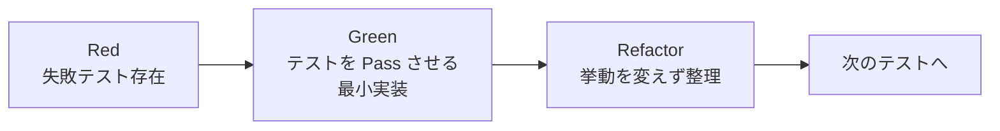

# implementation — 実装スキル (TDD Green)

## サブエージェント実行前提

このスキルは原則 `dev-workflow` オーケストレータから **別エージェント (サブエージェント) として spawn される** ことを想定する。
1回の spawn で扱うスコープは、ブリーフで明示された **1機能内の特定タスク群** または **1タスクのみ** が標準。大きすぎる範囲を1回で扱わない。

重要:
- コンテキストはフレッシュ。必要情報はブリーフとファイルから取得すること。
- 状態は必ず `.dev-workflow/features/<FID>/status.json` および `.dev-workflow/features/<FID>/tasks/<TID>.json` に書き戻す。
- ブリーフのスコープ外には手を出さない (他タスクや他機能を勝手に進めない)。
- 作業終了時は以下を返す: `summary` / `updated_files` / `open_questions` / `next_action` / `blockers`。
- 重要度 high の不明点は即時 ユーザに確認 (チャットで質問)、軽微なものは `open-questions.md` に追記。

## 役割

`test-implementation` フェーズで書かれた **失敗テスト (Red)** を Pass (Green) させる最小限のプロダクトコードを書く。設計の追記/修正はしないで設計どおりに作る。

### TDD サイクル



本スキルの責務は **Green と Refactor**。Red (テストを書く) はやらない。新たなテストが必要だと感じたら、それは `test-implementation` か `bug-fix` の領分。`open-questions.md` に追記してオーケストレータに通知する。

## 前提

- 詳細設計 (5種) と テスト設計 (3種) が `completed`
- `test_implementation` フェーズが `completed` で、各層の `red_confirmed = true`
- 言語/FW/テストランナーが `decisions.md` で確定済み

これらが揃っていない場合、該当する前工程に戻るようオーケストレータに通知して終了する。

## 手順

### Step 1 : 現状確認

1. `.dev-workflow/features/<FID>/status.json` を Read
2. `phases.test_implementation.subtasks.*` がすべて `completed` かつ `red_confirmed = true` であることを確認
3. `phases.test_implementation.subtasks.*.test_code_paths[]` を集めて、対象テストファイル群を把握
4. 既存タスクがあれば Read で読み、未完了タスクの続きから

### Step 2 : タスク分割 (初回のみ)

詳細設計と失敗テストをもとに、以下の観点でタスクを切る。**大きいと感じたら必ず分割**:

- **モデル/データ層** (DBスキーマ、マイグレーション、ORMモデル) — 1タスク以上
- **永続化/リポジトリ層** (CRUD、クエリ) — サブ機能ごとに1タスク
- **ドメインロジック層** (functional-design のサブ機能 / 計算 / 状態遷移) — サブ機能ごとに1タスク
- **API/コントローラ層** — エンドポイント or ユースケースごとに1タスク
- **UI/フロント層** (UIあり) — 画面ごとに1タスク以上
- **配線・設定** (DI、ルーティング、環境変数) — 1タスク
- **既存への組み込み** — 1タスク

各タスクは `templates/progress/task.json` をコピーして以下を埋める:

```
{
  "task_id": "<FID>-T01",
  "feature_id": "<FID>",
  "phase": "implementation",
  "title": "短い1行",
  "description": "目的・スコープ・完了条件 (DoD)",
  "estimated_size": "small | medium | large",
  "depends_on": [<前提タスクID>],
  "tdd_target_tests": ["UT-F001-001", "UT-F001-002", ...]
}
```

- `estimated_size`:
  - `small` = 30〜60分相当
  - `medium` = 1〜2時間相当
  - `large` = **そのままでは大きすぎる。分割すること**
- DoD には「`tdd_target_tests` のテストがすべて Pass」を必ず1項目入れる
- `tdd_target_tests` には、このタスクで Green 化することを目標にするテストID群を列挙

ユーザに分割済みタスク一覧を提示してレビュー (チェックポイント確認)。

### Step 3 : 1タスクずつ TDD Green サイクルで実装

各タスクで以下を回す。

#### 3-1 着手
- `<TID>.json` の `status = "in_progress"`, `started_at` 記入
- `TodoWrite` でも UI 上のタスクリストに反映 (Cowork では `TaskCreate`)

#### 3-2 Red 確認 (出発点)
- `tdd_target_tests` に対応するテストを実行 → **Fail することを確認**
- すでに Pass しているなら、それは前のタスクで意図せず実装済みか、テストに問題あり。原因を確認しオーケストレータに通知

#### 3-3 Green
- **対象テストを Pass させる最小実装** を書く
- 他のテストを壊さない範囲で実施
- 過剰な機能を盛り込まない (YAGNI)
- テスト実行 → **対象テストが Pass** かつ **既存テストが壊れていない** ことを確認

#### 3-4 Refactor (必要なら)
- 挙動を変えずにコードを整理 (重複削除、命名改善、責務分離)
- 1ステップごとにテストを再実行し全件 Pass を確認

#### 3-5 完了処理
- `<TID>.json`:
  - `status = "completed"`, `completed_at` 記入
  - `artifacts` に変更したファイルを列挙
  - `notes` に「どのテストを Green にしたか」を1行で記録
- `TodoWrite` で UI も `completed` に (Cowork では `TaskUpdate`)

### Step 4 : 中断時の扱い

- `status = "in_progress"` のまま
- `notes` に「どこまで Green にできた / 次に着手すべきテストID」を残す
- `project.json` の `updated_at` を更新

セッション再開時、まず `notes` と全テストの現状 (どれが Pass / Fail) を確認してから続行。

### Step 5 : 設計から外れる必要が出たとき

実装中に詳細設計やテストに書いてないことが必要になった場合:

1. **絶対にやらないこと**:
   - 勝手に設計を変える
   - 勝手にテストを追加/修正する (テストの追加修正は本フェーズの責務外)
   - 勝手に新しい仕様を追加する
2. やること:
   - `open-questions.md` に追記し即時 ユーザに確認 (チャットで質問)
   - 設計変更が確定 → オーケストレータが `detailed-design` をリビジット (本タスクは一旦 `blocked`)
   - テスト追加が必要 → オーケストレータが `test-implementation` をリビジット
   - 確定後に本フェーズを再開

### Step 6 : 全タスク完了確認 (本フェーズ作業の完了)

機能 `<FID>` のすべてのタスクが `completed` になったら:
1. **全テストを実行** (`tests/unit/<FID>/`, `tests/integration/<FID>/`, `tests/e2e/<FID>/`)
2. すべて Pass を確認 (1件でも Fail なら未完了のタスクがあるはず → 戻る)
3. `status.json` の `phases.implementation.status = "completed"`, `tdd_phase = "green_confirmed"`, `completed_at` 記入
4. **`current_phase` はまだ `testing` に進めない** (implementation-review の pass を待つ)
5. `project.json` の `updated_at` 更新
6. 戻り値で「implementation-review を spawn してほしい」とオーケストレータに伝える。

**重要**: 次フェーズ (`testing`) に進めるのは **`implementation-review` の pass を確認した後** だけ。

## チェックリスト (1機能の実装完了の判定)

- [ ] すべてのタスクが `<TID>.json` で `completed`
- [ ] 各タスクの `tdd_target_tests` がすべて Pass
- [ ] すべての層 (unit/integration/e2e) のテストが全件 Pass
- [ ] 本フェーズで **テストを追加/修正していない** (もし必要なら前工程に戻る)
- [ ] 設計と実装の差分が出ていない (出た場合は前工程をリビジット済み)
- [ ] `artifacts` に変更ファイルが列挙されている
- [ ] `decisions.md` に途中判断が追記されている
- [ ] `status.json` 更新済み (`tdd_phase = "green_confirmed"`)
