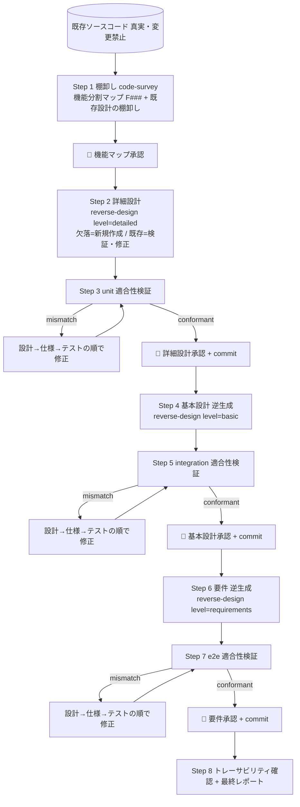

# reverse-design-workflow — リバース設計ワークフロー

## 目的と方向

V 字を **下から上へ逆走** する。コード (実装) を出発点に、詳細設計 → 基本設計 → 要件 を順に復元する。各層の設計は「その設計から作ったテストが既存コードで PASS する」ことで正しさを担保する。

**設計書の有無は問わない**:
- **欠落している設計書** → 新規作成する
- **既存の設計書** → 正しいと仮定せず、コードと突き合わせて検証する。誤り (実態とのズレ・コードに無い過剰記述) があれば **修正** する。一致していればそのまま活かす
- いずれの場合も、最終的な正しさは適合性テスト (設計から作ったテストが既存コードで PASS) で担保する

```
要件定義書        ← (4) 逆生成      ↑ 検証: e2e 適合性テスト (要件 ↔ コード)
基本設計書        ← (3) 逆生成      ↑ 検証: integration 適合性テスト (基本設計 ↔ コード)
詳細設計書        ← (2) 逆生成      ↑ 検証: unit 適合性テスト (詳細設計 ↔ コード)
ソースコード(真実) ← (1) 棚卸し
```

## 不変条件 (絶対規律・全 Agent に徹底)

1. **ソースコードの修正は禁止**。src/ は読み取り専用。本ワークフローが書き換えてよいのは設計ドキュメント (欠落分の新規作成 + 既存分の修正)・テスト仕様書・テストコードだけ
2. **テストが失敗してもテストコードだけの修正は禁止**。また期待値をコードの実出力に合わせて書き換えて Green にするのも禁止 (それは検証放棄)
3. **失敗時の修正順序は必ず 設計書 → テスト仕様書 → テストコード**。失敗 = 「設計 (コードの記述) が実態とずれている」ことの検出。設計を実態に合わせて直し、仕様→テストを再生成して再実行する
4. これは characterization (実挙動の特性化) であり、テストの期待状態は **PASS** (TDD の Red 先行とは逆)
5. コードに不具合に見える挙動があっても設計側で正規化・修正しない。観測どおり記述し open_questions で「不具合の可能性」を指摘する (実際の修正は別途 bugfix-workflow)

## ベース規約の継承

`dev-workflow` の以下の規約に従う (本ファイルでは繰り返さない):
- サブエージェント呼び出し仕様 (ブリーフ・戻り値・共有ファイル所有権)
- テンプレ解決順と初期化時の `.dev-workflow/templates/` 集約コピー
- **Git 統合**: 開始時の専用ブランチ確認、ゲート通過時 commit、**commit 前に必ずユーザ確認**、push は人、履歴改変禁止 (本ワークフローの commit は設計ドキュメント・テストのみ。ソースは変わらない)
- human-checkpoint の応答パターン (approve / 変更要求 / skip checkpoint)

## 入力

```
プロジェクトルート: <PROJECT_ROOT>   (= 既存コードのルート)
対象範囲: リポジトリ全体 / 特定モジュール
要件形式: 自由 / USDM (任意)
```

## 全体フロー



## 検証ループ (各層共通) — 「設計が正しいことの確認」

各設計層 `L` (detailed/basic/requirements、対応 layer = unit/integration/e2e) で:

1. **テスト仕様書を作る**: `Task(subagent_type="test-design", ...)` を spawn。ブリーフに **`mode: characterization`** と `layer` を必ず含める (test-design Agent の §「実行モード」参照。forward の TDD Red 前提を無効化し、Step 5/6 をスキップさせるため)。**検証対象の設計ドキュメントから** 当該 layer のテストケース (期待入出力) を起こす。期待値は設計の主張をそのまま使う (コードを覗いて決めるのは禁止)
2. **適合性テストを作って実行**: `Task(subagent_type="conformance-test", ...)` を spawn (layer 指定)。テスト仕様の期待値を encode したテストを **既存コードに対して実行**
3. **判定**:
   - `conformant` (全 PASS) → 設計は実コードと一致。次へ
   - `mismatch` (FAIL あり) → **修正順序を厳守**:
     1. `reverse-design` (mode=reconcile、不一致レポートを渡す) で **設計書を実態に合わせて修正**
     2. `test-design` で **テスト仕様書を修正後の設計に合わせて更新**
     3. `conformance-test` で **テストコードを再生成し再実行**
     - ※ テストコードだけ / テスト仕様だけ / ソースを直して Green にするのは **禁止**
   - `spec_incomplete` → test-design (必要なら reverse-design) に差し戻し
4. auto-check (組み込みの `check-traceability.py` + ドキュメント lint) を通す
5. mismatch ループが **同一箇所で 3 回** 解消しない場合はユーザにエスカレーション (観測困難な動的挙動 / 環境依存の可能性)

## 手順

### Step 0 : 初期化と前提

1. Git 前提チェック (専用ブランチ。ソースは変更しないが、生成物の履歴管理のため)
2. `.dev-workflow/` 初期化 + テンプレ集約コピー
3. **不変条件 (上記) を全サブエージェントのブリーフ末尾に必ず付ける**: 「ソース修正禁止 / テストのみ修正禁止 / 失敗時は設計→仕様→テストの順」

### Step 1 : コード棚卸し → 機能分割 + 既存設計の棚卸し

`code-survey` を spawn → 機能分割マップ (F###) と COMMON 候補・スタック・テストランナー、**既存設計ドキュメントの棚卸し (どの設計書が存在し/欠落しているか)** を得る。
**🛑 human-checkpoint**: 機能分割マップと既存設計の棚卸し結果をユーザに提示し承認を得る (この F### が以降の単位)。承認 → commit。

> 既存設計の扱いはこの時点では「存在/欠落」の把握まで。**内容が正しいかは判定しない** (reverse-design がコードと突き合わせ、最終的に適合性テストで確定する)。

### Step 2-3 : 詳細設計 (level=detailed) + unit 適合性検証

1. 機能ごとに `reverse-design` (level=detailed, mode=create) を spawn (並行可)。Step 0 (既存設計の棚卸し) に従い、**欠落しているドキュメントは新規作成、既存ドキュメントはコードと突き合わせて検証し誤りは修正** する。各記述は根拠 (ファイル:行番号) 付き
2. 機能ごとに **検証ループ** (layer=unit) を回す。**既存設計だったものも例外なく適合性テストにかける** (既存の正しさを前提にしない)
3. 全機能 conformant → **🛑 詳細設計承認** (新規作成分・既存修正分の差分を提示) → commit (`[reverse-design] detailed: conformant (F001..Fn)`)

### Step 4-5 : 基本設計 (level=basic) + integration 適合性検証

1. `reverse-design` (level=basic) を spawn → 確定済み詳細設計群とコードからアーキ・機能一覧・観測 NFR を集約。**基本設計が既存なら検証・修正、欠落なら新規作成**
2. **検証ループ** (layer=integration): 機能間連携・アーキ I/F が基本設計どおりに繋がっているかを既存コードで検証
3. conformant → **🛑 基本設計承認** (新規/修正差分を提示) → commit

### Step 6-7 : 要件 (level=requirements) + e2e 適合性検証

1. `reverse-design` (level=requirements) を spawn → 実挙動から `R-###` と受入条件 (= 観測された実際の振る舞い) を起こす。**要件定義書が既存なら検証・修正、欠落なら新規作成**
2. **検証ループ** (layer=e2e): システムの観測挙動が要件どおりかを既存コードで検証 (要件カバレッジ)
3. conformant → **🛑 要件承認** (新規/修正差分を提示) → commit

### Step 8 : 仕上げ

- auto-check `check-traceability.py` で **コード ↔ 詳細 ↔ 基本 ↔ 要件 ↔ テスト** の対応が全層 PASS することを確認
- `docs/00_reverse_report.md` を作成: 復元した設計の一覧、適合性テスト結果サマリ、**open_questions に挙がった「不具合の可能性がある観測挙動」一覧** (ユーザが次に bugfix-workflow へ回す候補)

## 完了の定義

- 詳細設計・基本設計・要件が揃い、各層の適合性テストが全 PASS (conformant)
- ソースコードが一切変更されていない (`git diff` に src/ の変更が無いこと)
- 設計 ↔ テスト ↔ コードのトレーサビリティが成立 (check-traceability.py PASS)
- 各承認ゲートで commit 済み (commit 前にユーザ確認・push は人)

## 注意

- 観測挙動が「明らかに意図と異なる」ケースは、本ワークフローでは **記述 + open_questions 指摘にとどめ、直さない**。修正したい場合はユーザ判断で `bugfix-workflow` に渡す
- 動的・環境依存で観測が安定しない箇所は、設計に「観測条件」を明記し、conformance テストにも前提を残す (flaky を Green 偽装しない)
