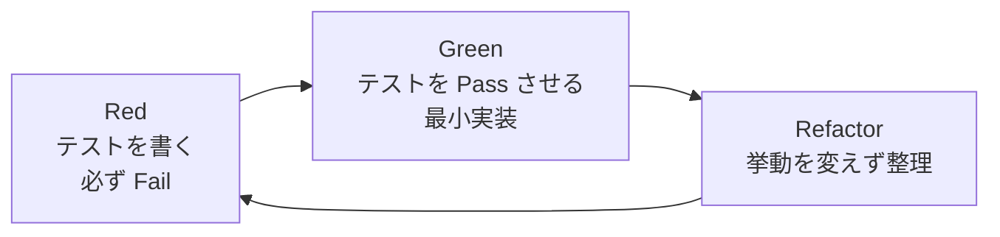

# test-implementation — テストコード作成スキル (TDD Red)

## サブエージェント実行前提

このスキルは原則 `dev-workflow` オーケストレータから **別エージェント (サブエージェント) として spawn される** ことを想定する。

重要:
- コンテキストはフレッシュ。必要情報はブリーフとファイルから取得すること。
- スコープは原則 **1機能 (`<FID>`) ずつ**。または明示された層 (unit/integration/e2e のいずれか) のみ。
- 状態は必ず `.dev-workflow/features/<FID>/status.json` に書き戻す。
- 作業終了時は以下を返す: `summary` / `updated_files` / `open_questions` / `next_action` / `blockers`。戻り値に **書いたテストファイルのパス一覧と Red 確認状況** を含めること。
- 重要度 high の不明点は即時 ユーザに確認 (チャットで質問)、軽微なものは `open-questions.md` に追記。

## 役割

`test-design` で作成したテスト設計 (`docs/03_test_design/<FID>/*.md`) に基づき、**実行可能なテストコード** をプロジェクトのテストツリーに書き起こす。プロダクトコードはまだ作成・修正されていないため、書いたテストは **必ず Fail (Red) する** ことを確認してから完了とする。

これにより:
- 後続の `implementation` フェーズはテストを Pass させることだけに集中できる (TDD Green)
- テストケースに「観測可能な期待結果」を持たない曖昧なものが混入することを防げる
- 実装の不足や設計の見落としを早期に検出できる

## TDD の3フェーズと、本スキルの位置づけ

| TDDフェーズ | 担当スキル              | 状態の値 (`tdd_phase`)   |
| ----------- | ----------------------- | ------------------------ |
| Red         | **test-implementation** | `red`                    |
| Green       | implementation          | `green`                  |
| Refactor    | implementation 内で実施 | `refactor` (任意の追加値) |

## 成果物

- **テストコード本体**: プロジェクトのテストツリー配下 (例: `tests/unit/F001/...`, `tests/integration/F001/...`, `tests/e2e/F001/...`)
- `docs/04_test_results/<FID>/{unit,integration,e2e}-test-result.md` の冒頭に **「Red 確認」セクション** を追記 (失敗テストの実行ログを生で残す)
- `status.json` 内 `phases.test_implementation.subtasks.<layer>.test_code_paths[]` に書いたファイルパスを列挙
- `status.json` 内 `phases.test_implementation.subtasks.<layer>.red_confirmed = true`

## 手順

### Step 1 : 前提読み込み

- `docs/02_detailed_design/<FID>/*.md` (関連設計)
- `docs/03_test_design/<FID>/{unit,integration,e2e}-test.md` (テストケース一覧)
- `.dev-workflow/decisions.md` (テストツール・テストランナーの決定事項)
- `.dev-workflow/features/<FID>/status.json`

テストツール (例: pytest, jest, go test, JUnit など) と既存のテストツリー構造を `decisions.md` で確認。未決定なら **即時ユーザに確認** (チャットで質問)。

### Step 2 : 層ごとにテストコードを書く

各層について、以下を実施:

#### 2-A. 単体テスト (Unit)
- `docs/03_test_design/<FID>/unit-test.md` のテストIDごとに1つ以上の関数/ケースを作成
- 命名規約: テスト関数名にテストID (`UT-F001-001` 等) を含めるか、コメントで紐づけ
- アサーションは「期待結果」列をそのままコード化
- 外部依存はモック/スタブで分離

#### 2-B. 結合テスト (Integration)
- `integration-test.md` のシナリオごとに1テスト
- DB やテスト用コンテナを使用 (本物のリソース)
- セットアップ/ティアダウンを書く

#### 2-C. E2E テスト (E2E / System)
- `e2e-test.md` のシナリオを自動化可能な範囲でコード化
- 自動化不能 (手動チェックリスト) の場合は、再現可能なスクリプト or 詳細な手順書を `tests/e2e/<FID>/manual/` 等に整備し、その旨を `red_confirmed` の代替記録として残す

### Step 3 : Red 確認 (これが本フェーズの肝)

書いたテストを **実行** して、想定どおり Fail することを確かめる。

1. テストランナーを起動 (例: `pytest tests/unit/F001/`, `npm test -- tests/unit/F001`)
2. **書いたテストが全て Fail することを確認**
   - Pass してしまった場合: テスト自体に欠陥がある (固定値を assert している、対象を呼んでいない、等)。テストを直してやり直す
   - エラー (テスト関数自体の構文/import エラー) で落ちた場合: それは Red ではなく欠陥。直してから再実行
3. 実行ログを `docs/04_test_results/<FID>/<layer>-test-result.md` の **「Red 確認」セクション** に貼り付け
4. `status.json` の該当 subtask の `red_confirmed = true` をセット

#### 期待される Fail のパターン

| パターン | 例 |
| -------- | -- |
| 対象関数/モジュールが存在しない | `ImportError: cannot import name 'create_task'` |
| 対象が None / 空を返す | `AssertionError: expected 201, got None` |
| メソッドが未実装 | `NotImplementedError` |
| エンドポイントが 404 | `AssertionError: expected 201, got 404` |

これらは健全な Red。

#### Red ではない (避けるべき) パターン

| パターン | 対処 |
| -------- | ---- |
| Pass してしまった | テストが対象を実際には検証していない → テストを直す |
| 構文エラー / Import エラー | テストコード自体のバグ → 直す |
| すでに実装が存在し Pass している | 本フェーズではなく `testing` フェーズに該当 → オーケストレータに通知 |

### Step 4 : ユーザレビュー (任意のチェックポイント)

3層分の Red 確認まで終わったら、要約をユーザに提示。特に:
- 「自動化不能な E2E」が含まれる場合の手動運用方針
- 大量のモックを使ったテストがある場合の妥当性

意見が出たら反映し `decisions.md` に追記。

### Step 5 : 進捗確定 (本フェーズ作業の完了)

1. `status.json` を更新:
   - 各 `phases.test_implementation.subtasks.<layer>.status = "completed"`
   - 全層完了 → `phases.test_implementation.status = "completed"`, `tdd_phase = "red_confirmed"`
   - **`current_phase` はまだ `implementation` に進めない** (test-implementation-review の pass を待つ)
2. `project.json` の `updated_at` を更新
3. 戻り値で「test-implementation-review を spawn してほしい」とオーケストレータに伝える。

**重要**: 次フェーズ (`implementation`) に進めるのは **`test-implementation-review` の pass を確認した後** だけ。

## ガイドライン

- **テストはなるべく薄く**: 1テストで複数の関心事を確認しない。「テストID = テスト関数」の原則。
- **AAA パターン**: Arrange (準備) / Act (実行) / Assert (検証) を明確に分ける。
- **データはハードコード優先**: フィクスチャや乱数を使うのは必要なときだけ。再現性を優先。
- **テストの命名**: 設計の何を検証しているか分かる名前にする。テストID付与必須。
- **コメント**: なぜそれをテストしているか1行で書く (テスト設計表の観点に対応)。

## チェックリスト

- [ ] 3層 (unit / integration / e2e) すべてに対しテストコードを作成 (該当なしは明記)
- [ ] テスト設計の **全テストID** に対しコードが存在 (取りこぼし無し)
- [ ] テストランナーで実行し **すべて Fail** することを確認
- [ ] 実行ログを `04_test_results/<FID>/<layer>-test-result.md` の Red 確認セクションに貼付
- [ ] `status.json` の各 `red_confirmed = true`
- [ ] テストファイルパスが `test_code_paths[]` に列挙されている
- [ ] `decisions.md` への追記 (テストフレームワーク選定など) が完了
